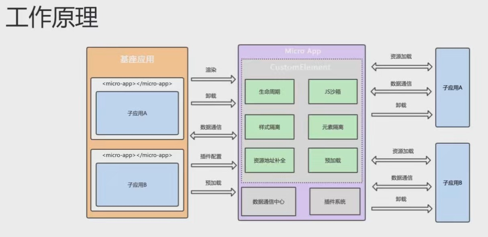

 # 微前端 micro-app

## 基本概念

微前端（Micro Frontends）是一种前端架构模式，通过将单个应用程序分解为多个小型、独立的部分来实现应用程序的组合。每个小型部分都由独立的团队开发、测试和部署，然后将它们组合成为一个完整的应用程序。

微前端的目标是使前端开发更加容易、可维护和可扩展，并且能够实现团队之间的协作。

在微前端架构中，每个微前端都有自己的代码库和独立的部署过程。

微前端可以使用不同的技术栈、框架和语言，因为它们只需要定义一组共享的 API 和协议。这样可以让团队独立地开发和部署微前端，同时还能够保持整个应用程序的一致性。


## 框架

iframe、Single-spa、Qiankun、Micro-app

### 其他框架

1. iframe html标签

```js
<iframe src="xxx" sandbox></iframe>
```

使用iframe有三个难以解决的问题，

   - **路由状态丢失**，刷新一下，iframe的url状态就丢失了
   - **dom割裂严重**，弹窗只能在iframe内部展示，无法覆盖全局
   - **通信非常困难**，只能通过postmessage传递序列化的消息


2. Single-spa
   - 注册应用
   - 挂载到基座
   - 监听url变化激活对应的子应用

- 改造成本大

- 沙箱不完美

- 应用通信能力差

- 不支持es model，不支持vite

  

3. Qiankun


### Micro-app

micro-app并没有沿袭single-spa的思路，而是借鉴了`WebComponent`的思想，通过CustomElement结合自定义的ShadowDom，将微前端封装成一个类WebComponent组件，从而实现微前端的组件化渲染。并且由于自定义ShadowDom的隔离特性，micro-app不需要像single-spa和qiankun一样要求子应用修改渲染逻辑并暴露出方法，也不需要修改webpack配置，是目前市面上接入微前端成本最低的方案。

- 使用简单
  将所有功能都封装到一个类WebComponent组件内，从而实现在基座应用中嵌入一行代码即可渲染一个微前端应用。
  同时micro-app还提供了js沙箱、样式隔离、元素隔离、预加载、数据通信、静态资源补全等一系列完善的功能。
- 零依赖
  micro-app没有任何依赖，这赋予它小巧的体积和更高的拓展行。
- 兼容所有框架
  为了保证各个业务之间独立开发、独立部署的能力，micro-app做了诸多兼容，在任何技术框架中都可以正常运行。

- WebComponent：原生组件
- CustomElement：自定义元素
- ShadowDom：影子DOM




**整体思路为**：CustomElement+HTMLEntry

- micro-app标签： 可以设置各种配置，比如开启iframe沙箱、开启ssr模式、开启keep-alive模式、关闭沙箱、数据通信
- HTMLEntry：就是以html文件作为入口地址进行渲染


```vue
//主应用（基座）
<micro-app name="app1" url="http://localhost:3000/"></micro-app>
```


#### 主要功能

生命周期、环境变量、虚拟路由、JS沙箱、样式隔离、元素隔离、数据通信等等

##### 生命周期

1. created
  `<micro-app>`标签初始化后，加载资源前触发。

2. beforemount
  加载资源完成后，开始渲染之前触发。

3. mounted
  子应用渲染结束后触发。

4. unmount
  子应用卸载时触发。

5. error
  子应用加载出错时触发，只有会导致渲染终止的错误才会触发此生命周期。


##### 环境变量

1. `__MICRO_APP_ENVIRONMENT__`

   **描述：判断应用是否在微前端环境中**

   在子应用中通过 `window.__MICRO_APP_ENVIRONMENT__` 判断是否在微前端环境中。

```js
if (window.__MICRO_APP_ENVIRONMENT__) {
  console.log('我在微前端环境中')
}
```

2. `__MICRO_APP_NAME__`

   **描述：应用名称**

   在子应用中通过 `window.__MICRO_APP_NAME__` 获取应用的name值，即`<micro-app>`标签的name值。

3. `__MICRO_APP_PUBLIC_PATH__`

   描述：子应用的静态资源前缀

   用于设置webpack动态public-path，将子应用的静态资源补全为 http 开头的绝对地址。

4. `__MICRO_APP_BASE_ROUTE__`

   **描述：子应用的基础路径**

5. `__MICRO_APP_BASE_APPLICATION__`

   **描述：判断当前应用是否是主应用**

   在执行`microApp.start()`后此值才会生效

```js
if (window.__MICRO_APP_BASE_APPLICATION__) {
  console.log('我是主应用')
}
```

6. `rawWindow`

   **描述：获取真实window（即主应用window）**

   默认情况下子应用window指向代理对象，通过`rawWindow`可以获取真实window。

```js
window.rawWindow
```

7. `rawDocument`

   **描述：获取真实document（即主应用document）**

   默认情况下子应用document指向代理对象，通过`rawDocument`可以获取真实document。

```js
window.rawDocument
```


##### 虚拟路由系统

通过虚拟路由系统，我们可以方便的进行导航守卫、跨应用的跳转，提升开发效率，并且子应用运行在这套虚拟路由系统中，和主应用的路由进行隔离，避免相互影响。

- 主应用控制子应用跳转
- 子应用控制主应用跳转
- 子应用控制其他子应用跳转


##### JS沙箱

确保子应用之间 全局变量/事件不冲突。

JS沙箱通过自定义的window、document拦截子应用的JS操作，实现一个相对独立的运行空间，避免全局变量污染，让每个子应用都拥有一个相对纯净的运行环境。

`micro-app`有两种沙箱模式：with沙箱和iframe沙箱，它们覆盖不同的使用场景且可以随意切换，默认情况下使用with沙箱，如果无法正常运行可以切换到iframe沙箱。


##### 样式隔离

MicroApp的样式隔离是默认开启的，开启后会以`<micro-app>`标签作为样式作用域，利用标签的`name`属性为每个样式添加前缀，将子应用的样式影响禁锢在当前标签区域。

```css
.test {
  color: red;
}

/* 转换为 */
micro-app[name=xxx] .test {
  color: red;
}
```


##### 元素隔离

元素隔离的概念来自ShadowDom，即ShadowDom中的元素可以和外部的元素重复但不会冲突，micro-app模拟实现了类似ShadowDom的功能，元素不会逃离`<micro-app>`元素边界，子应用只能对自身的元素进行增、删、改、查的操作。


数据通信

- 一、子应用获取来自主应用的数据
- 二、子应用向主应用发送数据
- 三、主应用向子应用发送数据
- 四、主应用获取来自子应用的数据
- 五、清空数据
- 全局数据通信
- 关闭沙箱后的通信方式


