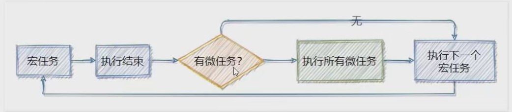
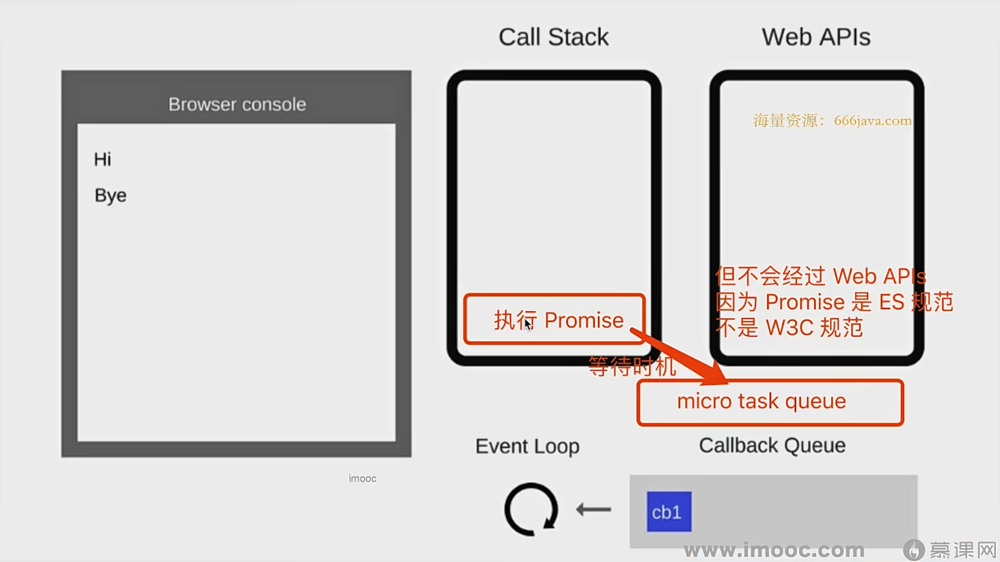
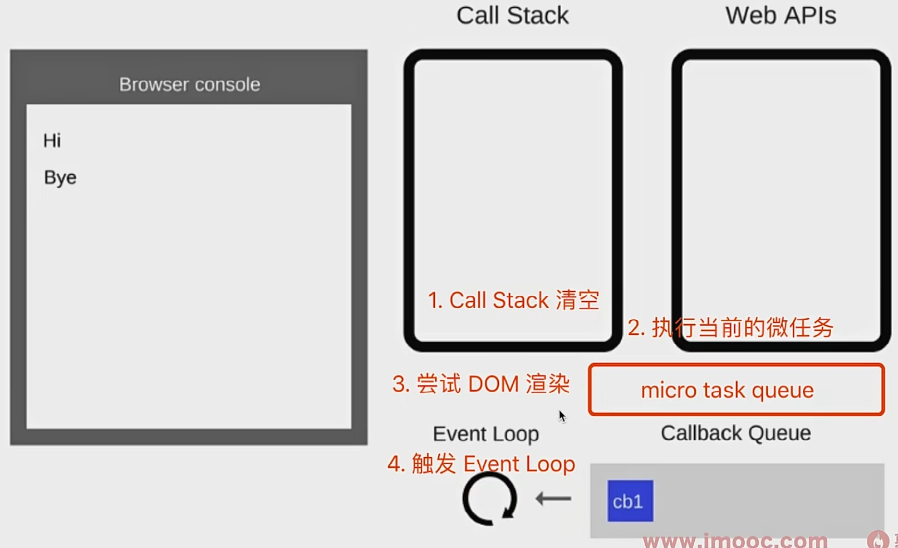

# CSS

## 行内样式

行内样式有两种

### tsx

```tsx
<label style={{ fontSize: '30px', color: 'blue' }}>hello</label> //tsx
<div style={{ width: '100px', background: 'yellow' }}>1</div >   //动态
<label style={{ paddingRight: tableShowType.value === "left-right" ? "10px" : "0px" }}>hello</label>
<div style="width:100px;background:yellow">1</div>				 //静态
```

### sfc

可以用驼峰或者短横线分隔（用引号括起来）

```vue
<label :style="{ fontSize: '30px', color: 'blue'}">hello</label>  //vue
<label :style="{ 'font-size': '30px', color: 'blue'}">hello</label>
<label :style="{ 'font-size': size + 'px', color: color}">hello</label>
//JavaScript 对象的语法来定义样式。属性名使用驼峰式命名，属性值使用字符串或数字。多个属性用逗号隔开


</div> <button onClick={add} style="width:100px;height:100px">+</button>
//这种方式使用了字符串来定义样式，类似于 HTML 中的 style 属性。属性名和属性值之间使用冒号 : 分隔，不同的属性使用分号 ; 分隔

```


## css Modules 模块化

CSS Modules的工作原理是将每个类名转换为一个唯一的哈希值，以确保在不同的模块或组件之间不会发生样式冲突。这种方式可以有效地避免全局样式污染的问题。

- 创建 xxxx.module.scss
```scss
.d1{
    background: blue;
}
```
- 导入
```tsx
import { defineComponent, ref } from 'vue'
import style from './style.module.scss'

export default defineComponent({
    setup(props, { slots, expose, emit }) {
        return () => (
            <>
                <div>
                    <div class={style.d1}>hello</div>
                </div>
            </>
        )
    }
})
```


# class

## sfc

- 静态class

```vue
<div class="d1 d2"}>内容</div>
```

- 动态class

```vue
<template>
  <div :class = "{ d1: condition1, d2: condition2 }"> </div>
  <div :class = " isActive ? 'active' : '' "> </div>
  <div :class = "{ active : isActive, why: true, kobe :false }"> </div>
  <div :class = "['abc', 'cba']"> </div>
</template>

<script setup lang="ts">
import { ref } from 'vue';

const condition1 = ref(true);
const condition2 = ref(false);
</script>
```


```vue
<template>
  <div :class="[condition1 ? 'd1' : '', condition2 ? 'd2' : '']">
    <!-- 内容 -->
  </div>
</template>

<script setup lang="ts">
import { ref } from 'vue';

const condition1 = ref(true);
const condition2 = ref(false);
</script>
```


# 动态绑定属性

## sfc


```vue
<template>
<div :[name] = "value">  </div>
</template>
```

使用 v-bind ="infos" 将对象属性绑到标签上

```vue
<template>
    <div v-bind="infos">1111</div>
</template>

<script setup lang="ts">
const infos = {
    style: {
        fontSize: '30px',
        color: 'red'
    },
    class: 'd1'
};
</script>

<style lang="scss" scoped>
.d1 {
    background-color: blue;
    color: white;
    padding: 10px;
}
</style>
```


## tsx

在 Vue 3 的 TSX 语法中，你可以使用对象展开运算符（`...`）将 `infos` 对象中的属性绑定到 `<div>` 元素上。

```tsx
import { defineComponent } from 'vue'

export default defineComponent({
    setup(props, { slots, expose, emit, attrs }) {
        const infos = {
            style: {
                color: 'red',
                fontSize: '16px',
                backgroundColor: 'blue'
            },
            class: 'd1'
        }

        return () => (
            <div>
                <div {...infos}>1111</div>
            </div>
        )
    }
})
```


# main.ts

```tsx
import './assets/main.css'

import { createApp } from 'vue'
import { createPinia } from 'pinia'
import 'element-plus/dist/index.css'
import App from './App'
import router from './router'

//将App.tsx或者App.vue挂载到
const app = createApp(App)

app.use(createPinia())
app.use(router)

//在 Vue.js 中，app.mount('#app') 是将 Vue 应用程序挂载到 HTML 页面上的一个元素上。在这里，#app 是一个 CSS 选择器，表示具有 id 属性值为 app 的元素。
app.mount('#app')

```

```html
//在index.html内
<!DOCTYPE html>
<html lang="en">
  <head>
    <meta charset="UTF-8">
    <link rel="icon" href="/favicon.ico">
    <meta name="viewport" content="width=device-width, initial-scale=1.0">
    <title>Vite App</title>
  </head>
  <body>
    <div id="app"></div>
    <script type="module" src="/src/main.ts"></script>
  </body>
</html>

在这里引入了main.ts,是挂载到这个页面的div上
```


- index.html    入口页面
- main.ts          入口文件
- App.vue         根组件


# vue3

## MVC & MVVM

- MVC：Model—View—Controller，是在前期被使用非常多的架构模式，比如IOS，前端
- MVVM：Model—View—ViewModel，是目前非常流行的架构模式

vue并没有完全遵守MVVM，但整个设计受到它启发


## 选项式API属性

### data

data属性是传入一个函数，该函数需要返回一个对象

- 在Vue2.x的时候，可以传入一个对象，推荐为传入函数
- 在Vue3.x的时候，必须传入一个函数

```javascript
const app = Vue.createApp({
	data: function() {
        return {
            counter: 0
        }
    }
})

// 简化
const app = Vue.createApp({
  data() {
    return {
      counter: 0
    }
  }
})
```


### methods


## 变量 & 修饰符

### event对象

在模板中想要明确的获取event对象：$event

传入参数同时需要获取event对象

```vue
<button @click="btnClick('why', age, $event)">按钮3</button>
```

#### tsx

<span style="color:red">tsx中还是使用event</span>

```tsx
import { defineComponent } from 'vue'

export default defineComponent({
    setup(props, { slots, expose, emit, attrs }) {
        const btnClick = (name: string, age: number, event: MouseEvent) => {
            console.log(name, age, event)
        }

        return () => (
            <div>
                <button onClick={(event) => btnClick('why', 18, event)}>
                    按钮
                </button>
            </div>
        )
    }
})
```


### 事件修饰符(可用于 `v-on`)

事件修饰符是Vue提供的特殊后缀,可以用点号 . 连接在事件名称之后。它们允许你以一种很方便的方式处理常见的事件行为,而无需在事件处理函数中手动编写事件处理逻辑。

1. `.stop`:
   - 作用: 阻止事件冒泡。等同于调用event.stopPropagation()。
   - 示例: `<button @click.stop="handleClick">Click me</button>`
   - 解释: 当按钮被点击时,点击事件不会冒泡到父元素。
2. `.prevent`:
   - 作用: 阻止事件的默认行为。等同于调用event.preventDefault()。
   - 示例: `<form @submit.prevent="onSubmit">...</form>`
   - 解释: 当表单提交时,阻止表单的默认提交行为。
3. `.capture`:
   - 作用: 在捕获阶段触发事件处理函数,而不是在冒泡阶段。
   - 示例: `<div @click.capture="handleClick">...</div>`
   - 解释: 点击事件将在捕获阶段触发handleClick函数,而不是在冒泡阶段。
4. `.self`:
   - 作用: 只有当事件是从事件绑定的元素本身触发时才触发事件处理函数。
   - 示例: `<div @click.self="handleClick">...</div>`
   - 解释: 只有当div元素自身被点击时才会触发handleClick函数,而不是其子元素被点击时。
5. `.once`:
   - 作用: 事件处理函数只会被触发一次,之后会自动解绑。
   - 示例: `<button @click.once="handleClick">Click me</button>`
   - 解释: handleClick函数只会在第一次点击按钮时被调用,之后再点击按钮不会触发这个函数。
6. `.passive`:
   - 作用: 表示事件处理函数不会调用preventDefault()。
   - 示例: `<div @scroll.passive="onScroll">...</div>`
   - 解释: 当div元素滚动时,onScroll函数不会调用preventDefault()。这可以提高滚动事件的性能,特别是在移动设备上。
7. `.exact`:
   - 作用: 精确控制系统修饰键的组合触发事件处理函数。
   - 示例: `<button @click.ctrl.exact="handleClick">Click me</button>`
   - 解释: 只有在按下Ctrl键,并且没有按下其他系统修饰键(如Alt、Shift或Meta)时,点击事件才会触发handleClick函数。
8. `.left`:
   - 作用: 只在鼠标左键触发事件处理函数。
   - 示例: `<button @click.left="handleClick">Click me</button>`
   - 解释: 只有在用鼠标左键点击按钮时,才会触发handleClick函数。
9. `.right`:
   - 作用: 只在鼠标右键触发事件处理函数。
   - 示例: `<button @click.right="handleClick">Click me</button>`
   - 解释: 只有在用鼠标右键点击按钮时,才会触发handleClick函数。
10. `.middle`:
    - 作用: 只在鼠标中键触发事件处理函数。
    - 示例: `<button @click.middle="handleClick">Click me</button>`
    - 解释: 只有在用鼠标中键点击按钮时,才会触发handleClick函数。
11. `.native`:
    - 作用: 监听组件根元素的原生事件。
    - 示例: `<my-component @click.native="handleClick"></my-component>`
    - 解释: 当点击my-component组件的根元素时,会触发handleClick函数。这对于监听自定义组件的原生事件非常有用。
12. `.sync`:
    - 作用: 创建一个双向绑定,更新父组件的状态。
    - 示例: `<my-component :title.sync="pageTitle"></my-component>`
    - 解释: 当my-component组件内部更新title属性时,pageTitle属性也会被更新。这提供了一种简洁的双向绑定语法。
13. `.camel`:
    - 作用: 将kebab-case属性名转换为camelCase。
    - 示例: `<my-component :my-prop.camel="value"></my-component>`
    - 解释: 在my-component组件内部,myProp属性将以camelCase的形式可用,而不是kebab-case。


### 按键修饰符（可用于 `v-on`）

- `.enter`：当按下回车键时触发事件。
- `.tab`：当按下 Tab 键时触发事件。
- `.delete`：当按下删除键（Delete）或退格键（Backspace）时触发事件。
- `.esc`：当按下 Esc 键时触发事件。
- `.space`：当按下空格键时触发事件。
- `.up`：当按下上箭头键时触发事件。
- `.down`：当按下下箭头键时触发事件。
- `.left`：当按下左箭头键时触发事件。
- `.right`：当按下右箭头键时触发事件。

### 系统修饰键（可用于 `v-on`）

- `.ctrl`：当按下 Ctrl 键时触发事件。
- `.alt`：当按下 Alt 键时触发事件。
- `.shift`：当按下 Shift 键时触发事件。
- `.meta`：在 Mac 系统下，表示当按下 Command 键时触发事件；在 Windows 系统下，表示当按下 Windows 徽标键时触发事件。

### 鼠标按钮修饰符（可用于 `v-on`）

- `.left`：当点击鼠标左键时触发事件。
- `.right`：当点击鼠标右键时触发事件。
- `.middle`：当点击鼠标中键时触发事件。

### 表单修饰符（可用于 `v-model`）

- `.lazy`：默认情况下，`v-model` 会在每次 `input` 事件触发后将输入框的值与数据进行同步。使用 `.lazy` 修饰符可以让数据在触发 `change` 事件后再进行同步，即在失去焦点或按下回车键时才更新数据。
- `.number`：自动将用户的输入值转为数值类型。如果转换失败，则返回原始的值。
- `.trim`：自动过滤用户输入的首尾空白字符。


## 渲染函数

### h函数

VNode和VDOM

- vue在生成真实的DOM之前，会将我们的节点转换成VNode，而VNode组合在一起形成一颗树结构，就是`虚拟DOM`（VDOM）
- template中的HTML最终也是使用`渲染函数`生成对应的`VNode`

h函数是一个用于创建VNode的函数

更准确的命名是createVNode()函数，简化为h()函数

- 语法：h(type, ?props, ?children)

  `type`：表示要创建的节点类型，可以是一个字符串（表示 HTML 标签）或一个 Vue 组件对象。

  `props`：表示节点的属性，是一个对象，包含了节点的属性、事件监听器等。

  `children`：表示节点的子节点，可以是一个字符串、数组或者 `null`。

```vue
<template>
<vnode></vnode>
</template>

<script setup lang="ts">
import { h } from 'vue'

const vnode = h(
    'div',
    {
        class: 'example',
        onClick: () => {
            console.log('Clicked!')
        }
    },
    [
        h('p', 'Hello'),
        h('p', 'World')
    ]
)
</script>

<style lang="scss" scoped>
</style>
```

```vue
<template></template>

<script>
import { h } from 'vue'

export default {
    setup() {
        return () => h(
            'div',
            {
                class: 'example',
                onClick: () => {
                    console.log('Clicked!')
                }
            },
            [
                h('p', 'Hello'),
                h('p', 'World')
            ]
        )
    }
}
</script>
```


```tsx
import { ElButton } from 'element-plus'
import { defineComponent, ref, h } from 'vue'

export default defineComponent({
    setup(props, { slots, expose, emit, attrs }) {
        const count = ref(0)

        return () => h(
            'div',
            null,
            [
                h('div', null, count.value),
                h(ElButton, { onClick: () => count.value++, class: 'b1' }, '+')
            ]
        )
    }
})
```


### 全局api

#### version

暴露当前所使用的 Vue 版本

```typescript
import { version } from 'vue'

console.log(version)
```


#### nextTick()

等待下一次 DOM 更新刷新的工具方法


#### defineComponent

在定义 Vue 组件时提供类型推导的辅助函数


## VNode

Virtal Node 虚拟节点

无论组件还是元素，最终在vue里表示出来都是一个个VNode

VNode本质是一个JavaScript对象

VNode Tree：虚拟dom


## 组件化开发

### 全局组件注册

```typescript
// main.js
import { createApp } from 'vue';
import App from './App.vue';
import MyComponent from './MyComponent.vue';

const app = createApp(App);

// 全局注册 MyComponent 组件
app.component('my-component', MyComponent);

app.mount('#app');
```

在通过app.component注册一个组件的时候，第一个参数是组件的名称，定义组件名的方式有两种

1. 短横线分隔符
2. 大驼峰


## 标签ref属性

### 普通dom标签

```vue
<template>
    <div class="person">
        <h1 ref="title1">尚硅谷</h1>
        <h2 ref="title2">前端</h2>
        <h3 ref="title3">Vue</h3>
        <input type="text" ref="inpt"> <br><br>
        <button @click="showLog">点我打印内容</button>
    </div>
</template>

<script lang="ts" setup name="Person">
import { ref } from 'vue';

let title1 = ref<HTMLHeadingElement>()
let title2 = ref<HTMLHeadingElement>()
let title3 = ref<HTMLHeadingElement>()
let inpt = ref<HTMLInputElement>()

function showLog() {
    console.log(title1.value?.innerText)
    console.log(title2.value?.innerText)
    console.log(title3.value?.innerText)
    console.log(inpt.value?.value)
}
</script>
```


### 组件标签

```vue
<!-- 父组件App.vue -->
<template>
  <Person ref="ren"/>
  <button @click="test">测试</button>
</template>

<script lang="ts" setup name="App">
  import Person from './components/Person.vue'
  import {ref} from 'vue'

  let ren = ref()

  function test(){
    console.log(ren.value.name)   // 张三
    console.log(ren.value.age)	  // 18
  }
</script>


<!-- 子组件Person.vue中要使用defineExpose暴露内容 -->
<script lang="ts" setup name="Person">
  import {ref,defineExpose} from 'vue'
	// 数据
  let name = ref('张三')
  let age = ref(18)
  /****************************/
  // 使用defineExpose将组件中的数据交给外部
  defineExpose({name,age})
</script>
```


## 生命周期

### 父子生命周期顺序

父组件setup

父组件beforeMount

子组件setup

子组件beforeMount

子组件mounted

父组件mounted


# sfc

## 与tsx的区别

### props，emits，expose

在组合式 API 的 `<script setup>` 语法中:

- 使用 `defineProps` 函数来定义组件的 props。
- 使用 `defineEmits` 函数来定义组件的自定义事件。
- 使用 `defineExpose` 函数来定义组件要暴露给父组件的属性和方法。


在 TSX 语法中:

- 使用 `props` 选项来定义组件的 props。
- 使用 `emits` 选项来定义组件的自定义事件。
- 在 `setup` 函数中使用 `expose` 函数来暴露组件的属性和方法。


### 事件

- 在Vue的模板中,我们可以直接写方法调用,如@click="handleClick('hello world')"。
- 在TSX中,我们需要写一个函数作为onClick的值,如onClick={() => handleClick('hello world')}

- vue

```vue
<template>
    <ElButton @click="handleClick('hello world')">打印</ElButton>
</template>

<script setup lang="ts">
import { ElButton } from 'element-plus';
const handleClick = (data: string) => {
    console.log(data);
}
</script>

<style lang="scss" scoped></style>
```

- tsx

```tsx
import { ElButton } from 'element-plus'
import { defineComponent } from 'vue'

export default defineComponent({
    setup(props, { slots, expose, emit, attrs }) {

        const handleClick = (data: string) => {
            console.log(data);
        }

        return () => (
            <div>
                <ElButton onClick={() => handleClick('hello world')}>打印</ElButton>
            </div>
        )
    }
})
```


## v-if

v-if是惰性的，当条件为false时，其判断的内容完全不会被渲染

```vue
<template>
    <div v-if="cj > 90"> 优秀</div>
    <div v-else> 不及格</div>
</template>

<script setup lang="ts">
	const cj = 92;
</script>

<style lang="scss" scoped></style>
```


## reactive

reactive重新分配一个对象，会失去响应式（可以使用Object.assign()）整体替换


## defineProps

``` vue
// 父

<template>
    <Child :num="num"></Child>
</template>

<script setup lang="ts">
import { ref } from "vue";
import Child from './child.vue'

const num = ref(110);
</script>

<style lang="scss" scoped></style>

// 子

<template>
    <div>
        {{ props.num }}
    </div>

</template>

<script setup lang="ts">
const props = defineProps(['num'])

</script>

<style lang="scss" scoped></style>

 // 或者
<template>
    <div>
        {{ props.num }}
    </div>

</template>

<script setup lang="ts">
const props = defineProps({
    num: {
        type: Number,
        default: 0,
        requierd: false
    }
})

</script>

<style lang="scss" scoped></style>

```


子组件可以用泛型限制父组件传递的props

```typescript
defineProps<{list?:Persons}>()
```

```typescript
withDefaults(defineProps<{list?:Persons}>(),{
    list:[{id:'a1',name:'test',age:19}]
})
```


## defineExpose

必须配合在父组件设置 ref 来使用

```vue
// 父
<template>
    <div>
        <Child ref="childRef" />
        <ElButton @click="handleClick">add</ElButton>
    </div>
</template>

<script setup lang="ts">
import { ref } from 'vue'
import Child from './child.vue'
import { ElButton } from 'element-plus'

const childRef = ref<any>(null)

const handleClick = () => {
    if (childRef.value) {
        childRef.value.add()
    }
}

</script>
<style lang="scss" scoped></style>


// 子
<template>
    <div>
        {{num}}
    </div>
</template>

<script setup lang="ts">
import { ref } from 'vue';

const num = ref(0)
const add = () => {
    num.value++
}

defineExpose({
    add
})
</script>

<style lang="scss" scoped></style>
```


## defineEmits

```vue
// 父
<template>
    <div>
        <Child @transDataV="handelAlt"></Child>
    </div>
</template>

<script setup lang="ts">
import { ElButton } from 'element-plus';
import Child from './child.vue';

const handelAlt = (data: string) => {
    alert(data)
}
</script>

<style lang="scss" scoped></style>

// 子
<template>
    <div>
        <ElInput v-model="data"></ElInput>
        <ElButton @click="emit('transDataV',data)"> 打印</ElButton>
    </div>
</template>

<script setup lang="ts">
import { ElButton, ElInput } from 'element-plus';
import { ref } from 'vue';

const data = ref('')

const emit = defineEmits(['transDataV'])
</script>

<style lang="scss" scoped></style>
```

```vue
<ElButton @click="emit('transDataV',data)"> 打印</ElButton>
// 这里tsx形式
// <ElButton onClick={()=>emit('transDataV',data)}> 打印</ElButton>
```


可以使用 TypeScript 的类型推断和泛型来为发出的事件提供类型信息

```vue
<template>
  <div>{{ c1 }}</div>
  <button @click="emit('changeC1')">增加</button>
</template>

<script setup lang="ts">
import { defineProps, defineEmits } from 'vue';

const props = defineProps<{
  c1: number;
}>();

const emit = defineEmits<{
  (event: 'changeC1'): void;
  (event: 'someOtherEvent', value: string): void;
}>();
</script>
```


## 插槽

### 默认插槽

```vue
// 父组件
<template>
	<child-component>
    	<span>hello</span>
	</child-component>
</template>

//子组件
<template>
	<div>this is child</div>
	<slot></slot>
</template>
```


### 具名插槽

```vue
// 父组件
<childComponent>
    <template #s1>
        <div>this is s1</div>
    </template>
    <template #s2>
        <div>this is s2</div>
    </template>
</childComponent>

// 子组件
<template>
    <div>this is child</div>
    <slot name="s1"></slot>
    <slot name="s2"></slot>
</template>
```

```vue
<template #s1>
    <div>this is s1</div>
</template>

// 等同于
<template v-slot='s1'>
    <div>this is s1</div>
</template>
```


### 作用域插槽

插槽传参

```vue
// 父组件
<childComponent>
    <template v-slot:s1="params">
        <ol>
            <li v-for="i in params.ps">
                {{ i.name}}
            </li>
        </ol>
    </template>
</childComponent>

//或者
<template #s1="params">
    <ol>
        <li v-for="i in params.ps" :key="i.id">
            {{ i.name }}
        </li>
    </ol>
</template>


// 子组件
<template>
    <slot name="s1" :ps="persons"></slot>
</template>

<script setup lang="ts">
import { reactive } from 'vue';

const persons =reactive([
    {name: '张三', age: 20},
    {name: '李四', age: 30},
    {name:'王五', age:40}
])
</script>
```


## v-model

### 修饰符

1. lazy

默认情况下v-model绑定input事件，加上lazy修饰符后切换为change事件。

2. number

3. trim


## computed

1. 默认为get

```vue
<template>
    <ElInput v-model.number="t1" clearable></ElInput>
    <ElInput v-model.number="t2" clearable></ElInput>
    <div>{{ count }}</div>
</template>

<script setup lang="ts">
import { ElInput } from 'element-plus';
import { computed, ref } from 'vue';

const t1 = ref(0);
const t2 = ref(0);

const count = computed(() => t1.value + t2.value);
</script>

<style lang="scss" scoped></style>
```

2. 传入对象，包含get和set属性

```vue
<template>
    <ElInput v-model.number="t1" clearable></ElInput>
    <ElInput v-model.number="t2" clearable></ElInput>
    <ElInput v-model.number="count"></ElInput>
</template>

<script setup lang="ts">
import { ElInput } from 'element-plus';
import { computed, ref } from 'vue';

const t1 = ref(0);
const t2 = ref(0);

const count = computed({
    get() {
        return t1.value + t2.value;
    },
    set() {
        console.log('count set');
    }
})

</script>

<style lang="scss" scoped></style>
```


### 计算属性的缓存

计算属性会基于它们的依赖关系进行缓存

在数据不发生变化时，计算属性不需要重新计算

如果依赖关系发生变化，在使用时，计算属性依然会重新计算。


## 侦听器watch

watch第一个参数可以是ref或者reactive，watch会自动解包

在Vue 3中,watch函数的第一个参数可以是以下几种类型:

1. 一个函数,该函数返回一个值
2. 一个ref
3. 一个响应式对象
4. ...或者是由以上几种类型构成的数组


监听ref

```vue
<template>
  <div class="person">
    <h1>情况一：监视【ref】定义的【基本类型】数据</h1>
    <h2>当前求和为：{{sum}}</h2>
    <button @click="changeSum">点我sum+1</button>
  </div>
</template>

<script lang="ts" setup name="Person">
  import {ref,watch} from 'vue'
  // 数据
  let sum = ref(0)
  // 方法
  function changeSum(){
    sum.value += 1
  }
  // 监视，情况一：监视【ref】定义的【基本类型】数据
  const stopWatch = watch(sum,(newValue,oldValue)=>{
    console.log('sum变化了',newValue,oldValue)
    if(newValue >= 10){
      stopWatch()
    }
  })
</script>
```

监视上述的多个数据

```vue
<template>
  <div class="person">
    <h1>情况五：监视上述的多个数据</h1>
    <h2>姓名：{{ person.name }}</h2>
    <h2>年龄：{{ person.age }}</h2>
    <h2>汽车：{{ person.car.c1 }}、{{ person.car.c2 }}</h2>
    <button @click="changeName">修改名字</button>
    <button @click="changeAge">修改年龄</button>
    <button @click="changeC1">修改第一台车</button>
    <button @click="changeC2">修改第二台车</button>
    <button @click="changeCar">修改整个车</button>
  </div>
</template>

<script lang="ts" setup name="Person">
  import {reactive,watch} from 'vue'

  // 数据
  let person = reactive({
    name:'张三',
    age:18,
    car:{
      c1:'奔驰',
      c2:'宝马'
    }
  })
  // 方法
  function changeName(){
    person.name += '~'
  }
  function changeAge(){
    person.age += 1
  }
  function changeC1(){
    person.car.c1 = '奥迪'
  }
  function changeC2(){
    person.car.c2 = '大众'
  }
  function changeCar(){
    person.car = {c1:'雅迪',c2:'爱玛'}
  }

  // 监视，情况五：监视上述的多个数据
  watch([()=>person.name,person.car],(newValue,oldValue)=>{
    console.log('person.car变化了',newValue,oldValue)
  },{deep:true})

</script>
```


# tsx

## 基础语法

```tsx
import { defineComponent } from "vue"

export default defineComponent({
    setup(props, { slots, attrs, expose, emit }) {
        return () => (
            <div>
                hello world
            </div>
        )

    }
})
```

```tsx
import { defineComponent } from "vue"

export default defineComponent({
    setup(props, { slots, attrs, expose, emit }) {
        return () => {
            return (
                    <div>
                       hello world
                    </div>
            )
        }
    }
})
```

```typescript
import { defineComponent } from 'vue'

export default defineComponent({
    setup(props, { slots, expose, emit, attrs }) {
        return () => [
            <div>hello1</div>,
            <div>hello2</div>
        ]
    }
})
```

```tsx
import { defineComponent } from 'vue'

export default defineComponent({
    setup(props, ctx) {
        const render = () => {
            return (
                <div>111</div>
            )
        }
        return render
    }
})
```


在 JSX 中，当返回的是单个元素时，可以省略括号。

然而，当返回的是多个并列的元素时，就需要使用括号将它们包裹起来，形成一个单一的表达式。


```tsx
import { defineComponent } from 'vue'

export default defineComponent({
    setup(props, { slots, expose, emit, attrs }) {
        const arr = [1, 2, 3, 4, 5]
        const flag = true

        function d1() {
            return (
                <ul>
                    {
                        arr.map((item, index) => {
                            return <li key={index}>{item}</li>
                        })
                    }
                </ul>
            )
        }
        return () => (
            <div>
                {
                    flag ? d1() : <div>no data</div>
                }
            </div>
        )
    }
})
```


## v-if

**tsx不支持v-if**

```tsx
import { defineComponent, ref } from 'vue'

export default defineComponent({
    setup(props, { slots, expose, emit }) {
        const v1 = ref(true)
        const changeV1 = () => {
            v1.value = !v1.value;
        }
        return () => (
            <>
                <div>
                    <h1>v-if</h1>
                    <h2>tsx不支持v-if</h2>
                    <div style="font-size:20px">v1:{v1.value ? 'true' : 'false'}</div>
                    <button onClick={changeV1} style="width:100px;height:50px">changeV1</button>
                </div>
                <div>
                    {
                        v1.value?<div>v1为true</div>:<div>v1为false</div>
                    }
                </div>

            </>
        )
    }
})
```

```tsx
<div>
  {
     v1.value?<div>v1为true</div>:<div>v1为false</div>
  }
</div>


<div>v1:{v1.value ? 'true' : 'false'}</div>
```


## v-for

 **tsx不支持v-for,通过map遍历**

```tsx
import { defineComponent } from 'vue'

export default defineComponent({
    setup(props, { slots, expose, emit }) {
        let arr = [1, 2, 3, 4, 5, 6]
        return () => (
            <>
                <h1>v-for</h1>
                <h2>tsx不支持v-for</h2>
                {
                    arr.map((item, index) => (
                        <ul> <li>{item * 2}---{index}</li></ul>
                    ))
                }
            </>
        )
    }
})
```


##  v-model

- 父组件使用v-model时

```vue
//vue
v-model:visible="visible"
展开为
:visible="visible"
@update:visible="visible=$event"  //父组件监听update:visible 并传参给visible
```


```tsx
import { defineComponent, ref } from 'vue'

export default defineComponent({
    setup(props, { slots, expose, emit, attrs }) {
        const v1 = ref("");
        return () => (
            <div>
                <input v-model={v1.value}></input>
                <br></br>
                <input value={v1.value}></input>
            </div>
        )
    }
})
```

原理

```tsx
import { defineComponent, ref } from 'vue'

export default defineComponent({
    setup(props, { slots, expose, emit, attrs }) {
        const message = ref("");
        const updateMsg = (event: Event) => {
            message.value = (event.target as HTMLInputElement).value;
        }
        return () => (
            <div>
                <input value={message.value} onInput={updateMsg}></input>
                msg:{message.value}
            </div>
        )
    }
})
```


不同组件内v-model

```tsx
//父
import { defineComponent, ref } from 'vue'
import ChildTest from './childTest';

export default defineComponent({
    setup(props, { slots, expose, emit, attrs }) {
        const message = ref("");
        const updateMsg = (event: Event) => {
            message.value = (event.target as HTMLInputElement).value;
        }
        return () => (
            <div>
                <input value={message.value} onInput={updateMsg}></input>
                <br></br>
                <ChildTest modelValue={message.value} onUpdate:modelValue={(data) => { message.value = data }}></ChildTest>
            </div>
        )
    }
})

//子
import { defineComponent } from 'vue'

export default defineComponent({
    props: ['modelValue'],
    emits: ['update:modelValue'],
    setup(props, { emit }) {
        const onInput = (event: Event) => {
            emit('update:modelValue', (event.target as HTMLInputElement).value)
        }

        return () => (
            <div>
                <input value={props.modelValue} onInput={onInput} />
            </div>
        )
    }
})

```

props: ['modelValue'],
emits: ['update:modelValue']

emits和props要在setup外定义


## onClick

在 TSX 语法中，事件处理函数是直接作为组件的属性传递的。当你使用 `onClick={handleClick}` 时，`onClick` 就是一个普通的 JavaScript 属性，它的值是 `handleClick` 函数。这种方式更接近于原生 JavaScript 中的事件绑定方式。


## props

父传子

<span style="color:red;font-size:20px">注意导入组件一定要用大驼峰</span>

```tsx
import ChildTest from './childTest'
```

- 父

```tsx
const message = ref("hello")
<ChildTest message={message.value} num={1}></ChildTest>
```

- 子

```tsx
import { defineComponent } from 'vue'

export default defineComponent({
    props: ['message', 'num'],
    setup(props, { slots, expose, emit, attrs }) {
        return () => (
            <div>
                <div>
                    child
                </div>
                <div>{props.message}</div>
                <div>{props.num}</div>
            </div>
        )
    }
})

具体形式
props: {
        message: {
            type: String,
            required: true
        },
        num: {
            type: Number,
            required: true
        }
}
```


## emit

子传父

- 父

```tsx
import { defineComponent, ref } from 'vue'
import ChildTest from './childTest'
export default defineComponent({
    setup(props, { slots, expose, emit, attrs }) {
        return () => (
            <div>
                <div>
                    <ChildTest onTransmitV={data => { alert(data) }}></ChildTest>
                </div>
            </div>
        )
    }
})
```

- 子

```tsx
import { defineComponent, ref } from 'vue'

export default defineComponent({
    emits: ['transmitV'],
    setup(props, { slots, expose, emit, attrs }) {
        const v = ref(30);
        return () => (
            <div>
                <div>
                    <button onClick={() => emit('transmitV', v.value)}>更新num</button>
                </div>
            </div>
        )
    }
})
```


## expose

```tsx
// 父
import { defineComponent, ref } from 'vue'
import Child from './child'
import { ElButton } from 'element-plus'

export default defineComponent({
    setup(props, { slots, expose, emit, attrs }) {
        const childRef = ref<any>(null)

        const handleClick = () => {
            if (childRef.value) {
                childRef.value.add()
            }
        }

        return () => (
            <div>
                <Child ref={childRef} />
                <ElButton onClick={handleClick}>add</ElButton>
            </div>
        )
    }
})

// 子
import { defineComponent, ref } from 'vue'

export default defineComponent({
    setup(props, { slots, expose, emit, attrs }) {
        const num = ref(0)
        const add=()=>{
            num.value++
        }

        expose({
            add
        })
        
        return () => (
            <div>
                {num.value}
            </div>
        )
    }
})

```


## mitt

事件总线

- 引入

```node.js
npm install --save mitt
```

- 使用

1. 定义utils  /src/util/emitter.ts

```tsx
import mitt from "mitt";

const emitter = mitt()

export default emitter
```

2. 发送方

```tsx
import emitter from '@/utils/emitter'
import { ElButton, ElInput } from 'element-plus'
import { defineComponent, ref } from 'vue'

export default defineComponent({
    setup(props, { slots, expose, emit, attrs }) {
        const data = ref("")
        const handleClick = () => {
            emitter.emit('sendData', data.value)
        }

        return () => (
            <div>
                <ElInput v-model={data.value} onInput={handleClick}></ElInput>
            </div>
        )
    }
})
```

3. 接收方

```tsx
import emitter from '@/utils/emitter';
import { ElButton, ElInput } from 'element-plus';
import { defineComponent, ref } from 'vue'
import Index2 from './index2';

export default defineComponent({
    setup(props, { slots, expose, emit, attrs }) {
        const testData = ref()
        emitter.on('sendData', (data) => {
            testData.value = data
        })
        return () => (
            <div>
                <div>
                    <ElInput v-model={testData.value}></ElInput>
                </div>
                <hr></hr>
                <div>
                    <Index2></Index2>
                </div>
            </div>
        )
    }
})
```


### 方法

1. `emitter.on(type, handler)`
   - 用于订阅事件。
   - `type` 参数表示事件类型，是一个字符串。
   - `handler` 参数是事件处理函数，当相应的事件被触发时会调用该函数。
2. `emitter.emit(type, [...args])`
   - 用于触发事件。
   - `type` 参数表示要触发的事件类型，是一个字符串。
   - `[...args]` 参数表示要传递给事件处理函数的参数，可以有多个。
3. `emitter.off(type, handler)`
   - 用于取消订阅事件。
   - `type` 参数表示要取消订阅的事件类型，是一个字符串。
   - `handler` 参数是要取消订阅的事件处理函数，需要与 `on` 方法中传递的处理函数相同。
4. `emitter.all`
   - 这是一个对象，包含了所有已注册的事件类型和对应的处理函数。
   - 可以通过 `emitter.all[type]` 来访问特定事件类型的处理函数数组。


## pinia

### 搭建pinia环境

第一步：`npm install pinia`

第二步：操作`src/main.ts`

```tsx
import { createApp } from 'vue'
import App from './App.vue'

/* 引入createPinia，用于创建pinia */
import { createPinia } from 'pinia'

/* 创建pinia */
const pinia = createPinia()
const app = createApp(App)

/* 使用插件 */{}
app.use(pinia)
app.mount('#app')
```


### 存储+读取数据

`Store`是一个保存：**状态**、**业务逻辑** 的实体，每个组件都可以**读取**、**写入**它。

1. Option Store

它有三个概念：`state`（状态）、`getters`、`action`（动作），相当于组件中的： `data`、 `computed` 和 `methods`。

具体编码：`src/store/count.ts`


2. Setup Store

在 Setup Store 中：

- `ref()` 就是 `state` 属性
- `computed()` 就是 `getters`
- `function()` 就是 `actions`

要让 pinia 正确识别 `state`，你**必须**在 setup store 中返回 **`state` 的所有属性**

具体编码：`src/store/counter.ts`

```typescript
import { ref, computed } from 'vue'
import { defineStore } from 'pinia'

export const useCounterStore = defineStore('counter', () => {
  const count = ref(0)
  const doubleCount = computed(() => count.value * 2)
  function increment() {
    count.value++
  }
  function decrement() {
    count.value--
  }

  return { count, doubleCount, increment, decrement }
})
```

使用state:

```typescript
import { ElButton, ElInput } from 'element-plus'
import { computed, defineComponent, ref } from 'vue'
import { useCounterStore } from '@/stores/counter'

export default defineComponent({
    setup(props, { slots, expose, emit, attrs }) {
        const counterStore = useCounterStore()
        return () => (
            <div>
                <div>{counterStore.count}</div>
                <div>{counterStore.doubleCount}</div>
                <ElButton onClick={() => counterStore.increment()}>+</ElButton>
                <ElButton onClick={() => counterStore.decrement()}>-</ElButton>
            </div>
        )
    }
})
```


### API

#### storeToRefs()

- 为了从Store中提取属性同时保持响应式，需要使用storeToRefs(~)
- 也可以使用vue的toRefs(~)

```typescript
import { ref, computed } from 'vue'
import { defineStore } from 'pinia'

export const useCounterStore = defineStore('counter', () => {
  const count = ref(100)
  const doubleCount = computed(() => count.value * 2)
  function increment() {
    count.value++
  }
  function decrement() {
    count.value--
  }

  return { count, doubleCount, increment, decrement }
})
```

```tsx
import { ElButton } from 'element-plus'
import { defineComponent, ref } from 'vue'
import { useCounterStore } from '../../stores/counter'
import { storeToRefs } from 'pinia'

export default defineComponent({
    setup(props, { slots, expose, emit, attrs }) {
        const counterStore = useCounterStore()
        const { count, doubleCount } = storeToRefs(counterStore)
        const { increment, decrement } = counterStore
        return () => (
            <div>
                <div>{count.value}</div>
                <div>{doubleCount.value}</div>
                <ElButton onClick={increment}>+</ElButton>
                <ElButton onClick={decrement}>-</ElButton>
            </div>
        )
    }
})
```


## attrs

1. props 要先声明才能取值，attrs 不用先声明
2. props 声明过的属性，attrs 里不会再出现
3. props 不包含事件，attrs 包含
4. props 支持 string 以外的类型，attrs 只有 string 类型


## 插槽

### 具名插槽

- 父组件

```tsx
<ChildComponent>
        {{
            default: () => (  
                <h2>  hello default slot  </h2>
            )
        }}
</ChildComponent>

<ChildComponent>
        {{
            default: () => {
                return(
                    <h2>hello 2</h2>
                )
            }
        }}
</ChildComponent>

//或者
<ChildComponent v-slots={{ default: () => (<h2>hello 3</h2>) }} />
```

- 子组件

```tsx
export default defineComponent({
    name: 'childComponent',
    setup(props, { slots }) {
        return () => (
            <div>
                <div>
                    {slots.default?.()}
                </div>
            </div>
        )
    }
})
```

**{slots.default?.()}**

<span style="color:red">如果`slots.default`存在且不为`null`或`undefined`，则调用`slots.default`作为函数。这样做是因为插槽内容可以是一个渲染函数</span>


### 作用域插槽

```tsx
// 父
import { defineComponent } from 'vue';
import ChildComponent from './childComponent';


interface Item {
    id: number;
    name: string;
}
export default defineComponent({
    setup() {
        return () => (
            <div>
                <h1>slotTest1</h1>
                <ChildComponent>
                    {{
                        s1: ({ ps }: { ps: Item[] }) => (
                            <ol>
                                {ps.map(item => (
                                    <li key={item.id}>{item.name}</li>
                                ))}
                            </ol>
                        )
                    }}
                </ChildComponent>
            </div>
        );
    }
});


// 子
import { defineComponent, h } from "vue"

export default defineComponent({
    setup(props, { slots, attrs, expose, emit }) {

        return () => (
            <div>
                <div>this is child</div>
                <div>
                    {slots.s1?.({ ps: [{ id: 1, name: 'Item 1' }, { id: 2, name: 'Item 2' }] })}
                </div>
            </div>
        )

    }
})
```


```tsx
// 父
import { defineComponent } from 'vue';
import ChildComponent from './childComponent';

interface Item {
    name: string;
    age: number;
}
export default defineComponent({
    setup() {
        return () => (
            <div>
                <h1>slotTest1</h1>
                <ChildComponent>
                    {{
                        s1: ({ ps }: { ps: Item[] }) => (
                            <ol>
                                {ps.map(item => (
                                    <li>{item.name}：{item.age}岁</li>
                                ))}
                            </ol>
                        )
                    }}
                </ChildComponent>
            </div>
        );
    }
});

// 子
import { defineComponent, reactive } from "vue"

export default defineComponent({
    setup(props, { slots, attrs, expose, emit }) {
        const persons = reactive([
            { name: '张三', age: 20 },
            { name: '李四', age: 30 },
            { name: '王五', age: 40 }
        ])

        return () => (
            <div>
                <div>
                    {slots.s1?.({ ps: persons })}
                </div>
            </div>
        )
    }
})
```


## VNode

### h函数

```tsx
const customVNode1 = h(
    "p",
    {
        class: "p1",
        onClick: () => {
            alert("hello p1");
        },
        style: {
            backgroundColor: "blue",
        },
    },
    "This is VNode1"
)
```
h函数  渲染html原生标签第一个参数为字符串

​			渲染vue标签时直接写入

```tsx
import { defineComponent, h } from 'vue';
import { ElButton } from 'element-plus';

export default defineComponent({
    setup() {
        const VNodeTest1 = () => h('div', null, 'VNodeTest1');
        const VNodeTest2 = () => h(ElButton, {
            type: 'primary',
            onClick: () => {
                alert('hello')
            },
            class: 'b1'
        }, 'VNodeTest2');
        return () => (
            <div>
                <VNodeTest1></VNodeTest1>
                <VNodeTest2></VNodeTest2>
            </div>
        );
    },
});
```


h函数接受三个参数，分别表示：

1. `type`：表示要创建的虚拟节点的类型，可以是一个字符串（如 `'div'`）、一个组件对象或一个函数。这个参数指定了要渲染的组件或元素。
2. `props`：表示要传递给虚拟节点的属性（props）对象。这个参数用于向组件传递数据和属性。
3. `children`：表示虚拟节点的子节点，可以是一个字符串、一个数组或一个虚拟节点。这个参数可以用来传递子元素或插槽内容。


- tsx
```tsx
const customVNode2 = () => (
    <p onClick={() => alert('hello p2')}>This is VNode2</p>
)
```

```tsx
{/* 插入创建的vNode */}
<customVNode1></customVNode1>
<customVNode2></customVNode2>
```


## tips

### 简写

在 JSX ,SFC中使用布尔属性时，可以直接使用属性名作为简写形式，而不需要显式地将其设置为 `true`。这是因为在 JSX,SFC 中，存在属性名本身就意味着该属性的值为 `true`。

例如，以下两种写法是等价的：

```tsx
<DictSelect v-model={selectDict.value} ref={dictSelectRef} style={{ margin: '16px' }} dict={cw_state} clearable size={"large"}></DictSelect>

<DictSelect v-model={selectDict.value} ref={dictSelectRef} style={{ margin: '16px' }} dict={cw_state} clearable={true} size={"large"}></DictSelect>
```

### reactive里的ref

```vue
let obj = reactive({
	a:1,
	b:2,
	c:ref(3)
})

console.log(obj.c)  // 不用obj.c.value
// reactive内部自动解包
```


## 父子传参

### 子传父

```tsx
//  父
import { defineComponent, h } from 'vue'
import { useTest1 } from './child/index'

export default defineComponent({
    setup(props, { slots, expose, emit, attrs }) {
        const test1 = useTest1()
        return () => (
            <div>
                {h(test1.element)}
            </div>
        )
    }
})
```

```tsx
// 子
export function useTest1() {
    const element = () => <div>hello</div>

    return {
        element
    };
}

// 或者
export function useTest1() {

    return {
        element: ()=><div>hello</div>
    };
}

// 或者
import { h } from "vue";

export function useTest1() {

    return {
        element: h('div', null, "hello")
    };
}
```


### 父传子

- h函数传参

```tsx
// 父
import { defineComponent, h, ref } from 'vue'
import { useTest1 } from './child/index'

export default defineComponent({
    setup(props, { slots, expose, emit, attrs }) {
        const fatherText = ref('father')
        const test1 = useTest1()
        return () => (
            <div>
                {h(test1.element, { text: fatherText.value })}
                // 将text作为props传递给子组件
            </div>
        )
    }
})

// 子
export function useTest1() {
    return {
        element: (props: { text: string }) => <div>{props.text}</div>
        // props: { text: string } 表示 props 参数是一个对象，它包含一个名为 text 的属性，并且 text 属性的类型是 string。
        // 是 TypeScript 中的类型注解
    };
}
```


```tsx
import { ElInput } from 'element-plus'
import { defineComponent, h, ref } from 'vue'
import C1 from './child/c1'

export default defineComponent({
    setup(props, { slots, expose, emit, attrs }) {
        const keyData = ref("")
        const c1 = C1(keyData);
        return () => (
            <div>
                <ElInput v-model={keyData.value}></ElInput>
                    <div style={{ display: 'flex', flexDirection: 'row' }}>
                        <div style={{ backgroundColor: 'yellow', width: '100px', height: '100px' }}>{
                            h(c1.element)
                        }</div>
                    </div>
            </div>
        )
    }
})


//c1
import { ElInput } from "element-plus"
import { ref, Ref } from "vue"

export default function c1(val: Ref<string>) {
    return {
        element: () => <div>
            <ElInput v-model={val.value}></ElInput>
            <div>{val.value}</div>
        </div>
    }
}
```

```tsx
import { ElInput } from 'element-plus'
import { computed, defineComponent, h, ref } from 'vue'
import useC2 from './child/c2'

export default defineComponent({
    setup(props, { slots, expose, emit, attrs }) {
        const keyData1 = ref("")
        const c2 = useC2("", (obj) => {
            switch (obj.type) {
                case "changeData":
                    keyData1.value = obj.data
                    c2.changeSonKey(obj.data)
                    break;
                default:
                    break;
            }
        });
        return () => (
            <div>
                <ElInput v-model={keyData1.value} onInput={(e) => { c2.changeSonKey(e) }}></ElInput>
                    <h2>函数式</h2>
					   {
                            h(c2.element)
                        }</div>
                    </div>
            </div>
        )
    }
})

// 子
import { ElInput } from "element-plus"
import { ref, Ref } from "vue"

type TCall = {
    type: "changeData",
    data: string
}

export default function useC2(val: string, callback: (arg: TCall) => void) {
    const sonkey = ref(val)
    function changeSonKey(arg: string) {
        sonkey.value = arg
    }
    return {
        element: () => <div>
            <ElInput v-model={sonkey.value} onInput={(e) => {
                callback({
                    type: "changeData",
                    data: e
                })
            }}> </ElInput>
            <div>{sonkey.value}</div>
        </div>,
        changeSonKey
    }
}
```


## computed

在Vue 3中,`computed`函数接受两个参数:

1. `getter`函数(必需)
2. 一个包含`set`函数的对象(可选)


computed与proxy类似，但是computed get不需要传递参数，set 函数只需要接收一个参数，即新的值


```tsx
import { computed, defineComponent, ref } from 'vue'

export default defineComponent({
    setup(props, { slots, expose, emit, attrs }) {

        const firstName = ref("")
        const lastName = ref("")
        const name = computed(() => {
            return firstName.value + lastName.value
        })
        return () => (
            <div>
                <div style={{ display: 'flex', flexDirection: 'row' }}>
                    <label style={{ marginRight: '10px' }}>姓:</label>
                    <input type="text" v-model={firstName.value} />
                </div>
                <div style={{ display: 'flex', flexDirection: 'row' }}>
                    <label style={{ marginRight: '10px' }}>名:</label>
                    <input type="text" v-model={lastName.value} />
                </div>
                <div>
                    <label>姓名:</label>
                    <span>{name.value}</span>
                </div>
            </div>
        )
    }
})
```


```tsx
import { computed, defineComponent, ref } from 'vue'

export default defineComponent({
    setup(props, { slots, expose, emit, attrs }) {

        const firstName = ref("")
        const lastName = ref("")
        const name = computed({
            get: () => `${firstName.value} ${lastName.value}`,
            set: (value: string) => {
                const [first, last] = value.split(" ")
                firstName.value = first
                lastName.value = last
                alert('hello')
            }
        })
        return () => (
            <div>
                <div style={{ display: 'flex', flexDirection: 'row' }}>
                    <label style={{ marginRight: '10px' }}>姓:</label>
                    <input type="text" v-model={firstName.value} />
                </div>
                <div style={{ display: 'flex', flexDirection: 'row' }}>
                    <label style={{ marginRight: '10px' }}>名:</label>
                    <input type="text" v-model={lastName.value} />
                </div>
                <div>
                    <label>姓名:</label>
                    <span>{name.value}</span>
                </div>
                <div style={{ display: 'flex', flexDirection: 'row' }}>
                    <label style={{ marginRight: '10px' }}>姓名:</label>
                    <input type="text" v-model={name.value} />
                </div>
            </div>
        )
    }
})
```


## 动态组件

1. v-if实现
2. 动态组件实现
3. h函数实现

```tsx

import { defineComponent, h, shallowRef } from 'vue'
import T1 from './child/t1'
import T2 from './child/t2'
import T3 from './child/t3'
import { ElButton } from 'element-plus'

export default defineComponent({
  setup(props, { slots, expose, emit, attrs }) {
    const components = [T1, T2, T3]
    const currentComponent = shallowRef(T1)

    const switchComponent = () => {
      const index = components.indexOf(currentComponent.value)
      const nextIndex = (index + 1) % components.length
      currentComponent.value = components[nextIndex]
    }

    return () => (
      <div>
        <div>{h(currentComponent.value)}</div>
        <ElButton onClick={switchComponent}>切换组件</ElButton>
      </div>
    )
  },
})

```


##  hooks

### 定义

一系列以 `“use”` 作为开头的方法，它们提供了让你可以完全避开 `class式写法`，在函数式组件中完成生命周期、状态管理、逻辑复用等几乎全部组件开发工作的能力。**函数式组件**

### 优点

1. 比mixins更好的状态逻辑复用

   **Hook 的状态复用写法：**

```vue
// 单个name的写法
const { name, setName } = useName();

// 梅开二度的写法
const { name : firstName, setName : setFirstName } = useName();

const { name : secondName, setName : setSecondName } = useName();
```

2. 高度聚合，可阅读性提升

### 示例

```ts
import { ref } from "vue";

export function useCounter(initialValue = 0) {
    const count = ref(initialValue)

    function increment() {
        count.value++
    }
    
    function decrement() {
        count.value--
    }
    
    return {
        count,
        increment,
        decrement  // 父组件调用子组件的方法，改变子组件里变量的值
    }
}
```

```tsx
import { defineComponent } from 'vue'
import { useCounter } from './child/index'

export default defineComponent({
    setup(props, { slots, expose, emit, attrs }) {
        const counter = useCounter()
        return () => (
            <div>
                <button onClick={() => counter.increment()}>Increment</button>
                <br></br>
                <button onClick={() => counter.decrement()}>Decrement</button>
                <br></br>
                <p>{counter.count.value}</p>
            </div>
        )
    }
})
```


## onClick事件

```tsx
import { ElButton } from 'element-plus'
import { defineComponent } from 'vue'

export default defineComponent({
    setup(props, { slots, expose, emit, attrs }) {
        function alt(){
            alert('alt')
        }

        return () => (
            <div>
                <ElButton onClick={alt}></ElButton>
                <ElButton onClick={()=>alt()}></ElButton>
            </div>
        )
    }
})
// 这两种是相同的
```

- `<ElButton onClick={alt}></ElButton>`

这里的 `onClick={alt}` 实际上是在为 `ElButton` 组件的 `onClick` 事件传递一个回调函数。

将 `alt` 函数作为回调函数传递给 `onClick`

当 `ElButton` 内部触发 `click` 事件时，Vue 会调用传入的 `alt` 函数


- `<ElButton onClick={() => alt()}></ElButton>`

这里的 `onClick={() => alt()}` 是定义了一个新的匿名函数，这个函数调用了 `alt`

Vue 将箭头函数作为 `onClick` 回调，并在事件触发时执行该箭头函数


## customRef

用hooks实现防抖

```tsx
import { clear } from 'console'
import { ElButton, ElInput } from 'element-plus'
import { tr } from 'element-plus/es/locales.mjs'
import { customRef, defineComponent, ref } from 'vue'

export default defineComponent({
    setup(props, { slots, expose, emit, attrs }) {


        function useCustomRef(v1: string, time: number) {
            let timer: NodeJS.Timeout
            return customRef((track, trigger) => {
                return {
                    get() {
                        track()
                        return v1
                    },
                    set(value: string) {
                        clearTimeout(timer)
                        timer = setTimeout(() => {
                            v1 = value
                            trigger()
                        },time)
                    }
                }
            })
        }

        let inputV = useCustomRef('hhh', 1000)

        return () => (
            <div>
                <input type="text" v-model={inputV.value}></input>
                <h3>{inputV.value}</h3>
            </div>
        )
    }
})
```


# 路由

- useRoute

```tsx
const route = useRoute();

route.path：当前路由的路径部分，不包括查询参数和哈希值。
示例：如果当前路由是/user/123?name=John#info，则route.path的值为/user/123。
route.fullPath：当前路由的完整路径，包括查询参数和哈希值。
示例：如果当前路由是/user/123?name=John#info，则route.fullPath的值为/user/123?name=John#info。
route.query：一个对象，包含当前路由的查询参数。
示例：如果当前路由是/user/123?name=John&age=25，则route.query的值为{ name: 'John', age: '25' }。
route.hash：当前路由的哈希值（包括#符号）。
示例：如果当前路由是/user/123#info，则route.hash的值为#info。
route.params：一个对象，包含当前路由的动态参数。
示例：如果当前路由是/user/:id，而实际访问的路由是/user/123，则route.params的值为{ id: '123' }。
route.name：当前路由的名称（如果有定义）。
示例：如果在路由配置中为某个路由指定了name属性，如{ path: '/user/:id', name: 'user' }，则当访问该路由时，route.name的值为'user'。
route.meta：一个对象，包含当前路由的元信息（如果有定义）。
示例：如果在路由配置中为某个路由指定了meta属性，如{ path: '/user/:id', meta: { requiresAuth: true } }，则当访问该路由时，route.meta的值为{ requiresAuth: true }。
route.redirectedFrom：如果当前路由是通过重定向访问的，该属性表示重定向来源的路由的名称。
示例：如果在路由配置中定义了重定向，如{ path: '/home', redirect: '/' }，则当访问/home时，会重定向到/，此时route.redirectedFrom的值为'/home'。
route.matched：一个数组，包含当前路由匹配到的所有路由记录。
示例：如果当前路由是/user/123，并且在路由配置中定义了嵌套路由，如{ path: '/user/:id', component: User, children: [{ path: 'profile', component: UserProfile }] }，则route.matched的值为[{ path: '/user/:id', ... }, { path: 'profile', ... }]。

```


- useRouter

```tsx
const router = useRouter()
```

1. `router.push(location)`：导航到指定的路由。 location可以是一个字符串或对象

```tsx
router.push('/user/123');
router.push({ path: '/user/123' });
router.push({ name: 'user', params: { id: '123' } });
router.push({ path: '/user/123', query: { name: 'John' } });
```

2. `router.replace(location)`：替换当前路由，导航到指定的路由。 

  与router.push()类似，但是使用replace不会向历史记录添加新记录，而是替换当前记录。

```tsx
router.replace('/user/123');
router.replace({ path: '/user/123' });
```

3. `router.go(n)`：在历史记录中前进或后退指定的步数。

```tsx
router.go(1); // 前进一步
router.go(-2); // 后退两步
```

​	4.`router.back()`：导航回上一个历史记录。  相当于调用`router.go(-1)`。

```tsx
router.back();
```

5. `router.forward()`：导航到下一个历史记录。 相当于调用`router.go(1)`。

```tsx
router.forward();
```

6. `router.resolve(location)`：解析给定的路由地址，返回解析后的路由地址信息。

   `location`可以是一个字符串或对象，表示要解析的路由地址。

   返回的对象包含以下属性：

   - `href`：解析后的完整路由地址。
   - `route`：解析后的路由对象。
   - `normalizedTo`：规范化后的目标路由地址对象。
   - `resolved`：解析后的路由记录对象。
     示例：

```tsx
const resolvedRoute = router.resolve('/user/123');
console.log(resolvedRoute.href); // 输出解析后的完整路由地址
```

7. `router.addRoute(route)`：动态添加一个新的路由记录。

```tsx
router.addRoute({ path: '/new-route', component: NewComponent });
```

8. `router.getRoutes()`：获取所有的路由记录数组。

```tsx\
const routes = router.getRoutes();
```


- 路由自动显示

```tsx
import { ElIcon, ElMenu, ElSubMenu, ElMenuItemGroup, ElMenuItem } from "element-plus"
import { title } from "process"
import { defineComponent } from "vue"
import { Location } from "@element-plus/icons-vue";
import style from "./styel.module.scss"
import { useRoute, useRouter } from "vue-router";


export default defineComponent({

    setup(props, { emit, expose, slots }) {
        const router = useRouter();
        function toPage(route: any) {
            router.push({
                name: route.name
            })
        }
        return () => (
            <ElMenu active-text-color="#ffd04b" background-color="silver" text-color="navy" router >
                {router.options.routes.map((route, index) => {
                    //通过在 .map() 的回调函数中使用 return 语句，你可以将每个 route 对象转换为对应的 JSX 元素
                    //并将转换后的元素作为新数组的元素返回。这样，.map() 方法最终会返回一个由 JSX 元素组成的数组。
                    return (
                        <ElSubMenu index={'' + index} v-slots={{ title: () => (<span>{route.meta?.title as string}</span>) }}>
                            {route.children?.map(routeChild => (
                                <ElMenuItem index={routeChild.name as string} onClick={() => toPage(routeChild)}>
                                    <span>{routeChild.meta?.title ?? 'title未定义'}</span>
                                </ElMenuItem>
                            ))}
                        </ElSubMenu>
                    );
                })}
            </ElMenu>
        )
    }
})
```


# 其他

## 对象属性扩展

- vue

```vue
<template>
  <input v-bind="obj" type="text"></input>
</template>

<script setup lang="ts">
const obj = {
  id: "input-id",
  class: "input-class",
  value: "Hello, World!",
  style: { color: "red" }
};
</script>

<style lang="scss" scoped>
.input-class {
  color: red;
}
</style>
```


- tsx

```tsx
import { ElButton } from 'element-plus'
import { defineComponent } from 'vue'

export default defineComponent({
    setup(props, { slots, expose, emit, attrs }) {
        const obj = {
            id: "input-id",
            class: "input-class",
            value: "Hello, World!",
            style: "color: red;"
            // 或者  style: { color: 'red' }
          };
        return () => (
            <input {...obj} />
        )
    }
})
```


# API

## shallowRef

只处理对象最外层属性的响应式（浅响应式）

`shallowRef`创建数据, 只有顶层的`value`属性具有响应性, 深层的数据不具有响应性, 会原因返回, 即`vue`不会递归的将深层数据通过`reactive`处理, 而是原样存储和暴露

## shallowReactive

`shallowReactive`创建响应对象没有深层级的转换：一个浅层响应式对象里只有根级别的属性是响应式的, 深层对象不会被`vue`自动包装为响应对象.


# vite

## webpack

一般的项目使用 Webpack 之后，启动花个几分钟都是很常见的事情，热更新也经常需要等待十秒以上。这主要是因为：

-   项目冷启动时必须递归打包整个项目的依赖树
-   JavaScript 语言本身的性能限制，导致构建性能遇到瓶颈，直接影响开发效率

这样一来，代码改动后不能立马看到效果，自然开发体验也越来越差。而其中，最占用时间的就是代码打包和文件编译。


## 模块标准

### 无模块化标准阶段

#### 1. 文件划分

#### 2. 命名空间

`命名空间`是模块化的另一种实现手段，它可以解决上述文件划分方式中`全局变量定义`所带来的一系列问题。下面是一个简单的例子:

```ts
// module-a.js
window.moduleA = {
  data: "moduleA",
  method: function () {
    console.log("execute A's method");
  },
};
```

```ts
// module-b.js
window.moduleB = {
  data: "moduleB",
  method: function () {
    console.log("execute B's method");
  },
};
```

```html
<!DOCTYPE html>
<html lang="en">
  <head>
    <meta charset="UTF-8" />
    <meta http-equiv="X-UA-Compatible" content="IE=edge" />
    <meta name="viewport" content="width=device-width, initial-scale=1.0" />
    <title>Document</title>
  </head>
  <body>
    <script src="./module-a.js"></script>
    <script src="./module-b.js"></script>
    <script>
      // 此时 window 上已经绑定了 moduleA 和 moduleB
      console.log(moduleA.data);
      moduleB.method();
    </script>
  </body>
</html>
```

这样一来，每个变量都有自己专属的命名空间，我们可以清楚地知道某个变量到底属于哪个`模块`，同时也避免全局变量命名的问题。

#### 3. IIFE(立即执行函数)

不过，相比于`命名空间`的模块化手段，`IIFE`实现的模块化安全性要更高，对于模块作用域的区分更加彻底。你可以参考如下`IIFE 实现模块化`的例子:

```ts
// module-a.js
(function () {
  let data = "moduleA";

  function method() {
    console.log(data + "execute");
  }

  window.moduleA = {
    method: method,
  };
})();
```

```ts
// module-b.js
(function () {
  let data = "moduleB";

  function method() {
    console.log(data + "execute");
  }

  window.moduleB = {
    method: method,
  };
})();
```

```html
// index.html
<!DOCTYPE html>
<html lang="en">
  <head>
    <meta charset="UTF-8" />
    <meta http-equiv="X-UA-Compatible" content="IE=edge" />
    <meta name="viewport" content="width=device-width, initial-scale=1.0" />
    <title>Document</title>
  </head>
  <body>
    <script src="./module-a.js"></script>
    <script src="./module-b.js"></script>
    <script>
      // 此时 window 上已经绑定了 moduleA 和 moduleB
      console.log(moduleA.data);
      moduleB.method();
    </script>
  </body>
</html>
```

我们知道，每个`IIFE` 即`立即执行函数`都会创建一个私有的作用域，在私有作用域中的变量外界是无法访问的，只有模块内部的方法才能访问。拿上述的`module-a`来说:

```ts
// module-a.js
(function () {
  let data = "moduleA";

  function method() {
    console.log(data + "execute");
  }

  window.moduleA = {
    method: method,
  };
})();
```

对于其中的 `data`变量，我们只能在模块内部的 `method` 函数中通过闭包访问，而在其它模块中无法直接访问。这就是模块`私有成员`功能，避免模块私有成员被其他模块非法篡改，相比于`命名空间`的实现方式更加安全。

但实际上，无论是`命名空间`还是`IIFE`，都是为了解决全局变量所带来的命名冲突及作用域不明确的问题，也就是在`文件划分方式`中所总结的`问题 1` 和`问题 2`，而并没有真正解决另外一个问题——**模块加载**。如果模块间存在依赖关系，那么 script 标签的加载顺序就需要受到严格的控制，一旦顺序不对，则很有可能产生运行时 Bug。


#### CommonJS 规范

```ts
// module-a.js
var data = "hello world";
function getData() {
  return data;
}
module.exports = {
  getData,
};

// index.js
const { getData } = require("./module-a.js");
console.log(getData());
```


#### AMD规范


#### ES6 Module

`ES6 Module` 也被称作 `ES Module`(或 `ESM`)， 是由 ECMAScript 官方提出的模块化规范

在现代浏览器中，如果在 HTML 中加入含有`type="module"`属性的 script 标签，那么浏览器会按照 ES Module 规范来进行依赖加载和模块解析

下面是一个使用 ES Module 的简单例子:

```ts
// main.js
import { methodA } from "./module-a.js";
methodA();

//module-a.js
const methodA = () => {
  console.log("a");
};

export { methodA };
```

```html
<!DOCTYPE html>
<html lang="en">
  <head>
    <meta charset="UTF-8" />
    <link rel="icon" type="image/svg+xml" href="/src/favicon.svg" />
    <meta name="viewport" content="width=device-width, initial-scale=1.0" />
    <title>Vite App</title>
  </head>
  <body>
    <div id="root"></div>
    <script type="module" src="./main.js"></script>
  </body>
</html>
```

如果在 Node.js 环境中，你可以在`package.json`中声明`type: "module"`属性:

```ts
// package.json
{
  "type": "module"
}
```

然后 Node.js 便会默认以 ES Module 规范去解析模块:

```ts
node main.js
// 打印 a
```


## 样式方案

1. `CSS 预处理器`：主流的包括`Sass/Scss`、`Less`和`Stylus`。这些方案各自定义了一套语法，让 CSS 也能使用嵌套规则，甚至能像编程语言一样定义变量、写条件判断和循环语句，大大增强了样式语言的灵活性，解决原生 CSS 的**开发体验问题**。
2. `CSS Modules`：能将 CSS 类名处理成哈希值，这样就可以避免同名的情况下**样式污染**的问题。
3. CSS 后处理器`PostCSS`，用来解析和处理 CSS 代码，可以实现的功能非常丰富，比如将 `px` 转换为 `rem`、根据目标浏览器情况自动加上类似于`--moz--`、`-o-`的属性前缀等等。
4. `CSS in JS` 方案，主流的包括`emotion`、`styled-components`等等，顾名思义，这类方案可以实现直接在 JS 中写样式代码，基本包含`CSS 预处理器`和 `CSS Modules` 的各项优点，非常灵活，解决了开发体验和全局样式污染的问题。
5. CSS 原子化框架，如`Tailwind CSS`、`Windi CSS`，通过类名来指定样式，大大简化了样式写法，提高了样式开发的效率，主要解决了原生 CSS **开发体验**的问题。

### CSS 预处理器

Vite 本身对 CSS 各种预处理器语言(`Sass/Scss`、`Less`和`Stylus`)做了内置支持。也就是说，即使你不经过任何的配置也可以直接使用各种 CSS 预处理器。

### CSS Modules

CSS Modules 在 Vite 也是一个开箱即用的能力，Vite 会对后缀带有`.module`的样式文件自动应用 CSS Modules。


## 创建vue3项目

```node.js
npm create vue@latest

npm init @vitejs/app  // 允许你创建各种类型的项目,不仅限于 Vue。
```


## 处理静态资源

### 图片加载

#### 使用场景

1. 在 HTML 或者 JSX 中，通过 img 标签来加载图片，如:

```html
</img>
```

2. 在 CSS 中通过 background 属性加载图片，如:

```css
background: url('../../assets/b.png') norepeat;
```

3. 在 JavaScript 中，通过脚本的方式动态指定图片的`src`属性，如:

```ts
document.getElementById('hero-img').src = '../../assets/c.png'
```


#### 在 Vite 中使用

##### 配置别名

```ts
// vite.config.ts
import path from 'path';

{
  resolve: {
    // 别名配置
    alias: {
      '@assets': path.join(__dirname, 'src/assets')
    }
  }
}
```


## Rollup

Rollup 是一款基于 ES Module 模块规范实现的 JavaScript 打包工具


## 配置文件

项目中一般使用`vite.config.ts`作为配置文件

### 别名配置

```ts
// vite.config.ts
import path from 'path';

{
  resolve: {
    // 别名配置
    alias: {
      '@assets': path.join(__dirname, 'src/assets'),
      '~': resolve(process.cwd()),
      '@/': `${resolve(__dirname, 'src')}/`
    }
  }
}
```


## 环境变量

### import.meta.env

- import.meta.env.MODE	应用运行的模式
- import.meta.env.BASE_URL    部署应用时的基本 URL。他由`base` 配置项决定。 
- import.meta.env.PROD    应用是否运行在生产环境。
- import.meta.env.DEV    应用是否运行在开发环境。
- import.meta.env.SSR    应用是否运行在 server 上。


### 自定义环境变量

在项目的根目录下，新建一个` .env` 文件。 加载的环境变量也会通过 import.meta.env 以字符串形式暴露给客户端源码。 为了防止意外地将一些环境变量泄漏到客户端，Vite规定：只有以 VITE_ 为前缀的变量才会暴露给经过 vite 处理的代码。

- `.env`内容

```
VITE_MY_KEY= 123
```

此时，我们再打印下`import.meta.env` 对象，就会出现`VITE_MY_KEY`变量

```
BASE_URL: "/"
DEV: true
MODE: "development"
PROD: false
SSR: false
VITE_MY_KEY: "hello world"
```


vite内置的环境变量属性是有代码智能提示补全的，如果你想要自己自定义的环境变量也有智能提示补全，你可以在 src 目录下创建一个 env.d.ts 文件，接着按下面这样增加 ImportMetaEnv 的定义：

```
/// <reference types="vite/client" />

interface ImportMetaEnv {
  readonly VITE_MY_KEY: string
  // 更多环境变量...
}

interface ImportMeta {
  readonly env: ImportMetaEnv
}
```


在真正项目的开发中，我们并不会直接去用`.env`文件，而是会新建`.env.development`文件和`.env.production`文件：

- `.env.development`文件：开发环境下会读取文件里面定义的数据
- `.env.production`文件：生产环境下会读取文件里面定义的数据

```
# .env.development
VITE_TITLE=开发环境的标题
# .env.production
VITE_TITLE=生产环境的标题
```

然后我们可以使用 import.meta.env.VITE_TITLE，在不同的环境下渲染不同的值


### 模式

<span style="color:red">在 Vite 中，可以通过 `--mode` 参数来指定不同的运行模式</span>

我们现在在项目的根目录下，新建一个` .env.test` 文件，对应test模式，内容如下

```
# .env.test
VITE_TITLE=test
```

在` package.json`里 新增配置

```
{
  "scripts": {
    "dev": "vite --mode test",
    "build": "run-p type-check \"build-only {@}\" --",
    "preview": "vite preview",
    "test:unit": "vitest",
    "build-only": "vite build",
    "type-check": "vue-tsc --build --force"
  }
}
```


## env文件

```
.env                # 所有情况下都会加载
.env.[mode]         # 只在指定模式下加载

.env                
.env.development
.env.production
.env.test
```


- .env文件

```
# 所有环境都会加载
# title
VITE_GLOB_APP_TITLE = YingSide_DEMO
 
# 本地运行端口号
VITE_PORT = 3000
 
# 启动时自动打开浏览器
VITE_OPEN = true
```


- .env.development文件

```
# 只在开发环境加载
VITE_USER_NODE_ENV = development
 
# 打包时是否删除 console
VITE_DROP_CONSOLE = true
 
# 公共基础路径
VITE_PUBLIC_PATH = /
 
# 开发环境接口地址
VITE_API_URL = /api
 
# 开发环境跨域代理，可配置多个
VITE_PROXY = [["/api","https://mock.mengxuegu.com/mock/6453b964af3bc37f99a23916"]]
```


- .env.production文件

```
# 只在生产环境加载
VITE_USER_NODE_ENV = production
 
# 公共基础路径
VITE_PUBLIC_PATH = /
 
# 是否启用 gzip 或 brotli 压缩打包，如果需要多个压缩规则，可以使用 “,” 分隔
# Optional: gzip | brotli | none
VITE_BUILD_COMPRESS = none
 
# 打包压缩后是否删除源文件
VITE_BUILD_COMPRESS_DELETE_ORIGIN_FILE = false
 
# 打包时是否删除 console
VITE_DROP_CONSOLE = true
 
# 是否启用图片压缩
VITE_USE_IMAGEMIN = true
 
# 线上环境接口地址
VITE_API_URL = "http://www.yanhongzhi.com"
```


- .env.test文件

```
# 测试环境
VITE_USER_NODE_ENV = test
 
# 公共基础路径
VITE_PUBLIC_PATH = /
 
# 是否启用 gzip 或 brotli 压缩打包，如果需要多个压缩规则，可以使用 “,” 分隔
# Optional: gzip | brotli | none
VITE_BUILD_COMPRESS = none
 
# 打包压缩后是否删除源文件
VITE_BUILD_COMPRESS_DELETE_ORIGIN_FILE = false
 
# 打包时是否删除 console
VITE_DROP_CONSOLE = true
 
# 测试环境接口地址
VITE_API_URL = "http://www.yanhongzhi.com"
```


### 确定当前环境

在`package.json`文件内

通过 --mode 配置

```
"scripts": {
    "dev": "vite",
    "build": "vue-tsc && vite build",
    "build:dev": "vue-tsc && vite build --mode development",   
    "build:test": "vue-tsc && vite build --mode test",
    //....
}
```


```
"build": "vue-tsc && vite build"
// vue-tsc 和 vite build 两个命令一起使用
// vue-tsc 是 Vue 3 项目中的一个命令，用于执行 TypeScript 的类型检查
// vite build 是 Vite 构建工具的构建命令，用于将项目代码打包和优化，生成可部署的生产版本
// vite 命令是 Vite 构建工具提供的一个开发服务器命令，用于在开发过程中启动一个本地开发服务器，并实时加载和更新代码
```


## vite.config.js

### 修改端口

```
 server: {
    port: 3000
 }
```


### 配置别名

```
resolve: {
    alias: {
      '@': fileURLToPath(new URL('./src', import.meta.url))
    }
}
```


### 其他配置

```
server: {
      hmr: true,   // 热模块替换
      cors: true,  // 跨域资源共享
      host: true,  // 允许通过 IP 访问开发服务器
      port: viteEnv.VITE_BASE_PORT  // 允许通过 IP 访问开发服务器
} 
```


# 标签

在 JSX 中，以小写字母开头的标签会被视为原生 HTML 元素，而以大写字母开头的标签会被视为自定义组件

```tsx
//渲染VNode
import { defineComponent, h, ref } from 'vue'
import { useRoute, useRouter } from 'vue-router';

export default defineComponent({
    setup() {
        const vNodeTest1 = h('div', null, 'VNodeTest1')
        return () => (
            <div>
                <vNodeTest1></vNodeTest1>
            </div>
        )
    }
})


//渲染函数组件
import { defineComponent, h } from 'vue';

export default defineComponent({
    setup() {
        const VNodeTest1 = () => h('div', null, 'VNodeTest1');
        return () => (
            <div>
                <VNodeTest1></VNodeTest1>
            </div>
        );
    },
});

```


# 导入导出

- 导入

```ts
import { ref } from "vue";

export function useCounter() {
    xxx
}

export default function() {
    xxx
}
```

```ts
import useDefault, { useCounter } from './child/index'
```


# vue函数

## warn

控制台显示黄色警告内容，底层是console.warn(~)

```tsx
import { defineComponent, ref, warn } from 'vue'

export default defineComponent({
    setup(props, { slots, expose, emit, attrs }) {
        const container = ref("hello")
        //从vue导入的warn
        warn( 
            `Failed"${container.value}".`
        )
        return () => (
            <div>

            </div>
        )
    }
})
```

## defineComponent()

- 选项语法

```js
// 选项语法
function defineComponent(
  component: ComponentOptions
): ComponentConstructor
```

```vue
<template>
  <div>
    <h1>{{ message }}</h1>
    <button @click="changeMessage">Change Message</button>
  </div>
</template>

<script>
import { defineComponent } from 'vue';

export default defineComponent({
  data() {
    return {
      message: 'Hello, Vue 3!',
    };
  },
  methods: {
    changeMessage() {
      this.message = 'Message changed!';
    },
  },
});
</script>
```


- 函数语法

```js
// 函数语法 (需要 3.3+)
function defineComponent(
  setup: ComponentOptions['setup'],
  extraOptions?: ComponentOptions
): () => any
```

```vue
<template>
  <div>
    <h1>{{ title }}</h1>
    <p>Count: {{ count }}</p>
    <button @click="increment">Increment</button>
  </div>
</template>

<script>
import { defineComponent, ref } from 'vue';

export default defineComponent({
  setup() {
    const title = ref('Option API with setup sugar');
    const count = ref(0);

    function increment() {
      count.value++;
    }

    return {
      title,
      count,
      increment,
    };
  },
  mounted() {
    console.log('Component mounted');
  },
});
</script>
```


# node.js

## package.json


## process.env.NODE_ENV

`process.env.NODE_ENV` 是 Node.js 中的一个环境变量，用于表示应用程序的运行环境。它通常用于区分开发环境、测试环境和生产环境，以便在不同的环境下采取不同的行为或配置。

在 Node.js 中，`process.env` 是一个对象，包含了当前进程的环境变量。其中的 `NODE_ENV` 就是一个特殊的环境变量，用于指定当前的运行环境。

NODE_ENV 的值通常有以下几种：

- development：表示开发环境。在开发环境下，应用程序通常会启用更多的调试信息、日志输出等，以便于开发和调试。

- production：表示生产环境。在生产环境下，应用程序通常会优化性能，关闭不必要的调试信息和日志输出，以提高运行效率和安全性。

- test：表示测试环境。在测试环境下，应用程序通常会运行测试用例，并可能有特定的测试配置。


# dom

## setup内渲染dom

dom渲染失败

```tsx
import { defineComponent } from 'vue'

export default defineComponent({
    setup() {
        const l1 = document.querySelector('.l1')
        if(l1){
            l1.innerHTML = 'hello world'
        }
        return () => (
            <div>
                <label class="l1"></label>
            </div>
        )
    },
})
//当组件首次渲染时，setup 函数执行，此时 DOM 元素还没有被挂载，因此 document.querySelector('.l1') 会返回 null
```

修改为

```tsx
import { defineComponent, onMounted } from 'vue'

export default defineComponent({
    setup() {
        onMounted(() => {
            const l1 = document.querySelector('.l1')
            if (l1) {
                l1.innerHTML = 'hello world'
            }
        })

        return () => (
            <div>
                <label class="l1"></label>
            </div>
        )
    },
})
```


## proxy实现 input参数动态传递

```tsx
import { defineComponent, onMounted, ref } from 'vue'

export default defineComponent({
    name: 'ProxyTest',
    setup() {
        const data = {
            inputValue: '',
        }

        const l1 = ref<HTMLElement | null>(null)

        onMounted(() => {
            l1.value = document.querySelector('.l1')
        })

        const handler = {
            get: function (target: any, key: string) {
                return target[key]
            },
            set: function (target: any, key: string, value: any,receiver:any) {
                target[key] = value
                if (l1.value) {
                    l1.value.textContent = value
                }
                else {
                    console.log("error");
                }
                return true
            },
        }

        const proxy = new Proxy(data, handler)

        return () => (
            <div>
                <input
                    type="text"
                    value={proxy.inputValue}
                    onInput={(e) => {
                        proxy.inputValue = (e.target as HTMLInputElement).value
                    }}
                />
                <br></br>
                <label class="l1"></label>
            </div>
        )
    },
})
```

或者

```tsx
import { defineComponent, onMounted, ref } from 'vue'

export default defineComponent({
    name: 'ProxyTest',
    setup() {
        const data = {
            inputValue: '',
        }

        const l1 = ref<HTMLElement | null>(null)

        const handler = {
            get: function (target: any, key: string) {
                return target[key]
            },
            set: function (target: any, key: string, value: any) {
                target[key] = value
                if (l1.value) {
                    l1.value.textContent = value
                }
                else {
                    console.log("error");
                }
                return true
            },
        }

        const proxy = new Proxy(data, handler)

        return () => (
            <div>
                <input
                    type="text"
                    value={proxy.inputValue}
                    onInput={(e) => {
                        proxy.inputValue = (e.target as HTMLInputElement).value
                        console.log(proxy.inputValue);
                    }}
                />
                <br></br>
                <label ref={l1}></label>
            </div>
        )
    },
})
```

# 响应式原理

vue2使用defineProperty监听对象里的每个属性，无法后面增加的属性，无法监听属性删除

vue3使用proxy，监听整个对象

## proxy

```tsx
import { ElButton } from 'element-plus'
import { defineComponent } from 'vue'

export default defineComponent({
    setup(props, { slots, expose, emit, attrs }) {

        const obj = {
            name: 'li',
            age: 16
        }

        const proxy = new Proxy(obj, {
            get(target: any, prop: string, receiver) {
                console.log('get', prop);
                return target[prop]
            },
            set(target: any, prop: string, value, receiver) {
                console.log('set', prop, value)
                target[prop] = value
                return true
            }
        })

        return () => (
            <div>
                <ElButton onClick={() => {
                    proxy.age++
                }}>+</ElButton>
            </div>
        )
    }
})
```

# 生命周期

1、setup() : 开始创建组件，在 beforeCreate 和 created 之前执行，创建的是 data 和 method

2、onBeforeMount() : 组件挂载到节点上之前执行的函数；

3、onMounted() : 组件挂载完成后执行的函数；

4、onBeforeUpdate(): 组件更新之前执行的函数；

5、onUpdated(): 组件更新完成之后执行的函数；

6、onBeforeUnmount(): 组件卸载之前执行的函数；

7、onUnmounted(): 组件卸载完成后执行的函数；

8、onActivated(): 被包含在 <keep-alive> 中的组件，会多出两个生命周期钩子函数，被激活时执行；

9、onDeactivated(): 比如从 A 组件，切换到 B 组件，A 组件消失时执行；

10、onErrorCaptured(): 当捕获一个来自子孙组件的异常时激活钩子函数。


## 生命周期钩子

### onMounted()

注册一个回调函数，在组件挂载完成后执行。

```vue
function onMounted(callback: () => void): void
```

- 详细信息

  组件在以下情况下被视为已挂载：

  - 其所有同步子组件都已经被挂载 (不包含异步组件或 `<Suspense>` 树内的组件)。
  - 其自身的 DOM 树已经创建完成并插入了父容器中。注意仅当根容器在文档中时，才可以保证组件 DOM 树也在文档中。

  这个钩子通常用于执行需要访问组件所渲染的 DOM 树相关的副作用，或是在[服务端渲染应用](https://cn.vuejs.org/guide/scaling-up/ssr.html)中用于确保 DOM 相关代码仅在客户端执行。

  **这个钩子在服务器端渲染期间不会被调用。**

### onUpdated()

注册一个回调函数，在组件因为响应式状态变更而更新其 DOM 树之后调用。

```vue
function onUpdated(callback: () => void): void
```

- **详细信息**

  <span style="color:red;">父组件的更新钩子将在其子组件的更新钩子之后调用。</span>

  这个钩子会在组件的任意 DOM 更新后被调用，这些更新可能是由不同的状态变更导致的，因为多个状态变更可以在同一个渲染周期中批量执行 (考虑到性能因素)。如果你需要在某个特定的状态更改后访问更新后的 DOM，请使用 [nextTick()](https://cn.vuejs.org/api/general.html#nexttick) 作为替代。

  **这个钩子在服务器端渲染期间不会被调用。**

  <span style="color:red;">不要在 updated 钩子中更改组件的状态，这可能会导致无限的更新循环！</span>

- **示例**

​		访问更新后的 DOM

```vue
<script setup>
import { ref, onUpdated } from 'vue'

const count = ref(0)

onUpdated(() => {
  // 文本内容应该与当前的 `count.value` 一致
  console.log(document.getElementById('count').textContent)
})
</script>

<template>
  <button id="count" @click="count++">{{ count }}</button>
</template>
```


## setup语法糖

## 生命周期和任务队列的顺序

- onMounted在宏任务之前

```tsx
import { defineComponent, nextTick, onMounted } from 'vue'

export default defineComponent({
    setup(props, { slots, expose, emit, attrs }) {

        setTimeout(() => {
            alert('timeout1')
        }, 0);
        
       
        
        onMounted(() => {
            alert('mounted')
        })
        return () => (
            <div class="d1">

            </div>
        )
    }
})

//先执行alert('mounted')，后执行alert('timeout')
```


微任务在dom渲染前

`onMounted` 钩子函数实际上会在微任务之后执行，因为它是在 DOM 挂载后触发的。


# 异步

## promise

promise是js中进行异步编程的新解决方案：旧方案是单纯使用回调函数

1. 从语法上说：promise是一个构造函数
2. 从功能上说：promise对象用来封装一个异步操作并可获取其成功/失败的值


Promise是一个类，可以翻译为承诺，期约

当需要时给予调用者一个承诺，待会给你回调函数时可以创建一个Promise对象，回调函数被立即执行

reject()时调用.then内的回调函数
resolve()时调用.catch内的回调函数


### es6之前 异步

通过传成功和失败的两个回调函数，在成功和失败时调用

```typescript
function execCode(counter: number, successCallback: any, errorCallback: any) {
    setTimeout(() => {
        if (counter > 0) {
            let total = 0;
            for (let i = 0; i < 1000; i++) {
                total += i;
            }
            successCallback(total);
        } else {
            errorCallback(`${counter} is less than 0`);
        }
    }, 1000);
}

execCode(100, (value: number) => {
    console.log("success", value);
}, (err: string) => {
    console.log("error", err);
});
```


### promise解决

```typescript
function execCode(counter: number) {
     return new Promise((resolve, reject) => {
        setTimeout(() => {
            if (counter > 0) {
                let total = 0;
                for (let i = 0; i < 1000; i++) {
                    total += i;
                }
                resolve(total);
            } else {
                reject('counter is less than 0');
            }
        }, 1000);
    })
}

execCode(100).then((result) => {
    console.log(result);
}).catch((error) => {
    console.log(error);
});
```


### 状态

- pending（待定）状态：初始状态
- fulfilled / resolved（已完成）状态
- rejected（已拒绝）状态

Promise状态一旦被确定下来就不会更改


### Executor

Executor是在创建Promise时需要传入的一个回调函数，这个回调函数会被立即执行，并且传入两个参数

在调用resolve时，如果resolve传入的值本身不是一个Promise，那么会将该Promise的状态变成 fulfilled


### resolve

`resolve` 函数的作用是将 Promise 的状态从"待定"变为"已完成"，并将异步操作的结果作为参数传递出去。这个结果可以是任何 JavaScript 的值，比如数字、字符串、对象等。

举个例子：

```js
new Promise((resolve, reject) => {
  setTimeout(() => {
    resolve('Hello, World!');
  }, 1000);
});
```

在这个例子中，我们创建了一个 Promise，它的异步操作是在 1 秒钟后完成的。当异步操作完成后，我们调用 `resolve` 函数，并将字符串 'Hello, World!' 作为参数传递出去。

那么，这个传递出去的值有什么用呢？它可以被 `.then()` 方法接收到。

```js
new Promise((resolve, reject) => {
  setTimeout(() => {
    resolve('Hello, World!');
  }, 1000);
}).then(value => {
  console.log(value);  // 输出 'Hello, World!'
});
```


#### 在resolve内传入promise对象

当前的promise状态由传入的promise决定

```typescript
const p = new Promise((resolve, reject) => {
    reject('error')
})

const promise = new Promise((resolve, reject) => {
    resolve(p)
})

promise.then(res => console.log(res))
promise.catch(err => console.log(err))
```


#### 在resolve内传入thenable对象(了解)

```typescript
resolve({
    name:"li",
    then: function(resolve){
        resolve(1111)
    }
})
```


###  reject

```js
new Promise((resolve, reject) => {
  setTimeout(() => {
    reject(new Error('Something went wrong!'));
  }, 1000);
});
```

在这个例子中，我们在异步操作中模拟了一个错误。当异步操作"完成"（实际上是失败了）后，我们调用 `reject` 函数，并将一个 Error 对象作为参数传递出去。

那么，这个传递出去的错误信息有什么用呢？它可以被 `.catch()` 方法接收到。

```js
new Promise((resolve, reject) => {
  setTimeout(() => {
    reject(new Error('Something went wrong!'));
  }, 1000);
}).catch(error => {
  console.log(error.message);  // 输出 'Something went wrong!'
});
```


### then

#### 参数

promise.then(onFulfilled, onRejected)

```typescript
promise.then(res => console.log(res)).catch(err => console.log(err))

// 或者

promise.then(res => console.log(res),err => console.log(err))
```


可以写多个promise.then / catch 监听

```typescript
const promise = new Promise((resolve, reject) => {
    resolve("success")
})

promise.then(res => console.log(res))
promise.then(res => console.log(res))
promise.then(res => console.log(res))  // 打印三次
```


#### 返回值

then方法返回Promise

这个promise的决议是等到then方法传入的回调函数有返回值时进行决议

```typescript
promise.then(res => {  // then方法返回一个新Promise
    console.log("1")
    return "bbbb"	   // 相当于
}).then(res => {	   // then等待新的Promise有决议后执行
    console.log("2")   // 把第一个then方法的返回值
})
```


### catch

#### 返回值

catch也会返回一个Promise对象


#### 报错

如果Promise抛出错误，then中没有处理就会报错

```typescript
// 这样会报错，因为没有处理promise的拒绝
const promise = new Promise((resolve, reject) => {
  reject("111111")
})
promise.then(res => {        //这里没有处理promise错误reject("111111")，会报错
                    
})
promise.catch((err)=>{       
  console.log(err);
})
```


#### 错误传递

Promise的状态一旦变为rejected，就会立即跳转到链式调用中的catch方法。这是因为Promise的错误传递机制。

当一个Promise被rejected时，控制权会被传递到链式调用中最近的catch方法。这意味着错误会被一直向下传递，直到被捕获为止。如果没有catch方法，错误就会被抛出，导致错误未被处理。

```typescript
const promise = new Promise((resolve, reject) => {
    reject("111111")
})
promise.then(res => {       
    console.log(res);
}).then(res => {
    console.log(res);
}).catch(err => {
    console.log(err);   // 111111
})
```


#### 中断函数执行

方式一：return

方式二：throw new Error()

方式三：yield 暂停


### finally

在ES9的时候新增的一个特性

无论Promise对象变为fulfilled还是rejected状态，最终都会执行


**以前的做法**

封装一个函数，在then和catch里分别调用


```typescript
promise.then(res => {
	console.log(res)
}).catch(err => {
    console.log(err)
}).finally(() => {
    console.log("final")
})
```


### Promise类方法

如果已经有一个现成的内容了，希望将其转为Promise使用，可以使用Promise.resolve来完成

```typescript
Promise.resolve("hello")
// 相当于
new Promise((resolve) => {
    resolve("hello")
})

Promise.resolve("hello").then(res => {
    console.log(res)
})
```


```typescript
function getUserData(userId) {
    if (typeof userId === 'number') {
        return Promise.resolve(userId);
    } else {
        return Promise.reject('Invalid user ID');
    }
}

getUserData(123)
    .then(userId => {
        console.log('User ID:', userId);
        // 在这里可以继续进行其他异步操作，如从数据库获取用户数据
    }).catch(error => {
        console.error('Error:', error);
    });
```


#### all方法

将多个Promise包裹在一起形成一个新的Promise

新的Promise状态由包裹的所有Promise状态决定

- 当所有Promise状态变为fulfilled时，新的Promise状态为fulfilled，并且将所有Promise的返回值组成一个数组
- 当有一个Promise状态为rejected，新的Promise状态为rejected，并且将第一个reject的返回值作为参数


```typescript
const p1 = new Promise((resolve, reject) => {
    setTimeout(() => {
        resolve('p1 resolved')
    }, 3000)
})
const p2 = new Promise((resolve, reject) => {
    setTimeout(() => {
        resolve('p2 resolved')
    }, 2000)
})

const p3 = new Promise((resolve, reject) => {
    setTimeout(() => {
        resolve('p3 resolved')
    }, 1000)
})


Promise.all([p1, p2, p3]).then(values => {
    console.log(values)   //  ['p1 resolved', 'p2 resolved', 'p3 resolved']
})
```


```typescript
const p1 = new Promise((resolve, reject) => {
    setTimeout(() => {
        resolve('p1 resolved')
    }, 3000)
})
const p2 = new Promise((resolve, reject) => {
    setTimeout(() => {
        resolve('p2 resolved')
    }, 2000)
})

const p3 = new Promise((resolve, reject) => {
    setTimeout(() => {
        reject('p3 rejected')
    }, 1000)
})


Promise.all([p1, p2, p3]).then(values => {
    console.log(values)
}).catch(error => {
    console.log(error)  // p3 rejected
})
```


#### allSettled

all方法当其中一个Promise变为rejected状态，新Promise立刻变为对应的reject状态

对于resolved以及仍处于pending状态的promise无法获取结果

**ES11（ES2020）中，加入Promise.allSettled**

- 该方法会在所有Promise中都有结果（settled）
- 这个Promise结果一定是fulfilled

```typescript
const p1 = new Promise((resolve, reject) => {
    setTimeout(() => {
        resolve('p1 resolved')
    }, 3000)
})
const p2 = new Promise((resolve, reject) => {
    setTimeout(() => {
        resolve('p2 resolved')
    }, 2000)
})

const p3 = new Promise((resolve, reject) => {
    setTimeout(() => {
        reject('p3 rejected')
    }, 1000)
})


Promise.allSettled([p1, p2, p3]).then(values => {
    console.log(values)  // 打印
}).catch(error => {
    console.log(error)
})

/*
[
    { status: 'fulfilled', value: 'p1 resolved' },
    { status: 'fulfilled', value: 'p2 resolved' },
    { status: 'rejected', reason: 'p3 rejected' }
]
*/
```


#### race方法

如果一个Promise有了结果，我们就希望决定最终新Promise状态

谁先有结果，就使用谁的结果

```typescript
const p1 = new Promise((resolve, reject) => {
    setTimeout(() => {
        resolve('p1 resolved')
    }, 3000)
})
const p2 = new Promise((resolve, reject) => {
    setTimeout(() => {
        resolve('p2 resolved')
    }, 2000)
})


Promise.race([p1, p2]).then(values => {
    console.log(values)  // p2 resolved
}).catch(error => {
    console.log(error)
})
```


#### any方法

Promise的any方法，只要参数中有一个Promise实例化对象的状态为fulfilled，则整体结果就是fulfilled，只有当所有Promise实例对象都是rejected，结果才是rejected


 

<span style="color:red;font-weight:bold">promise支持链式调用，可以解决回调地狱</span>

### 示例-三秒弹框 抽奖

- 旧实现

```js
setTimeout(() => {
	let n = rand(1, 100) //获取1-100
	if(n<=30){
		alert("恭喜中奖")
	}else{
		alert("很遗憾没有中奖")
	}
}, 3000)
```

- promise实现

```js
const p = new Promise((resolve, reject) => {
            setTimeout(() => {
                let n = rand(1, 100) //获取1-100
                if (n <= 30) {
                    resolve("恭喜中奖") //调用后将promise的状态变为resolved，并将值传递给then方法的回调函数
                } else {
                    reject("很遗憾没有中奖") //调用后将promise的状态变为rejected，并将值传递给catch方法的回调函数
                }
            }, 3000)
        })

p.then((msg) => { alert(msg) }, (msg) => { alert(msg) })
//或
p.then((msg) => { () => { alert(msg) } })
p.catch((msg) => { () => { alert(msg) } })
```


## 模拟请求

需求：发送三次请求

### 回调地狱

```javascript
function requestData(url) {
    return new Promise((resolve, reject) => {
        setTimeout(() => {
            resolve(url)
        }, 2000);
    })
}

function handleData() {
    requestData("data").then(res1 => {
        console.log(res1)
        requestData(res1).then(res2 => {
            console.log(res2)
            requestData(res2).then(res3 => {
                console.log(res3)
            })
        })
    })
}

handleData()
```


### promise

```javascript
function requestData(url) {
    return new Promise((resolve, reject) => {
        setTimeout(() => {
            resolve(url)
        }, 2000);
    })
}

function handleData() {
    requestData("data").then(res1 => {
        console.log(res1)
        return requestData(res1)
    }).then(res2 => {
        console.log(res2);
        return requestData(res2)
    })
}

handleData()
```


### 生成器

```javascript
function requestData(url) {
    return new Promise((resolve, reject) => {
        setTimeout(() => {
            resolve(url)
        }, 1);
    })
}

function* handleData() {
    const res1 = yield requestData("data")
    console.log(res1)
    const res2 = yield requestData(res1)
    console.log(res2)
    const res3 = yield requestData(res2)
    console.log(res3)
}

const generator = handleData()
generator.next().value.then(res1 => {
    generator.next(res1).value.then(res2 => {
        generator.next(res2).value.then(res3 => {
            generator.next(res3)
        })
    })
})
```


### async实现

```javascript
function requestData(url) {
    return new Promise((resolve, reject) => {
        setTimeout(() => {
            resolve(url)
        }, 2000);
    })
}

async function handleData() {
    const res1 = await requestData("data")
    console.log(res1)
    const res2 = await requestData(res1)
    console.log(res2)
    const res3 = requestData(res2)
    console.log(res3)
}

handleData()
```


## async / await

### 出现的原因

Promise 的编程模型依然充斥着大量的 `then` 方法，虽然解决了`回调地狱`的问题，但是在语义方面依然存在缺陷，代码中充斥着大量的 `then` 函数，这就是 async/await 出现的原因。async/await 让代码更少，更简洁。

1. 函数的返回值为promise对象

   当你声明一个异步函数时，它总是返回一个 `Promise` 对象，不管函数内部是否有返回值

2. promise对象的结果由async函数执行的返回值决定
   - 返回值为一个非promise类型的数据：成功
   - 返回值是一个promise对象
   - <span style="color:red">返回值是一个对象实现了thenable，由对象的then方法决定 </span>
   - 抛出异常：失败

`async` 用于声明一个异步函数。异步函数是一种特殊的函数，它总是返回一个 Promise。

`await` 只能在异步函数内部使用。它会暂停函数的执行，直到后面的 Promise 完成（resolved 或 rejected）。

`await` 会自动解包后面的 Promise 的值。如果 Promise 被 resolve，`await` 会返回 resolve 的值；如果 Promise 被 reject，`await` 会抛出 reject 的错误。

<span style="color:red">当异步函数被调用时，会立即返回一个Promise对象，然后继续执行后面的代码，而不会等待异步函数内部的代码执行完毕</span>

```js
 async function timeout() {
     return 'hello world!'
 }
 timeout()
 console.log('我虽然在后面，但是先执行')
```

- 以下两种等效

```js
// 方法1
function f() {return Promise.resolve('TEST');}  // asyncF is equivalent to f!

// 方法2
async function f() {return 'TEST';}
```

- 简单示例

```js
const f1 = async () => {
    return "hello world" // 相当于返回Promise.resolve("hello world")
}
const p1 = f1()
p1.then((msg) => {
    alert(msg)
})
```


- async函数的返回的promise的解析值就是这个函数return的值，如果没有return就返回undefined

### await函数

1. 右侧的表达式如果为promise对象，await返回的是promise成功的值
2. 右侧的表达式如果为其他值，直接将此值作为await的返回值

- await必须写在async内，async内可以没有await
- 如果await的promise失败了，就会抛出异常，需要try...catch捕获
- async 返回的是一个Promise对象，await就是等待这个promise的返回结果后，再继续执行
- await 等待的是一个Promise对象，后面必须跟一个Promise对象，但是不必写then()，直接就可以得到返回值
- `await` 关键字用于等待一个 Promise 对象的解析。如果 `await` 右侧是一个普通值或同步函数的返回值，那 `await` 不会有实际效果，因为它会立即返回该值


```js
async function m(){
    const n = await 1;
    console.log(n)
}
//等同于
function m(){
    return Promise.resolve(1).then((n)=>{
        console.log(n)
    })
}
```

```js
async function m() {
    console.log(0);
    const n = await 1;
    console.log(n)
}
m()
console.log(2);
m().then(result => console.log(result)); 
// 输出 0,2,1,undefined
因为m函数没有return,返回的 Promise 会解析为 undefined
```

解析：

1. 调用异步函数 `m`
2. 执行 `console.log(0)`
3. 遇到 `await 1`：这行代码会将 `1` 转换为一个已解决的 `Promise`，即 `Promise.resolve(1)`。这里 `await` 关键字暂停了函数 `m` 的执行，直到这个 `Promise` 被解决。重要的是，这个解决过程会被放入事件循环的<span style="color:red;font-weight">微任务队列</span>中。
4. 执行 `console.log(2)`：在 `m` 函数暂停的同时，事件循环继续执行，因此 `console.log(2)` 会立即执行并输出 `2`。
5. 恢复 `m` 函数的执行：当事件循环处理完当前的同步代码后，它会处理微任务队列中的任务。在这种情况下，解决 `Promise.resolve(1)` 会触发 `m` 函数的恢复执行。
6. 继续执行 `m` 函数

```ts
async function m() {
     console.log(0);
     const n = await 1;
     console.log(n)
     console.log(3);
}
m()
console.log(2);
// 输出 0,2,1,3
```


- await 右侧为rejected Promise

```javascript
function requestData(url) {
    return new Promise((resolve, reject) => {
        setTimeout(() => {
            reject(url)
        }, 2000);
    })
}

// 1.函数内try catch 捕获
async function getData() {
    try{
        const res1 = await requestData("data")
        console.log(res1)
        const res2 = await requestData(res1)
        console.log(res2)
    } catch (error) {
        console.log("error")
    }
}

// 2.外面捕获
async function getData() {
    const res1 = await requestData("data")
    console.log(res1)
    const res2 = await requestData(res1)
    console.log(res2)
}

getData().catch(err => {
    console.log("error", err)
})
```


- await右侧为非promise

js会自动将其包装成一个已解决的promise

```js
async function m() {
    const res1 = await 42;
    console.log(res1); // 输出: 42

    const res2 = await "Hello";
    console.log(res2); // 输出: Hello

    const res3 = await true;
    console.log(res3); // 输出: true
}

m();
```

- 对于异步操作可能抛出的错误，可以使用Promise的`catch()`方法或者在`try...catch`块中进行捕获和处理

```js
async function myFunction() {
  try {
    const result = await someAsyncOperation();
    // 使用结果进行后续处理
  } catch (error) {
    // 处理异步操作的错误
  }
}

// 或者

async function myFunction() {
  const result = await someAsyncOperation().catch((error) => {
    // 处理异步操作的错误
  });
  // 使用结果进行后续处理
}
```


### 顺序

```ts
async function myFunction() {
  console.log('Before await');
  let result = await 42;
  console.log('After await');
}

console.log('Before call');
myFunction();
console.log('After call');
```

输出顺序为

Before call
Before await
After call
After await


在 `async` 函数中，`await` 之前的代码都是同步执行的。只有当 `await` 被encountered时，函数的执行才会被暂停。


## 回调地狱及解决

顺序打印 t1,t2,t3

### 回调地狱

```tsx
<template>
</template>

<script setup lang="ts">
function t1() {
    setTimeout(() => {
        console.log('t1');
        setTimeout(() => {
            console.log('t2');
            setTimeout(() => {
                console.log('t3');
            }, 1000)
        }, 2000);
    }, 1000);
}

t1()
</script>

<style lang="scss" scoped></style>
```


### promise解决

```vue
<template>
</template>

<script setup lang="ts">
function delay(ms: number) {
    return new Promise(resolve => setTimeout(resolve, ms));
}

function t1() {
    delay(3000)
        .then(() => {
            console.log('t1');
            return delay(2000);
        })
        .then(() => {
            console.log('t2');
            return delay(1000);
        })
        .then(() => {
            console.log('t3');
        });
}

t1();

</script>

<style lang="scss" scoped></style>
```


### async,await解决

```vue
<script setup lang="ts">
function delay(ms: number) {
  return new Promise((resolve) => setTimeout(resolve, ms));
}

async function t1() {
  await delay(1000);
  console.log("t1");
  await delay(2000);
  console.log("t2");
  await delay(1000);
  console.log("t3");
}

t1();
</script>

<style lang="scss" scoped></style>
```


# 任务调度

## js任务

JS执行的任务分为`同步任务`和`异步任务`

同步任务：指的是在主线程上排队等待执行的任务，只有当上一个任务完成后退出主线程执行下一个任务。

异步任务：指的是一些耗时任务，会阻塞主线程的任务，需要交由宿主环境其他线程执行或直接放到任务队列中。

## 任务队列

<span style="color:red;">异步任务</span>分为<span style="color:red;">微任务</span>（micro task）和<span style="color:red;">宏任务</span>（macro task）。

- 微任务主要有：Promise.then，Promise.catch，Promise.finally，process.nextTick等
- 宏任务主要有：异步Ajax请求，setInterval，setTimeout，文件操作，事件等


<span style="color:red;">任务队列</span>又分为两种：微任务队列，宏任务队列。 

- 微任务会直接放进微任务队列中
- 而宏任务会在宿主环境（浏览器/node等）的子线程执行完成后将回调函数会放到宏任务队列中。 


<span style="color:red;">**微任务在dom渲染前触发，宏任务在dom渲染后触发**</span>

<span style="color:red;">微任务队列只有一个，宏任务队列可以有很多个。</span>

- 示例

```js
setTimeout(() => console.log("1"), 0) // timer1
 
Promise.resolve("2").then(res => console.log(res)) // promise1
 
new Promise((resolve, reject) => {
     console.log("3");
     setTimeout(() => {    // timer2
         console.log("4");
         Promise.resolve("5").then(res => {   // promise2
              console.log(res);
         })
         setTimeout(() => {   // timer3
              console.log("7");
         }, 0)
      }, 0)
      resolve("8")
}).then(res => {
    console.log(res);
})
console.log("9")


//打印顺序 3，9，2，8，1，4，5，7
```

- 解析

1. timer1 为宏任务，放到浏览器定时器线程执行，回调函数包装成任务放到宏任务队列。
2. promise1为微任务，放到微任务队列中等待执行。
3. new Promise() 为执行Promise的构造函数，属于同步任务 ，执行函数打印 3 
4. 再执行new Promise()遇到timer2，属于宏任务放到浏览器定时器执行，回调函数包装成任务放到宏任务队列。
5. new Promise().then() 遇到then，为微任务放到为任务队列
6. 遇到console.log("9”)属于同步任务，打印 9。至此主线程的同步任务执行完毕。


同步任务执行完毕开始执行任务队列的任务，微任务优先级大于宏任务，先执行微任务队列的任务。

1. 执行promise1的回调函数打印 2 。
2. 由于在同步任务new Promise()中已调用resolve("8")，执行new Promise().then()的回调函数打印 8。
3. 微任务队列全部任务执行完成，执行宏任务队列。执行timer1回调函数打印 1。
4. 执行timer2，打印 4 。发现微任务promise2的回调函数包装成任务放进微任务队列，发现宏任务timer3推到浏览器定时器线程执行，将回调函数包装成任务放进宏任务队列

5. 微任务队列不为空先执行微任务队列，执行promise2的回调函数打印 5。
6. 微任务队列为空执行宏任务，执行timer3 打印 7。


<span style="color:red;font-weight:bold;font-size:20px">同步任务>>微任务>>宏任务</span>


## 事件循环 event loop

主线程执行同步任务，将微任务推到任务队列（微任务队列），将宏任务推给宿主环境的其他线程执行并将执行完成后的回调函数推到任务队列（宏任务队列）中，等待主线程中的同步任务全部完成，执行栈会推出任务队列中的首个任务到主线程执行，先执行微任务队列在执行宏任务队列。




- event loop 和dom渲染
  - 每次 Call Stack 清空（即每次轮训结束），即同步任务执行完
  - 都是DOM重新渲染的机会，DOM结构如有改变则重新渲染
  - 然后再去触发下一次Event Loop

宏任务在dom渲染后触发，微任务在dom渲染前触发


- 宏任务


- 微任务





Web APIs 是 W3C 组织的标准，是 JS 所独有的部分

微任务是es6语法规定的

宏任务是由浏览器规定的


像process.nextTick和[Promise](https://so.csdn.net/so/search?q=Promise&spm=1001.2101.3001.7020)这种微任务，都添加的**当前循环的微任务队列**之中。所以会比当前循环中的所有宏任务要后执行，会比下个循环中的宏任务要先执行。

先执行同步任务，异步任务放任务队列；执行同步任务，再先去为任务队列看有没有微任务，有就执行；直到微任务队列中暂时为空时，再去执行宏任务；每次执行一个宏任务前，都必须看微任务队列中又没有没执行的微任务，微任务都执行完了才执行宏任务


## CallStack

CallStack是用来处理函数调用与返回的。每次调用一个函数，Javascript运行时会生成一个新的调用结构压入CallStack。而函数调用结束返回时，JavaScript运行时会将栈顶的调用结构弹出。由于栈的LIFO（后入先出）特性，每次弹出的必然是最新调用的那个函数的结构。


## nextTick

- 作用

nextTick是等待下一次更新刷新的工具方法

当你在 Vue 中更改响应式状态时，最终的 DOM 更新并不是同步生效的，而是由 Vue 将它们缓存在一个队列中，直到下一个“tick”才一起执行。这样是为了确保每个组件无论发生多少状态改变，都仅执行一次更新。

`nextTick()` 可以在状态改变后立即使用，以等待 DOM 更新完成。你可以传递一个回调函数作为参数，或者 await 返回的 Promise。

DOM更新通过微队列，在同步任务之后。


- 使用场景

1. 在数据变化后立即操作更新后的DOM


```vue
<script setup>
import { ref, nextTick } from 'vue'

const count = ref(0)

async function increment() {
  count.value++

  // DOM 还未更新
  console.log(document.getElementById('counter').textContent) // 0

  await nextTick()
  // DOM 此时已经更新
  console.log(document.getElementById('counter').textContent) // 1
}
</script>

<template>
  <button id="counter" @click="increment">{{ count }}</button>
</template>
```

2. 在使用v-for渲染列表后立即操作列表中的DOM元素

```vue
<template>
  <ul>
    <li v-for="item in items" :key="item.id">{{ item.text }}</li>
  </ul>
</template>

<script setup>
import { ref, nextTick } from 'vue';

const items = ref([]);

const fetchData = async () => {
  // 模拟异步数据获取
  await new Promise((resolve) => setTimeout(resolve, 1000));
  items.value = [
    { id: 1, text: 'Item 1' },
    { id: 2, text: 'Item 2' },
    { id: 3, text: 'Item 3' },
  ];
  await nextTick();
  console.log('v-for rendering completed');
};

fetchData();
</script>
```


```vue
<template>
  <div>
    <p ref="message">Hello</p>
    <p class="greeting">World</p>
  </div>
</template>

<script setup>
import { ref, nextTick } from 'vue';

const message = ref(null);

const greeting = ref(null);

nextTick(() => {
  message.value; // 使用 ref 获取的 DOM 元素
  greeting.value = document.querySelector('.greeting'); // 使用 document.querySelector 获取的 DOM 元素
});
</script>
```


# css效果

## 跟随鼠标移动

### 鼠标位置

- js

```tsx
document.addEventListener('mousemove', function(event) {
  const mouseX = event.clientX;
  const mouseY = event.clientY;
  
  console.log('鼠标位置：', mouseX, mouseY);
});
```

- vue3

```tsx
<template>
  <div @mousemove="handleMouseMove">Move your mouse</div>
</template>

<script>
export default {
  methods: {
    handleMouseMove(event) {
      const mouseX = event.clientX;
      const mouseY = event.clientY;
      
      console.log('鼠标位置：', mouseX, mouseY);
    }
  }
};
</script>
```

```tsx
import { defineComponent, onMounted, onUnmounted, ref } from 'vue'

export default defineComponent({
    setup(props, { slots, expose, emit, attrs }) {
        const mouseX = ref(0);
        const mouseY = ref(0);

        const updateMousePosition = (event: any) => {
            mouseX.value = event.clientX;
            mouseY.value = event.clientY;
            console.log(`Current mouse position: (${mouseX.value}, ${mouseY.value})`);
        };

        onMounted(() => {
            window.addEventListener('mousemove', updateMousePosition);
        });

        onUnmounted(() => {
            window.removeEventListener('mousemove', updateMousePosition);
        });
        return () => (
            <div>
                <div>Mouse Position: ({mouseX.value}, {mouseY.value})</div>
            </div>
        )
    }
})
```


### 属性

`clientX`：当鼠标事件发生时（不管是onclick，还是omousemove，onmouseover等），鼠标相对于浏览器（这里说的是浏览器的有效区域）x轴的位置；
`clientY`：当鼠标事件发生时，鼠标相对于浏览器（这里说的是浏览器的有效区域）y轴的位置；
`screenX`：当鼠标事件发生时，鼠标相对于显示器屏幕x轴的位置；
`screenY`：当鼠标事件发生时，鼠标相对于显示器屏幕y轴的位置；
`offsetX`：当鼠标事件发生时，鼠标相对于事件源x轴的位置
`offsetY`：当鼠标事件发生时，鼠标相对于事件源y轴的位置
`pageX`：参照点是页面本身的body原点，而不是浏览器内容区域左上角，它计算的值不会随着滚动条而变动，它在计算时其实是以body左上角原点（即页面本身的左上角，而不是浏览器可见区域的左上角）为参考点计算的，这个相当于已经把滚动条滚过的高或宽计算在内了，所以无论滚动条是否滚动，他都是一样的距离值。

### 效果实现

```vue
<template>
    <div class="container" @mousemove="handleMouseMove">
      <div class="d1" :style="{ top: Y-50+ 'px', left: X-50 + 'px' }"></div>
    </div>
  </template>
  
  <script setup lang='ts'>
  import { ref } from 'vue';
  
  const X = ref(0);
  const Y = ref(0);
  
  const handleMouseMove = (event: MouseEvent) => {
    X.value = event.layerX;
    Y.value = event.layerY;
  };
  </script>
  
  <style lang='scss' scoped>
  .container {
    width: 100%;
    height: 100vh;
    position: relative;
  }
  
  .d1 {
    width: 100px;
    height: 100px;
    background-color: rgb(21, 0, 255);
    position: absolute;
    pointer-events: none;
  }
  </style>
```

或

```vue
<template>
    <div class="container">
      <div class="d1" :style="{ top: Y-50+ 'px', left: X-50 + 'px' }"></div>
    </div>
</template>
  
<script setup lang='ts'>
  import { ref } from 'vue';
  
  const X = ref(50);
  const Y = ref(50);
  
  document.addEventListener('mousemove', (e) => {
    X.value = e.layerX;
    Y.value = e.layerY;
  });   

</script>
  
<style lang='scss' scoped>
  .container {
    width: 100%;
    height: 100vh;
    position: relative;
  }
  
  .d1 {
    width: 100px;
    height: 100px;
    background-color: rgb(21, 0, 255);
    position: absolute;
    pointer-events: none;
  }
</style>
```


# 实际案例

## 本地视频播放，调整速率

```tsx
import { ElButton } from 'element-plus';
import { defineComponent, ref } from 'vue';
import video from './lgcr.mp4'

export default defineComponent({
    setup() {
        const rate = ref(1);
        const videoRef = ref<HTMLVideoElement | null>(null);

        const increaseRate = () => {
            rate.value += 0.5;
            if (videoRef.value) videoRef.value.playbackRate = rate.value;
        };

        const decreaseRate = () => {
            rate.value = Math.max(0.5, rate.value - 0.5); // 设置最小速率为0.5
            if (videoRef.value) videoRef.value.playbackRate = rate.value;
        };

        return () => (
            <div>
                <video ref={videoRef} src={video} controls style={{ width: '300px', height: '170px' }}></video>
                <br></br>
                <div style={{ display: 'flex', width: '150px' }}>
                    <ElButton onClick={decreaseRate}>-</ElButton>
                    <div style={{ width: '50px', textAlign: 'center' }}>{rate.value}</div>
                    <ElButton onClick={increaseRate}>+</ElButton>
                </div>

            </div >
        );
    }
});

```


## 下划线动态

通过background，no-repeat bottom left。和background-size实现

```html
<!DOCTYPE html>
<html lang="en" style="height: 3000px;">

<head>
    <meta charset="UTF-8">
    <meta name="viewport" content="width=device-width, initial-scale=1.0">
    <title>Document</title>
    <style>
        .d1 {
            width: 200px;
        }
        .p1 {
            background: linear-gradient(to right, rgb(255, 0, 195), rgb(0, 255, 255), rgb(0, 26, 255)) no-repeat bottom left;
            background-size: 0 2px;
            transition: background-size 1300ms;
        }

        .p1:hover {
            background-size: 100% 2px;
        }
    </style>
</head>

<body>
    <div class="d1">
        <span class="p1">
            内心满是憔悴 眼神游动不止
            我在这世界孤身一人
            这不断凋零的春季中
            每年都只感受到冰冷
            在一片黑暗中 单向往前走着
            我只能不断胡乱写着
            明知期待也是一场空
            却依然不断寻求救赎
        </span>
    </div>
</body>
<script>

</script>

</html>
```

