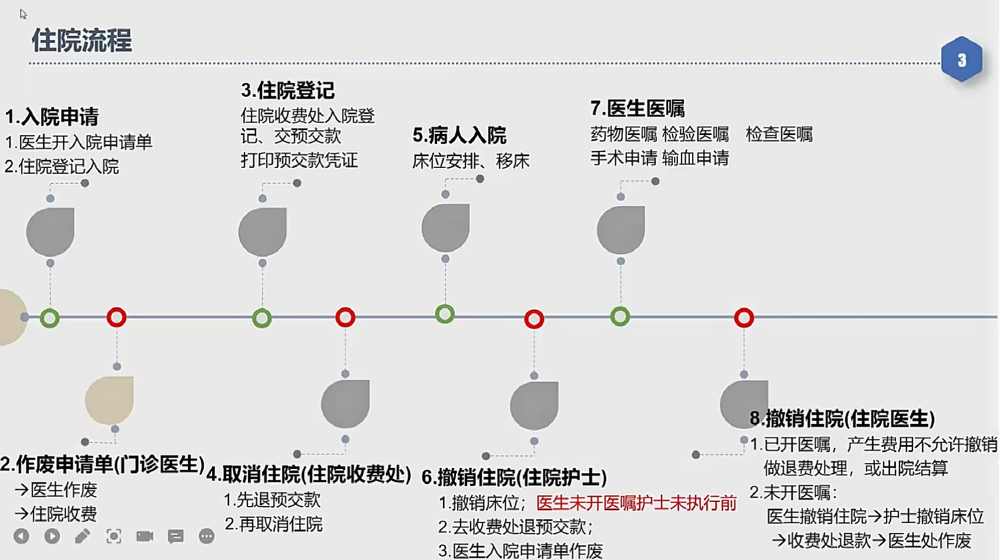

# his流程

## 住院

病人入院（包括：入院单，住院收费确认，护士入院安排，医生处理）

1. 住院收费（包括：病人入院，医保入院，预交款，清单打印，出院结算）
2. 住院医生（包括：药品医嘱，检查医嘱，治疗医嘱，手术申请）
3. 住院护士（包括：执行医嘱，补费用，出院处置）

如果医生开了药物或者检验检查，但是病人没有吃或者做检查，这时候要出院。

医院根据实际情况，让护士退费，退成0，医生撤销住院。

零费用无法走正常出院流程。

### 入院申请

**操作：**

 方式一：住院收费处登记入院　 ＜住院收费系统＞--[入院登记]

 方式二：医生开入院申请单    <门急诊医生系统>--[诊间处理]--[入院申请单]模块。

**涉及表：**

　his.pat_inpat_info --病人入院信息登记表

　 记录ZYLSH/PAT_ID/ZYH/ZY_CS/RY_BQ_ID/RY_KS_ID/CW_ID/STATUS 床位等信息

**关键点：**

　入院申请单确定提交的时候生成：

　   住院号(ZYH) ：例：0000042180,　住院号类似于PAT_ID,是该病人住院的唯一ID。　　

　   住院流水号(ZYLSH) ：46417、46418　每一次住院会生成一个新的住院流水号

​		ZYH是唯一的，ZYLSH 每次住院都会生成1个。

**病人类型：**0-普通病人入院

　 　　 	 1-留观病人入院

　       		2-血透病人入院 :有血透病房,物价有相应标准，一般不住在医院,需要设置一些特殊床位。

**病危情况：**危重/普通　　根据实际情况选择

**送入方式：**步行/担架/扶入/抱入/担架  根据实际情况选择

联系人/关系/联系方式：必填项，建议如实填写，方便有问题可以及时联系

入院诊断(ICD)：如果病人之前有门诊就诊记录,就会读取病人门诊诊断。

　　          		  如果病人没有门诊就诊记录,由门诊医生手动录入诊断信息。 什么是ICD? 

​							

预入院时间/入院科室/护理单元：准确选择相应的科室和病区。

**准生证号：** 如妇产科产妇入院的时候录入，根据情况填写。

**是否手术：**是否需要手术

**抗凝药物：**许多心血管疾病患者服用预防血液凝块的药物,

​         血液凝块可停留在血管内,阻断供给腿部、肺部或脑部的血液。

**申请单状态：**

0入院(开入院申请单); 　医生开了入院申请单，住院收费处未确认前的状态。

1住院收费处确认;   　　住院收费处住院登记，缴纳预交款后的状态。

2在院;    护士办理完入院登记，床位安排，医生在[病人列表］界面能看到病人了。

3医生开出院; 

4护士执行出院;

5出院结算;   护士费用审核完后，执行出院后的状态

9作废;

6转科中;　　医生开转科医嘱

7医生取消住院:　24小时内没有产生费用　才可以取消, 不统计入病历人次

8正在结算:　

`一个收费员在结算，另外一个收费员无法结算`

护士站和收费员都可以进行结算：

收费处结算可以收现金，护士站结算不允许收现金。

### 作废入院申请单

方式一：医生作废：<门急诊医生系统>--[诊间处理]--[入院申请单查询] 处右键作废。

方式二：护士作废：＜住院护士站＞--[病人管理] --[病人入院]选择病人右键作废申请单。

方式三：住院收费处：<住院收费>--[收费处理]--取消住院

**涉及表：**

　his.pat_inpat_info --病人入院信息登记表

　  记录ZYLSH/PAT_ID/ZYH/ZY_CS/RY_BQ_ID/RY_KS_ID/CW_ID/STATUS 床位等信息

### 住院登记

**操作：**

门诊医生开完入院申请单，这时候护士站已经能看到该申请单了，先不要安排床位，因为病人还没有进行入院登记。

按正常流程：患者需先到住院收费处 缴纳住院预缴款＼打印入院通知单，持预缴款凭证、入院通知单到护士处办理入院

**涉及表：**

1. HIS.OUTINPAT_ADVANCEPAY_RECORD where yl_lsh = ‘46418’门诊/住院预交金记录表 记录

　YL_LSH 医疗流水号 门急诊就诊访问记录表中的“留观流水号”或病人住院信息表中“住院流水号”   

　YJ_JE   预交金额  退还时是负金额 

　YJJ_STATUS  预交金状态  1 收取，2退还，4结转   5冲账转入  9重打作废

　YJJ_JS_STATUS 预交金状态  1 收取，2退还，4结转 5冲账转入  9重打作废

　SKY_ID  收款员ID 职工字典中的“职工ID” 

　PRNSTATUS 打印状态 

2. HIS.OUTINPAT_COST_PAYMENT 门诊/住院结算费用支付方式表 

　SELECT * FROM his.outinpat_cost_payment where pat_id = '948211' and patlsh = '46418'

### 取消住院（住院收费处)

**操作：**

1. 仅交预交款，护士未办理入院　可以**在住院收费处取消住院**。

住院收费处住院登记缴纳预缴款后，病人在［住院收费]模块才能 检索 到（没有预缴款的可以直接退）。这时候可以对病人 取消入院　操作，前提是先冲正预缴款。

　

**涉及表：**

1. HIS.OUTINPAT_ADVANCEPAY_RECORD where yl_lsh = ‘46418’门诊/住院预交金记录表 记录

　YL_LSH 医疗流水号 门急诊就诊访问记录表中的“留观流水号”或病人住院信息表中“住院流水号”   

　YJ_JE   预交金额  退还时是负金额 

　YJJ_STATUS  预交金状态  1 收取，2退还，4结转  5冲账转入  9重打作废

　YJJ_JS_STATUS 预交金状态  1 收取，2退还，4结转 5冲账转入  9重打作废

　SKY_ID  收款员ID 职工字典中的“职工ID” 

　PRNSTATUS 打印状态 

2. HIS.OUTINPAT_COST_PAYMENT 门诊/住院结算费用支付方式表 

　SELECT * FROM his.outinpat_cost_payment where pat_id = '948211' and patlsh = '46418'

## 药品信息流程

### 药库药品管理
#### 药品基础信息设置

#### 药品的入出库

#### 药品的调价

#### 药品相关信息设置

#### 药品的各类统计
