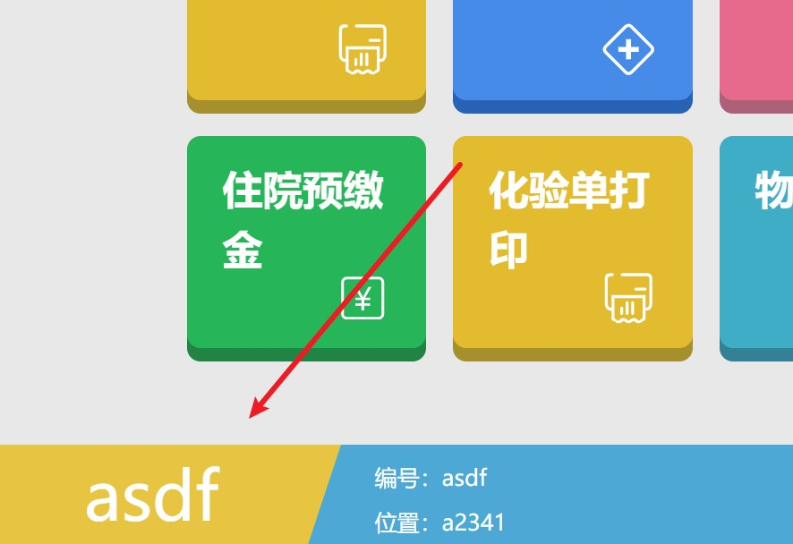
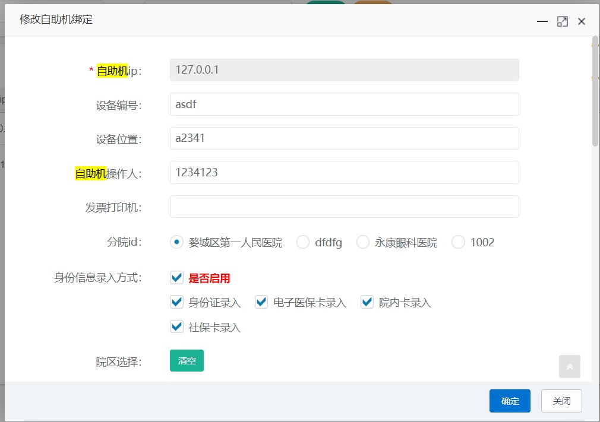

# 自助机流程说明

## 前端页面位置


## 自助机绑定

一般不会设置设备编号，设备位置，自助机操作人等




功能模块>>>自助机ip诊室设置>>>修改自助机绑定




## 接口位置

\jarboot\services\api-view-base\webapp\WEB-INF\api\ldzzj\solve


## 接口说明

### pat_info_zzj

```enjoy
### 获取病人信息 自动建档
#@setReqLog()	### 不记录日志

### 设置就诊卡类型变量ldzzj_card_type的值为请求参数中的ldzzj_card_type
#set(ldzzj_card_type=param.ldzzj_card_type)  

### 初始化就诊卡号变量jzkh为空字符串
#set(jzkh="")

### 判断如果就诊卡类型为"jzk"(就诊卡)
#if(ldzzj_card_type=="jzk")  
    ### 将就诊卡号jzkh设置为请求参数中的cardIdCode
    #set(jzkh=param.cardIdCode)  
#end

### 设置医保卡号变量ybkh的值为请求参数中的icCardNo
#set(ybkh=param.icCardNo)

### 判断如果就诊卡类型为"sbk"(社保卡)
#if(ldzzj_card_type=="sbk")
    ### 将医保卡号ybkh前面拼接上请求参数中的insuOrg(医保机构编号)
    #set(ybkh=param.insuOrg+ybkh)
#end

### 判断如果就诊卡类型为"dzsbk"(电子社保卡)
#if(ldzzj_card_type=="dzsbk")
    ### 将医保卡号ybkh设置为请求参数中的idCardNo(身份证号)
    #set(ybkh=param.idCardNo)  
#end

### 使用kitutil工具类的getStr方法获取请求参数中的birthTime(出生日期),并赋值给变量cardInfo_birthTime
#set(cardInfo_birthTime=kitutil.getStr(param.birthTime))

### 使用kitutil工具类的getStr方法获取请求参数中的sex(性别),并赋值给变量cardInfo_sex 
#set(cardInfo_sex=kitutil.getStr(param.sex))

### 将请求参数param赋值给变量data_param作为数据备份
#set(data_param=param)

### 重新设置请求参数param为一个包含以下属性的对象:
### ybkh: 医保卡号
### sfz_hm: 身份证号,取自原始请求参数的idCardNo
### pat_name: 患者姓名,取自原始请求参数的name
### jzkh: 就诊卡号
### jt_dh: 家庭电话,取自原始请求参数的jt_dh
#set(param={"ybkh":ybkh,"sfz_hm":param.idCardNo,"pat_name":param.name,"jzkh":jzkh,"jt_dh":param.jt_dh})

### 渲染名为"pat_info.html"的模板文件
#render("pat_info.html")
```

#### pat_info

```enjoy
###获取病人信息 自动建档
#@setReqLog()
#@setParam(["ybkh","sfz_hm","jt_dh","pat_name","jt_dz","jzkh"
,"province_id"
,"city_id"
,"area_id"
,"town_id"
])

#if(jzkh!="")
#sql_query_list("his")
#[[
select * from his.v_patinfo where jzkh=#para(jzkh) and del_flag = '0'
]]#
#end
#@check_empty("卡号已作废或不存在")
#end

#if(jzkh=="" && ybkh=="" && sfz_hm=="")
#@throwBusi("参数错误")
#end

#if(jt_dh!="")
#if(!cn.hutool.core.lang.Validator::isMatchRegex("^[0-9\-]+$",jt_dh))
#@throwBusi("手机号格式错误")
#end
#end

#set(sfz_hm_validate=true)

#if(sfz_hm!="")
###<建卡>
#@validate_blank_param(["sfz_hm","pat_name"])
#if(cn.hutool.core.util.IdcardUtil::isValidCard(sfz_hm))
    #set(cs_rq=cn.hutool.core.util.IdcardUtil::getBirthByIdCard(sfz_hm))
    #set(cs_rq=dbutil.toDate(cs_rq))
    #set(xb_id=cn.hutool.core.util.IdcardUtil::getGenderByIdCard(sfz_hm))
    #set(xb_id=kitutil.getStr(xb_id))
    #if(xb_id!="1")
    #set(xb_id="2")
    #end
#else
    #set(sfz_hm_validate=false)
    #if(cardInfo_birthTime!="" && cardInfo_birthTime!=null)
    #set(cs_rq=dbutil.toDate(cardInfo_birthTime.substring(0,10)))
    #end
    #if(cardInfo_sex!="" && cardInfo_sex!=null)
    #set(xb_id=cardInfo_sex)
    #end
#end


#set(pat_xzid='10')
#if(ybkh=="")
#set(mzh=sfz_hm)
#set(jzkh=sfz_hm)
#set(jzk_lx="2000")
#else
#set(mzh=ybkh)
#set(jzkh=ybkh)
#set(pat_xzid='10')
#set(jzk_lx="2000")
#end

#if(ybkh=="")
    #sql_query_list("his")
    #[[
        select jzkh from his.pat_tmkh where yxbz='0' and pat_id in (
            select pat_id from his.pat_info where sfz_hm = #para(sfz_hm) and del_flag='0'
        ) order by cjsj desc
    ]]#
    #end

    #if(!isEmpty(list))
    #set(jzkh=kitutil.getStr(list[0].JZKH))
    #end
#end

#sql_query_list("his")
#[[
select pat_id  from (
select a.jzkh,a.pat_id from his.pat_tmkh a,his.pat_info b where  a.pat_id=b.pat_id   and b.del_flag='0'
and a.jzkh=#para(jzkh) and a.yxbz='0'
)
]]#
#end
#set(now=dbutil.getNow())
#if(isEmpty(list))
    #sql_query_list("his")
    #[[
        select * from his.pat_info where  sfz_hm=#para(sfz_hm) and rownum=1
    ]]#
    #end

    #if(isEmpty(list))
    #if(ldzzj_card_type!="sfz")
    #render("pat_info_mi.html")
    #end
    #@getOracleSeq("his.patseq")
    #set(pat_id=kitutil.getStr(_seq))
    #set(ybkh="-"+pat_id)
    #set(pat_info={
    PAT_ID:pat_id,PAT_NAME:pat_name,
    XB_ID:xb_id,CS_RQ:cs_rq,ZY_ID:'90',GJ_ID:'01',
    PAT_XZID:pat_xzid,MZH:mzh,YBKH:ybkh,JZKH:mzh,
    PROVINCD_ID:'',
    CITY_ID:'',
    JT_DZ:jt_dz,
    JT_DH:jt_dh,
    ZJLX_ID:'01',
    ZJ_HM:sfz_hm,
    SFZ_HM:sfz_hm,
    DEL_FLAG:'0',
    CJSJ:now,
    ZHGXSJ:now,
    CJR:zzj_czr,
    ZHGXR:zzj_czr
    })
    #if(!sfz_hm_validate)
    #set(pat_info.put("SFZ_HM",""))
    #end
    #set(com.ld.plug.TableDbUtil::insert(pat_info,"his","his.pat_info"))
    #else
    #set(pat_id=list[0].PAT_ID)
    #set(pat_info=list[0])
    #end


#@busi_get_obj("his.pat_tmkh",["JZKH"],[mzh],"pat_tmkh")
#if(pat_tmkh.JZKH==null)
#set(pat_tmkh={PAT_ID:pat_id,JZKH:mzh,JZK_LX:jzk_lx,YXBZ:'0',CJSJ:now,CJR:zzj_czr,ZHGXSJ:now,
ZHGXR:zzj_czr
})
#set(com.ld.plug.TableDbUtil::insert(pat_tmkh,"his","his.pat_tmkh"))
#end
#end
###</建卡>
#end

#sql_query_list("his")
#[[
select * from his.v_patinfo where jzkh = #para(jzkh) and del_flag = '0'
]]#
#end

#@check_empty("找不到病人记录")

#@list_record(list)
#set(pat_record=record)

#if(pat_record.PAT_NAME!=pat_name && pat_name!="")
#@throwBusi("档案姓名验证不通过，请到窗口修改")
#end

#if(jt_dh!="")
#set(pat_record.set("JT_DH",jt_dh))
#set(pat_record.update("his","his.pat_info","PAT_ID"))
#end
#if(jt_dz!="")
#set(pat_record.set("JT_DZ",jt_dz))
#set(pat_record.set("PROVINCE_ID",province_id))
#set(pat_record.set("CITY_ID",city_id))
#set(pat_record.set("AREA_ID",area_id))
#set(pat_record.set("TOWN_ID",town_id))
#set(pat_record.update("his","his.pat_info","PAT_ID"))
#end


#set(pat_id=pat_record.PAT_ID)
#if(cs_rq!=null)
#set(cs_rq=cs_rq.toSqlDate())
#sql_update_rs("his")
#[[
update pat_info set cs_rq = #para(cs_rq),
hy_id=nvl(hy_id,'90')
where pat_id=#para(pat_id)
and rownum=1
]]#
#end
#end


#cache_plug("null","//",[],["ldzzj_syn_ip"])
#@sys_get("ldzzj_syn_ip")
#if(rs==null)
#@sys_set("ldzzj_syn_ip",{})
#end
#set(ldzzj_syn_ip=rs)
#end
#for(syn_item : ldzzj_syn_ip)
#set(syn_item_value=syn_item.value)
#if(syn_item_value.value==null)#continue#end
#set(dqsj=dbutil.currentTimeMillis())
#set(syn_item_sj=syn_item_value.sj)
#if(dqsj-syn_item_sj>120000)#continue#end
#if(kitutil.getStr(syn_item_value.value)==kitutil.getStr(pat_record.PAT_ID))
#bodyget_rs()
{"msg":"已在其他自助机上使用，请勿二次登陆","code":501}
#end
#set(json=kitutil.toJSONObject(rs))
#set(json.put("notify_msg","已在其他自助机上使用，请勿二次登陆"))
#set(json.put("notify_type","warn"))
#set(json.put("notify_timeout",300))
#@throwRs("application/json",kitutil.getStr(json))
#end
#end


#@busi_get_cache("DICTMANAGE.DICT_SEX",["XB_ID","DEL_FLAG"],[record.XB_ID,'0'],"dict_sex")
#@msg({
"XB":dict_sex.XB,
"PAT_NAME":pat_record.PAT_NAME,
"JZKH":jzkh,
"YXBZ":pat_record.YXBZ,
"SFZ_HM":pat_record.SFZ_HM,
"PAT_ID":pat_record.PAT_ID,
"JT_DH":pat_record.JT_DH,
"JT_DZ":pat_record.JT_DZ
})
```


#### 入参

```json
{
	"cardinfo": {},
	"ldzzj_card_type": "jzk",	// 卡类型
	"userinfo": {},		// 
	"cardidcode": "1"
}
```

#### 出参

```enjoy
```


### his.mzpb_ks

```enjoy
```

- 入参

```json
{
	"cardinfo": {
		"type": "jzk",
		"info": {
			"code": 200,
			"data": {
				"cardIdCode": "1"
			},
			"message": ""
		}
	},
	"pagesize": 24,
	"type": "today",
	"pagenum": 1,
	"userinfo": {
		"JT_DZ": "贵州省黔南布依族苗族自治州长顺县凯佐乡32",
		"JT_DH": "18367826765",
		"PAT_ID": "591610",
		"XB": "男",
		"SFZ_HM": "330102199003073092",
		"PAT_NAME": "测试卡号1",
		"YXBZ": "0",
		"JZKH": "1"
	}
}
```

- 出参

```json
{
	"total": 1,
	"rows": [{
		"KS_ID": "500",
		"KS_MC": "中医      ",
		"KS_HZ": "500",
		"HZ_MC": "中医      ",
		"PYM": "ZY",
		"ROWNUM_": 1
	}],
	"pym": ["Z"],
	"code": 200,
	"msg": "查询成功"
}
```


### his.mzpb_zs


- 入参

```json
{
	"cardinfo": {
		"type": "jzk",
		"info": {
			"code": 200,
			"data": {
				"cardIdCode": "123"
			},
			"message": ""
		}
	},
	"pym": "",
	"pagesize": 24,
	"ks_id": "500",
	"type": "today",
	"pagenum": 1,
	"userinfo": {
		"JT_DZ": "浙江省金华市婺城区安地镇安地村",
		"JT_DH": "123",
		"PAT_ID": "536329",
		"XB": "男",
		"SFZ_HM": "100000000000000000",
		"PAT_NAME": "测试病人",
		"YXBZ": "0",
		"JZKH": "123"
	}
}
```

- 出参

```json
{
	"total": 1,
	"rows": [{
		"ZS_ID": "1232",
		"ZS_MC": "中医科专家诊室 王春凤",
		"KS_HZ": "500",
		"HZ_MC": "中医      ",
		"PYM": "ZYKZJZSWCF",
		"ROWNUM_": "1",
		"is_show": false,
		"show_color": ""
	}],
	"content": "",
	"pym": ["Z"],
	"code": 200,
	"msg": "查询成功"
}
```


## 挂号流程

1. 输入就诊码    his.pat_info_zzj,his.mzpb_ks
2. 选择科室    his.mzpb_zs
3. 选择医生、号源    his.mzpb_hy_detail_today
4. his.outpat_register_zxt


## 数据库&视图

### his.v_patinfo

### his.pat_tmkh


