# 银湖问题手册

## 收费处

### 入院

1. 医保登记报错,该病人未查询到出院医生信息

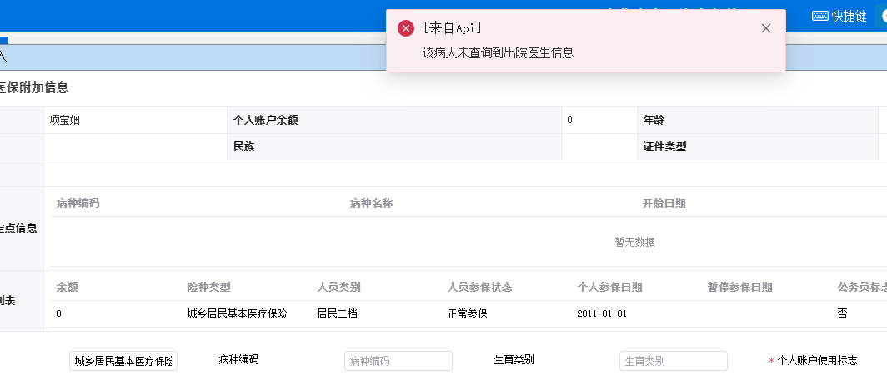

这次是因为入院申请的诊断医生自己填写，导致icd编码查询不到，无法上传医保。

无论是入院申请单还是门诊里的诊断都不能自己填写，一定要写系统提供的


```sql
select a.PRINCIPAL_DIAGNOSIS_CODE,a.PRINCIPAL_DIAGNOSIS,a.* from adt.INPATIENT a where pid= '77008261'; 
select i.clinic_diagnosis,i.CLINIC_DIAGNOSIS_CODE,i.* from adt.inpatient_other i where pid ='77008261'; 

select d.REAL_ICDCODE,d.* from dictmanage.dict_icd d where ICD_CODE like '%A09.901%' or JB_MC = '急性胃炎';
```


### 出院

1. 病人出院结算一直显示正在结算

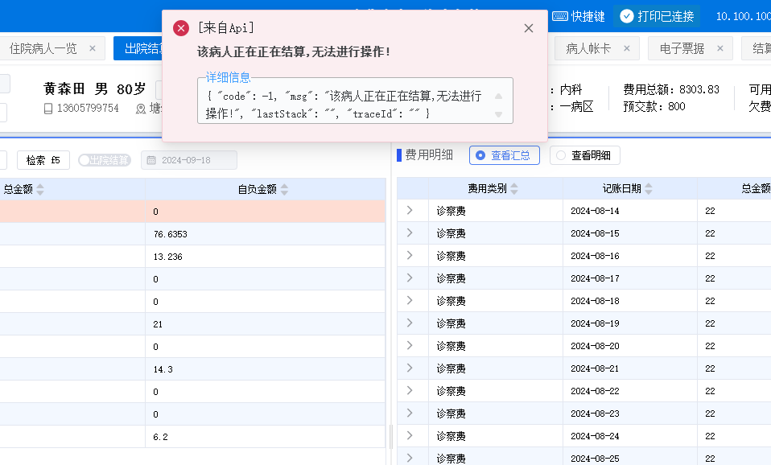

右边可以解锁

2. 拉回来之后出院，出院时间未改,显示就诊日期交叉

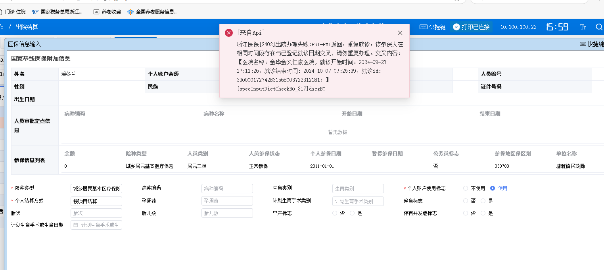

3. 出院时间不可早于费用发生时间

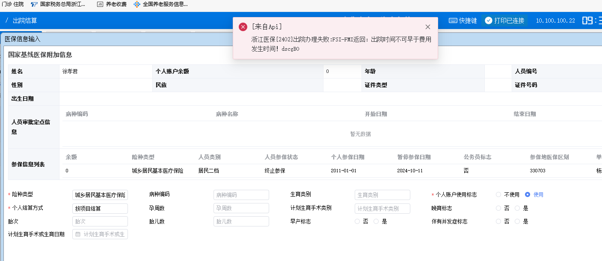

查询费用时间，只要不出院晚上就会有床位费和诊查费，将出院时间延后即可

4. 社保卡信息为空

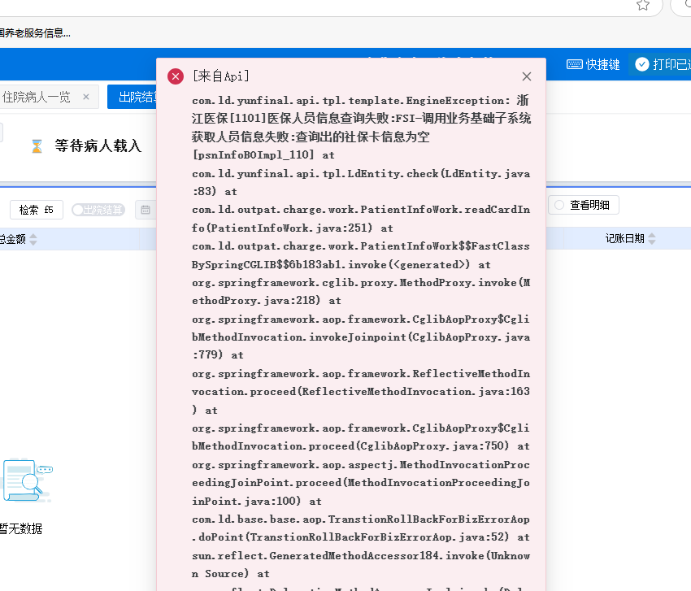


这个不是系统问题，是病人自己的医保卡问题

5. 出院结算  未查询到费用明细信息[HospSettB0_367]

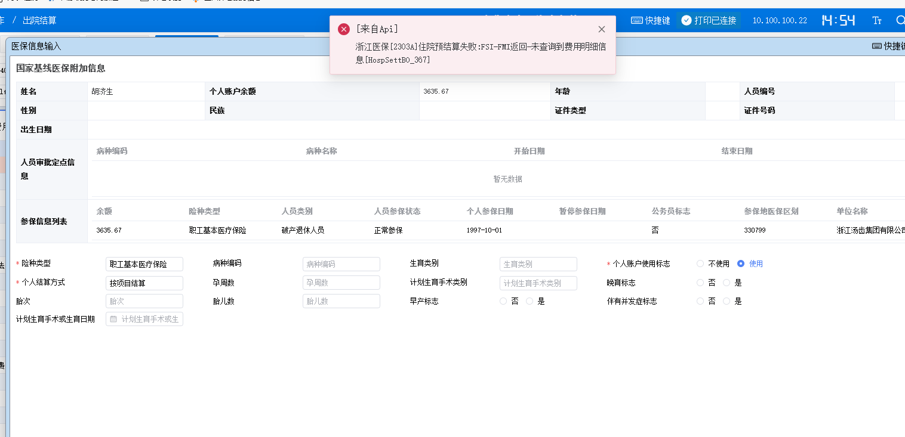

把费用明细表yb_scflag改成0 ，费用明细上传，代入住院流水号即可

```sql
UPDATE his.pat_inpat_order_cost a
SET a.YBSC_FLAG = '0'
WHERE a.fy_status in('2','7') and a.zylsh='3514955'
and a.ybsc_flag='2' and a.otherreceipt='0' and a.jsbz='0';
```

7. 未贯标

```sql
update his.PAT_INPAT_ORDER_COST c set SQ_YSID ='020' where c.ZXR_ID ='026' and SQ_YSID='026' and pat_id ='77005869';
```

9. 上传医保卡住不会动

```sql
select * from his.pat_inpat_info_extend where ZYLSH ='3516975';  // 修改FEE_UPL_TIM
```

10. 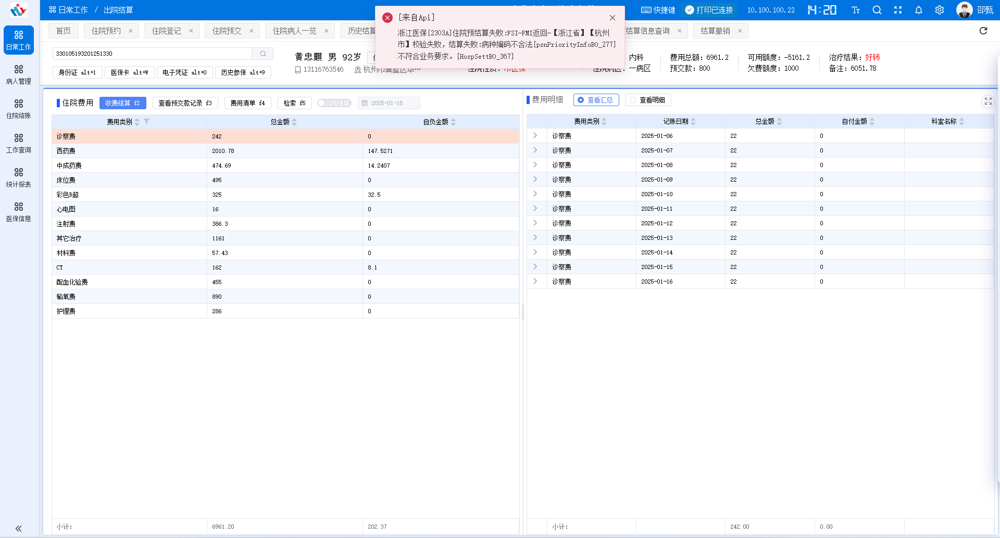

杭州医保糖尿病不能作为次诊断，有些z开头的诊断也不能开

```sql
select * from his.mi_tradelog where infno='2303A' and ref_time>=trunc(sysdate) and ipt_otp_id='3517636'
select * from his.mi_tradelog where infno='2402' and ref_time>=trunc(sysdate) and ipt_otp_id='3517636'

select * from his.mi_tradelog where pat_id='77004268' and ref_time>=trunc(sysdate)

select * from his.mipat_inout_record where ipt_id in ('3517636','3517288')

select * from his.mi_tradelog where infno='2304A' and pat_id='77004268'

select * from his.mipat_inout_record where pat_id='77004268'

select a.*,rowid from inpcase.inp_diag a where ipid='3517636'
```


### 其他

1. 自费比例

基本医疗保险统筹基金支付比例就是自费比例

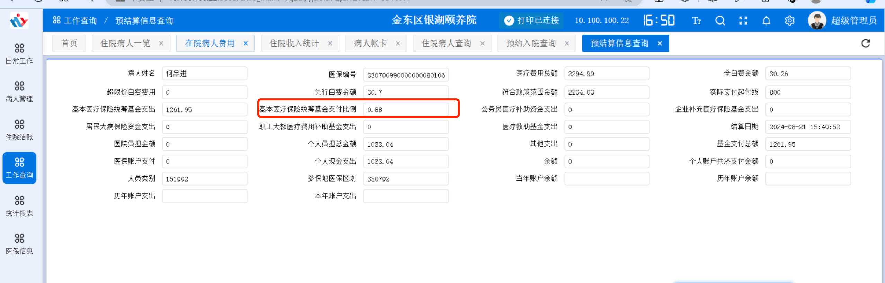


## 门诊医生站

1. 历史就诊内找不到改病历

ICD编码为空，填入诊断对应的ICD编码

```sql
select * from his.OUTPAT_ZD_RECORD where PAT_ID = '77007688'; -- 写入icd编码
select o.zdms,o.* from his.OUTPAT_ZD_RECORD o where zdms like '%冠状%';  -- 查找医保编码
```

2. 体检不能走医保

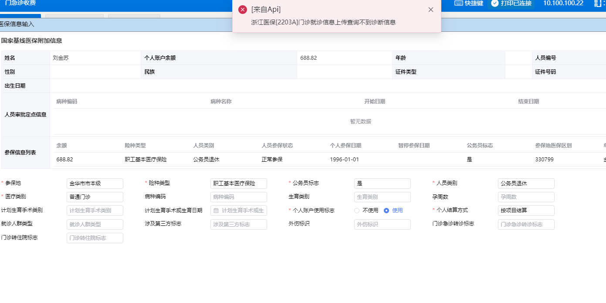

门诊医生站医生开的诊断是体检，体检系统里没有，他自己写的，无法走医保


## 医保相关

1. 医保费用上传卡死，未上传条数很久都没有变化

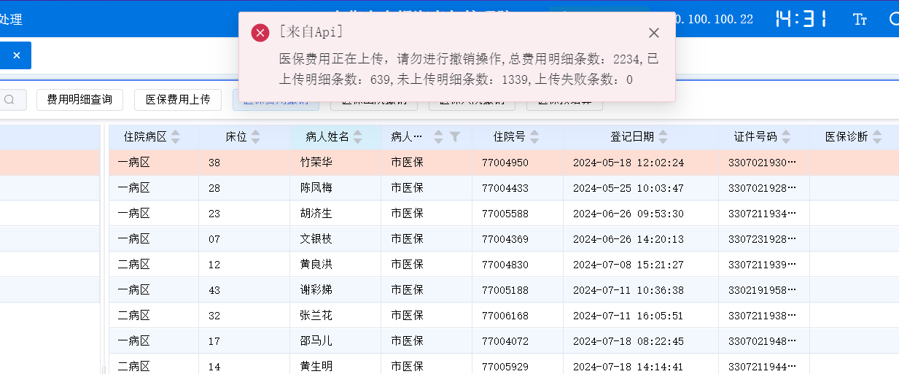

清空扩展表的上传时间，重新上传

```sql
select e.FEE_UPL_TIME,e.* from his.pat_inpat_info_extend e where pat_id ='xxx';
```

2. 当前人员状态为[死亡]，死亡日期[20240910]，无法办理当前业务dscgBo

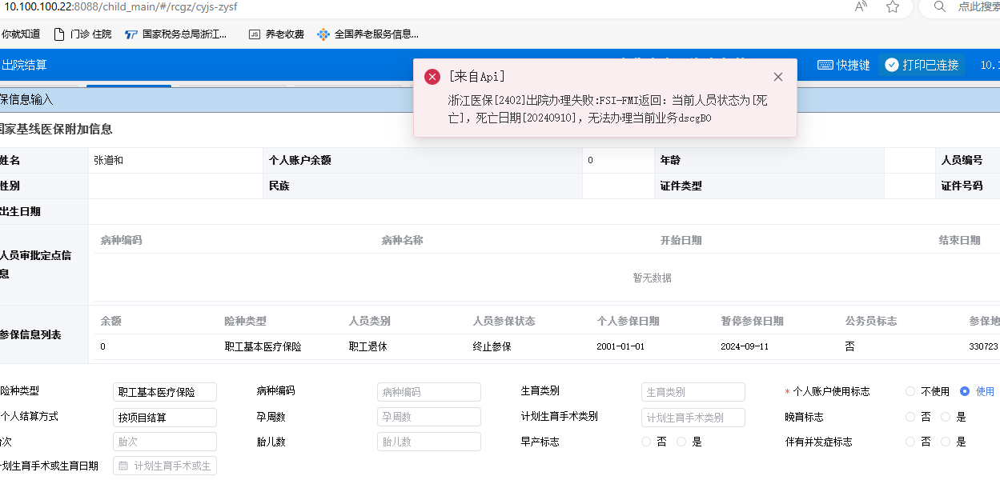

出院日期改为死亡日期6小时内

3. 出院时间不可早于费用R发生时间!dscgB0

*之前是因为病人死亡且医生第二天中午才结束医嘱只能修改数据*

修改费用时间时间早于出院时间

```sql
select * from his.pat_inpat_order_cost;
select * from his.pat_inpat_order_info;
select * from inpord.MEDICAL_ORDER;
-- 修改时间相关字段
```

4. 显示入院诊断为空但是记录中有

误点24小时出入院记录，优先取24小时出入院，如果不是当天出院的话删除24小时出入院记录即可

5. 预结算为0

医保病人处理里撤销后重新上传

6. 医保账不平

医保管理系统—审批工作—医保对账

选择对账明细，选择账不平的那天。

先点击对账明细，看下门诊/住院里 不平和中心多有没有条目，有的话冲正就可以了，再去对总账刷新一下就好了


## DRGS上传问题

1. 主诊医师代码chfpdr_code不能为空

   该病人管床医生为空或者没有资质

2. 


## 药房


## 检验科

1. 打印条码为空，门诊，核收时未写入lab_outinpat_apply 申请单表

```sql
select a.yz_status,a.* from his.OUTPAT_ORDER a where YZJL_ID = '31941944'; -- 修改yz_status，然后重新核收
```


## 医技

1. 门诊病人有申请单但是医技模块下没有费用核收

先去收费处收费


## 医生站

1. 病历系统多开，无法开医嘱，卡死

```sql
select 'alter system kill session ''' || SID ||',' || SERIAL# || ''';' from
(select distinct a.sid, a.Serial#, status, machine, LOCKWAIT, logon_time
  from v$session a, v$locked_object b
 where (a.status = 'ACTIVE' or a.status = 'INACTIVE')
   and a.sid = b.session_id )
-- 通过以上sql查询出锁表，将得到的语句拿出来执行
```

2. 修改医嘱医师名字

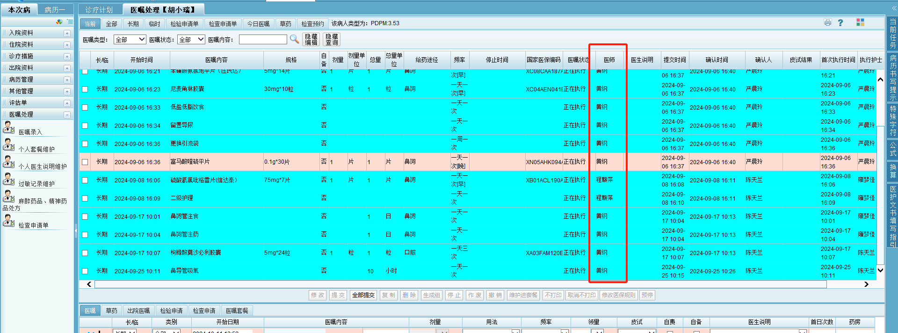

```sql
select o.SUBMIT_ID,o.SUBMIT_NAME,o.* from INPORD.MEDICAL_ORDER o where o.PID = '77004090' and CREATOR_NAME like '%黄纲%' and STOP_TIME like '%202410110956%';

-- 可以通过时间，创建人姓名，PID等查询该条记录
-- 修改SUBMIT_ID为该医生工号，修改SUBMIT_NAME为该医生姓名
```

3. 入院记录已提交，如何删除

```sql
-- 修改 Inpcase.hospital_record 入院记录表的提交标识 以及其他相关字段
```

4. 病人医嘱锁，解锁

   病历系统>>>CPOE管理员>>>业务维护管理>>>医嘱操作锁管理>>>解锁

   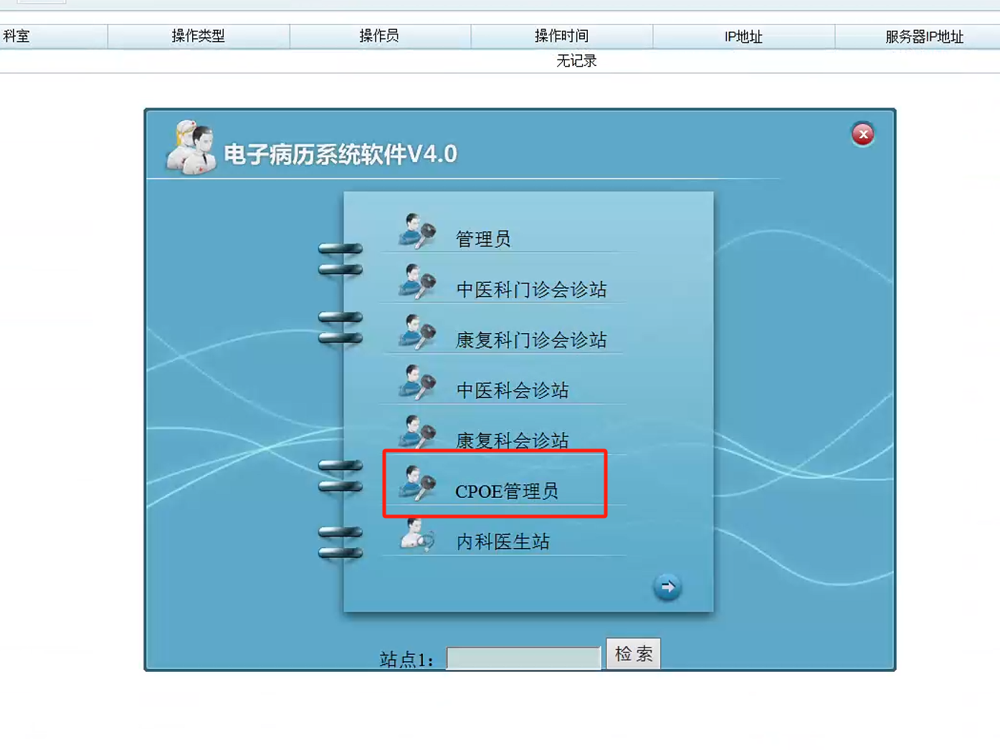

   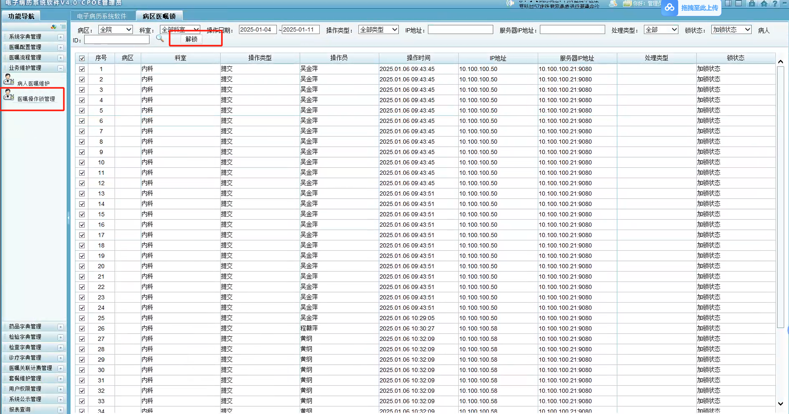


## 护士站

1. 出院结算校验数据时显示数据加载失败

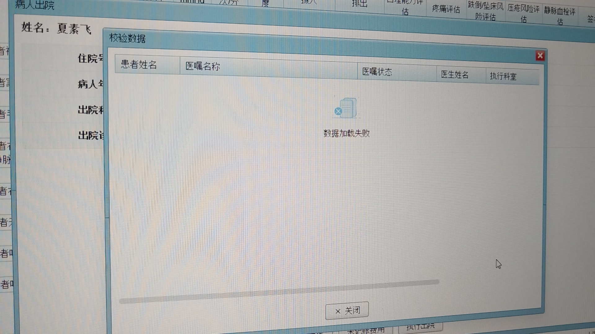

```sql
select a.* from HIS.PAT_INPAT_BED_CHANGE a where zylsh='3515658';  -- 根据住院流水号查询床位记录id
select a.* from DICTMANAGE.DICT_BED_DEPART a where CWjl_id='10784'; -- 修改该床位记录id的信息
-- 修改state 为1 , 填入pat_id,ZYLSH
```

2. 自带药作废，护士无法确认，无法作废自带药摆药明细


```sql
select d.zx_status,d.* from his.inpat_order_act_detail d where d.PAT_ID ='77008261' and YZ_MC like '%非布司%';
-- 将 zx_status 改为 9
```

3. 费用查询所有自费比例变成1

定时任务有上传医保，会把自费比例变成医保返回的数值。所有费用一开始默认都为1。如果卡了几天都没动的话。去ldapi定时任务里手动执行一次

4. 护士站页面配置

   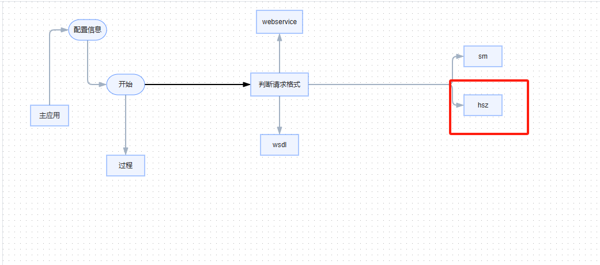


## 其他

分区，每年增加

```sql
ALTER TABLE his.material_inoutdepot
ADD PARTITION PRT_WZDEPOT_12 VALUES LESS THAN (2026)
TABLESPACE his
PCTFREE 10
INITRANS 1
MAXTRANS 255
STORAGE (
  INITIAL 256K
  NEXT 1M
  MINEXTENTS 1
  MAXEXTENTS UNLIMITED
);
```

