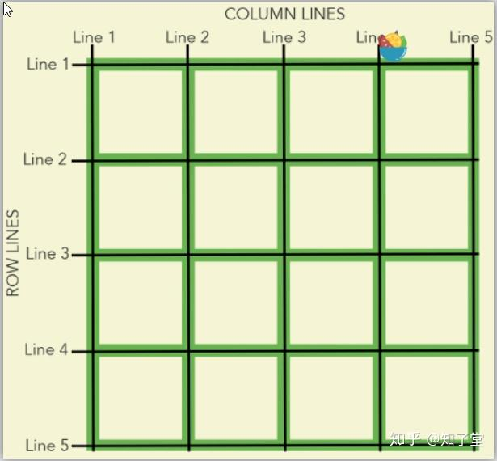
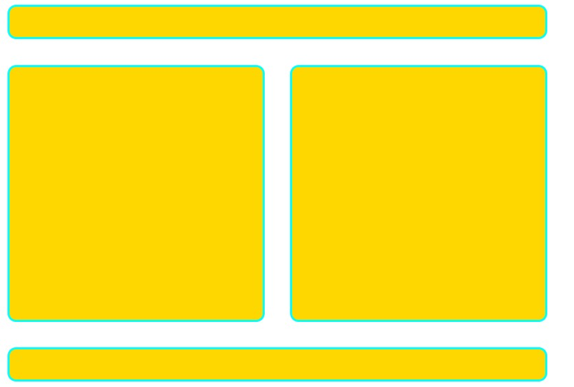
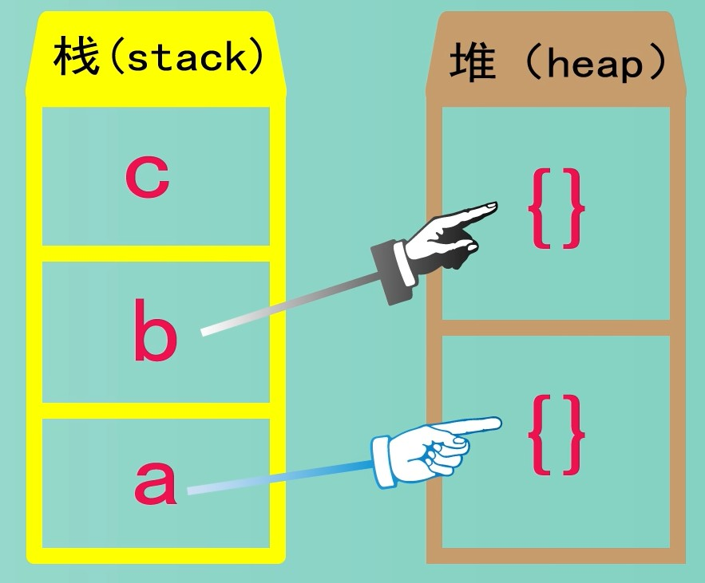

# html

## 元素分类

### 行内元素

#### **特点**

行内元素也称内联元素，其特点是不会占据一行，也不强迫其他标签在新的一行显示，一般<span style="color:red">不可以设置宽度、高度、对齐等属性</span>，靠文本内容大小和图像尺寸填充，常用于控制页面中文本的样式。

- 相邻行内元素在一行，一行可以显示多个。
- 高度、宽度的设置无效，只会被文字撑开。
- 默认宽度就是文本撑开的长度

#### 元素

- `<a>` - 超链接
- `<b>`, `<strong>` - 加粗文本
- `<i>`, `<em>` - 斜体文本
- `<span>` - 通用行内容器
- `` - 图片
- `<input>` - 输入框
- `<label>` - 表单控件标签
- `<select>` - 下拉选择框
- `<textarea>` - 多行文本输入框
- `<code>` - 代码片段
- `<sub>`, `<sup>` - 下标、上标文本
- `<br>` - 换行符
- `<button>` - 按钮

### 块元素

#### 特点

在页面中以区域块的形式出现，其特点是每个块元素通常都会独占一行或多行，可以对其设置宽度、高度、对齐等属性，常用于网页布局和网页结构的搭建。

- 自身独占一行
- 高度、宽度、内外边距都可以自定义
- 宽度默认是父元素的100%

#### 元素

- `<div>` - 通用块级容器
- `<p>` - 段落
- `<h1>` ~ `<h6>` - 标题
- `<ol>` - html有序列表
- `<ul>` - 无序列表
- `<li>` - 列表项，放在`<ol>`或者`<ul>`中
- `<table>` - 表格
- `<form>` - 表单
- `<hr>` - 水平分割线
- `<pre>` - 预格式化文本块
- `<blockquote>` - 长引用
- `<address>` - 联系方式信息
- `<article>`, `<section>`, `<nav>`, `<aside>`, `<header>`, `<footer>` - HTML5 语义化元素


### 行内块元素

#### 特点

既可以像块元素那样设置宽高，又可以像行内元素那样不独占一行。

- 和相邻的行内元素（包含行内块）在一行上，它们直接会有空白缝隙
- 一行可以显示多个（行内元素特点）
- 默认宽度就是内容的宽度（行内元素特点）
- 高度、宽度、内外边距都可以自定义（块元素特点）

#### 元素

- `` - 图片
- `<input>` - 输入框
- `<button>` - 按钮
- `<select>` - 下拉选择框
- `<textarea>` - 多行文本框

1. 和相邻行内块元素再一行显示，但是他们之间会有空白缝隙。一行上可显示多个。
2. 默认宽度就是它本身内容的宽度。
3. 高度，宽度，行高，内边距，外边距都可以自己控制。

4. 在布局上表现得像一个行内元素(如文本),但同时也能像块级元素一样设置宽度、高度等属性。


# css

## 选择器

1. 类选择器（Class Selectors）：
   - .className { ... } 选择所有具有class="className"的元素
   - p.intro { ... } 选择所有具有class="intro"的 <p> 元素

2. 属性选择器（Attribute Selectors）：
   - [attribute] { ... } 选择具有指定属性的元素
   - [attribute="value"] { ... } 选择具有指定属性和值的元素
   - [attribute~="value"] { ... } 选择属性值包含指定词汇的元素
   - [attribute^="value"] { ... } 选择属性值以指定值开头的元素
   - [attribute$="value"] { ... } 选择属性值以指定值结尾的元素
   - [attribute*="value"] { ... } 选择属性值包含指定值的元素
3. 后代选择器：
   - div p { ... } 选择div内部的所有p元素
4. 子元素选择器（Child Selectors）：
   - parent > child { ... } 选择parent元素的直接子元素child
5. 相邻兄弟选择器（Adjacent Sibling Selectors）：
   - element1 + element2 { ... } 选择紧跟在element1后面的element2元素
6. 通用兄弟选择器（General Sibling Selectors）：
   - element1 ~ element2 { ... } 选择element1之后的所有element2同级元素
7. 伪类选择器（Pseudo-classes）：
   - :hover { ... } 选择鼠标悬停的元素
   - :active { ... } 选择被激活的元素
   - :focus { ... } 选择获得焦点的元素
   - :first-child { ... } 选择父元素的第一个子元素
   - :last-child { ... } 选择父元素的最后一个子元素
   - :nth-child(n) { ... } 选择父元素的第n个子元素
   - :nth-last-child(n) { ... } 选择父元素的倒数第n个子元素
   - :first-of-type { ... } 选择父元素下第一个指定类型的子元素
   - :last-of-type { ... } 选择父元素下最后一个指定类型的子元素
   - :only-child { ... } 选择父元素下唯一的子元素
   - :only-of-type { ... } 选择父元素下唯一指定类型的子元素
   - :not(selector) { ... } 对selector取反


## 属性

###  height: 100vh

 height: 100vh; /* 设置容器高度为视口高度 */


### position

1. static（默认值）:
   - 元素按照正常的文档流进行排列
   - top、bottom、left、right属性无效
2. relative:
   - 元素按照正常的文档流进行排列
   - 可以使用top、bottom、left、right属性相对于其正常位置进行偏移
   - 元素原本所占的空间仍然保留
3. absolute:
   - 元素脱离文档流
   - 可以使用top、bottom、left、right属性相对于最近的非static定位祖先元素进行偏移
   - 如果没有非static定位的祖先元素，则相对于初始包含块（通常是视口）进行偏移
   - 元素原本所占的空间不再保留
4. fixed:
   - 元素脱离文档流
   - 可以使用top、bottom、left、right属性相对于浏览器窗口进行偏移
   - 元素原本所占的空间不再保留
   - <span style="color:red">即使页面滚动，元素仍然保持在固定位置</span>
5. sticky（CSS3新增）:
   - 元素在跨越特定阈值前为相对定位，之后为固定定位
   - 可以使用top、bottom、left、right属性定义偏移量
   - 常用于创建粘性头部或侧边栏，当页面滚动到一定位置时，元素会固定在屏幕上


### overflow

可以用于任何块级或内联块级元素

1. **visible**: 默认值，内容不会被剪裁，会溢出元素框。
2. **hidden**: 内容会被剪裁，超出部分不可见。
3. **scroll**: 内容会被剪裁，但会出现滚动条（无论是否需要）。
4. **auto**: 当内容溢出时，会自动显示滚动条，否则不显示。
5. **clip**: 类似于 `hidden`，但是不允许滚动。


### white-space

1. `white-space: normal`（默认值）:
   - 连续的空白字符会被合并为一个
   - 换行符会被当作空白字符处理
   - 必要时会对文本进行换行，以适应容器宽度
2. `white-space: nowrap`:
   - 连续的空白字符会被合并为一个
   - 换行符会被当作空白字符处理
   - 文本不会自动换行，除非遇到 `<br>` 标签
3. `white-space: pre`:
   - 连续的空白字符会被保留
   - 换行符会被保留
   - 文本只在遇到换行符时才换行
4. `white-space: pre-wrap`:
   - 连续的空白字符会被保留
   - 换行符会被保留
   - 文本会在必要时自动换行，并在遇到换行符时换行
5. `white-space: pre-line`:
   - 连续的空白字符会被合并为一个
   - 换行符会被保留
   - 文本会在必要时自动换行，并在遇到换行符时换行
6. `white-space: break-spaces`（CSS3新增）:
   - 连续的空白字符会被保留
   - 换行符会被当作空白字符处理
   - 文本会在必要时自动换行，并在遇到换行符时换行
   - 任何保留的空白序列总是会占用空间，包括在行尾


### font

#### font-weight (字体粗细设置)

font-weight: normal / bold / bolder / lighter / 数字值(从100到900的整数) 


### transform 形变

#### 位移 translate(x,y)

```css
.d1 {
    width: 100px;
    height: 100px;
    background-color: aqua;
    position: absolute;
    left: 50%;
    top: 50%;
    transform: translate(-50%, -50%);
}
```


#### 缩放 scale(x,y)

- 可以改变元素的大小
- 一个值为x轴的缩放
- 二个值为x轴和y轴的缩放
- 数字：1表示不变，0.5表示缩小一班，2表示放大一倍
- 百分比，不常用，也可以设置

```css
.d1 {
    width: 100px;
    height: 100px;
    background-color: aqua;
    position: absolute;
    left: 50%;
    top: 50%;
    transform: translate(-50%, -50%);
    transform: scale(0.5,0.5);
}
```


#### 旋转 rotate(角度)

- 旋转：rotate

  - 一个值，表示旋转的角度
  - 常用单位为deg表示角度，一个圆为360deg
  - 正数为顺时针旋转
  - 负数为逆时针旋转
  - 也可以使用其他单位

  *90deg = 100grad = 0.25turn = 1.5708rad*

```css
.d1 {
    width: 100px;
    height: 100px;
    background-color: aqua;
    position: absolute;
    left: 50%;
    top: 50%;
    transform: translate(-50%, -50%);
    transform: rotate(45deg);
}
```

#### transform-origin

设置变换中心

```css
transform-origin: center;
transform-origin: left top; /* 设置原点为元素的左上角 */
```


## 颜色渐变

1. 线性渐变 linear-gradient

```css
.linear-gradient {
  width: 300px;
  height: 150px;
  background: linear-gradient(to right, red, orange, yellow, green, blue, indigo, violet);
}
```

第一个参数为渐变方向

1. 角度值 (Angle):
   - 使用 "deg" 单位指定角度,如 "45deg"。
   - 0deg 表示从下到上,90deg 表示从左到右,180deg 表示从上到下,270deg 表示从右到左。
   - 也可以使用负值,如 "-45deg",表示逆时针旋转45度。
2. 方位关键字 (Directional Keywords):
   - "to top": 从下到上渐变。
   - "to right": 从左到右渐变。
   - "to bottom": 从上到下渐变。(默认值)
   - "to left": 从右到左渐变。
   - "to top right": 从左下角到右上角渐变。
   - "to bottom right": 从左上角到右下角渐变。
   - "to bottom left": 从右上角到左下角渐变。
   - "to top left": 从右下角到左上角渐变。

2. 径向渐变 (Radial Gradient)

```css
.radial-gradient {
  width: 300px;
  height: 300px;
  background: radial-gradient(circle, red, yellow, green);
}
```


## border

```css
border: 1px solid black;
```

这三项顺序可随意更改

分别代表 `border-width`、`border-style`、`border-color`

### border-style

- `solid`：实线

- `dotted`：点状边框
- `dashed`：虚线边框
- `double`：双实线边框
- `groove`：凹槽边框
- `ridge`：脊状边框
- `inset`：内嵌边框
- `outset`：外嵌边框
- `none`：无边框
- `hidden`：隐藏边框


## display : table

```html
<style>
  .table {
    display: table;
    border: 1px solid #cccccc;
    margin: 5px;
  }

  .row {
    display: table-row;
    border: 1px solid #cccccc;
  }

  .cell {
    display: table-cell;
    border: 1px solid #cccccc;
    padding: 5px;
  }
</style>

<div class="row">
  <div class="cell">张三</div>
  <div class="cell">李四</div>
  <div class="cell">王五</div>
</div>
<div class="cell">张三</div>
<div class="cell">李四</div>
<div class="cell">王五</div>

```


## table

### border-collapse

- 用于决定表格单元格的边框是否合并为一个单一的边框。
- 可能的值包括：
  - `separate`（默认值）：单元格之间的边框独立，不合并。
  - `collapse`：相邻单元格的边框合并为一个单一的边框。

```css
border-collapse: collapse / separate;
```

### border-spacing

- 用于设置相邻单元格边框之间的间距。
- 接受一个或两个长度值：
  - 如果提供一个值，表示水平和垂直方向的间距相同。
  - 如果提供两个值，第一个值表示水平间距，第二个值表示垂直间距。
- 默认值为 `0`，即单元格之间没有间距。
- 仅在 `border-collapse` 为 `separate` 时生效。


## BFC

**Block format context ，块级格式上下文**

一块独立渲染区域，触发bfc的元素会形成一个独立的渲染区域，这个区域里面的元素（包括他自己）不会影响外部元素的渲染，

什么情况下，会形成bfc区域呢？

1. 当添加了float属性，且float不为none时

2. 块元素添加overflow属性，且属性不能为visible（hidden、auto、scroll）

3. 类型强制转换：display：inline-block、、table-cell、table-caption；

4. 添加定位，positio值为absolute或fixed

5. 有根元素、父元素或其他包含元素
   

### 作用

1. 避免外边距重叠
2. 容纳浮动元素

```html
<div style="border: 2px solid red;overflow: hidden;">
    <div style="width: 100px;height: 100px;float: left;">
    </div>
</div>
```

3. 阻止文字环绕

4. 自适应两栏布局

 


## 盒模型

### 盒模型宽度计算

计算div1的`offsetWidth`

```html
<style>
    #div1{
        width: 100px;
        padding: 10px;
        border: 1px solid #ccc;
        margin: 10px;
    }
</style>

<div id="div1">    
</div>
```

offsetWidth = (width + padding + border)  = (100px + 10px *2 + 1px * 2) = 122px

#### offsetWidth

offsetWidth =（内容宽度+内边距+边框） 无外边距

offsetWidth = (width + padding + border)  无margin


### margin

#### margin纵向重叠

求AAA和BBB之间的距离

```html
<style>
    p {
        font-size: 16px;
        line-height: 1;
        margin-top: 10px;
        margin-bottom: 15px;
    }
</style>

<p>AAA</p>
<p></p>
<p></p>
<p></p>
<p>BBB</p>

// 答案15px
```

相邻元素的`margin-top`和`margin-bottom`会发生重叠

空白的`<p>`也会重叠


#### margin负值

- `margin-top`,`margin-left`设置负值，元素向上、向左移动

- `margin-bottom `负值，下方元素上移，自身不受影响
- `maring-right`负值，右方元素左移，自身不受影响


#### margin: auto


### box-sizing

以特定的方式定义匹配某个区域的特定元素

默认值: content-box

#### content-box（默认）

```css
box-sizing:  content-box
```

padding和border不被包含在定义的width和height之内。对象的实际宽度等于设置的width值和border、padding之和，即 ( Element width = width + border + padding)

#### border-box

```css
box-sizing:  border-box
```

padding和border被包含在定义的width和height之内。对象的实际宽度就等于设置的width值，即使定义有border和padding也不会改变对象的实际宽度，即 ( Element width = width )

offsetWidth等于width

#### inherit

规定从父元素继承此值。继承父亲box-sizing 属性值

```css
box-sizing: inherit
```

## 函数

### attr

用于获取所选元素的属性值并将其用作样式的内容。它通常与 `content` 属性一起使用，可以在伪元素中显示元素的属性值

```css
<style>
  a::after {
    content: " (" attr(href) ")";
  }
</style>

<a href="https://www.example.com">链接到 Example 网站</a>
```

- `content: " (" attr(href) ")";` 将伪元素的内容设置为括号中的链接 URL。这里，`attr(href)` 获取了 `<a>` 元素的 `href` 属性的值。

## img

### 当src为空时，alt显示其他内容

```css
img::before {
    content: attr(alt);
    display: inline-block;
    width: 90px;
    height: 90px;
    line-height: 90px;
    text-align: center;
    background-color: aqua;
    color: black;
    font-size: 14px;
    font-weight: bold;
}
```

- `content: attr(alt);` 将 `alt` 属性的值设置为伪元素的内容。
- `display: inline-block;` 确保伪元素与图片在同一行。
- `width` 和 `height` 与图片的尺寸相同。
- `line-height` 与 `height` 相同，以垂直居中文本。
- `text-align: center;` 水平居中文本。
- `background-color: blue;` 设置蓝色背景。
- `color: black;` 设置黑色文本。
- `font-size` 和 `font-weight` 设置字体大小和粗细。


## 布局

### flex布局

#### flex:1

等同于: flex: 1 1 0

**flex: 1** 实际上是三个属性的缩写：**flex-grow: 1; flex-shrink: 1 flex-basis: auto;**

#### flex-grow

这个属性规定了 flex-grow 项在 flex 容器中分配剩余空间的相对比例。 主尺寸是项的宽度或高度，剩余空间是 flex 容器的大小减去所有 flex 项的大小加起来的大小。如果所有的兄弟项目都有相同的 flex-grow 系数，那么所有的项目将剩余空间按相同比例分配，否则将根据不同的 flex-grow 定义的比例进行分配。

- 属性值：`负值无效，默认为 0`

- 公式就是：`原始宽度 + （剩余空间 / 总共分成多少份 * 当前元素所占 分数）`


#### flex-shrink

flex-shrink 属性指定了 flex 元素的`收缩规则`。flex 元素仅在默认宽度之和大于容器的时候才会发生收缩，其收缩的大小是依据 flex-shrink 的值。

- 属性值：`负值无效，默认值为 1`

- 公式就是：

  `缩小比例 = (flex item的flex-shrink值* flex item 的基准宽度)/所有 flex item 的 (flex-shrink 值 * 基准宽度)之和`

```vue
<template>
    <div class="d1">
        <div class="left">left</div>
        <div class="center">center</div>
        <div class="right">right</div>
    </div>
</template>

<script setup lang="ts">

</script>

<style lang="scss" scoped>
.d1{
    display: flex;
    flex-direction: row;
    margin-top:30px;
    width:500px;

}
.d1>div{
    height:100px;
    width:200px;
}
.left{
    background-color: yellow;
    flex-shrink:1;
}
.center{
    background-color: darkcyan;
    flex-shrink:1;
}
.right{
    background-color: red;
    flex-shrink:2;
}
</style>
```

外层div 500px,内层三个 div 每个200px。

flex-shrink分别是 1、1、2

计算步骤:

1. 计算内层 div 的总宽度:
   200px + 200px + 200px = 600px
2. 计算超出的宽度:
   600px - 500px = 100px
3. 计算每个 div 的 (flex-shrink * 基准宽度) 值:
   - .left: 1 * 200 = 200
   - .center: 1 * 200 = 200
   - .right: 2 * 200 = 400
4. 计算 (flex-shrink * 基准宽度) 的总和:
   200 + 200 + 400 = 800
5. 计算每个 div 的缩小比例:
   - .left 的缩小比例 = 200 / 800 = 0.25
   - .center 的缩小比例 = 200 / 800 = 0.25
   - .right 的缩小比例 = 400 / 800 = 0.5
6. 计算每个 div 需要缩小的宽度:
   - .left 需要缩小的宽度 = 100px * 0.25 = 25px
   - .center 需要缩小的宽度 = 100px * 0.25 = 25px
   - .right 需要缩小的宽度 = 100px * 0.5 = 50px
7. 计算每个 div 的最终宽度:
   - .left 的最终宽度 = 200px - 25px = 175px
   - .center 的最终宽度 = 200px - 25px = 175px
   - .right 的最终宽度 = 200px - 50px = 150px

因此,在这个页面中,每个 div 的最终宽度为:

- .left: 175px
- .center: 175px
- .right: 150px


#### flex-basis

CSS 属性 flex-basis 指定了 flex 元素在主轴方向上的`初始大小`。如果不使用 box-sizing 改变盒模型的话，那么这个属性就决定了 flex 元素的内容盒（content-box）的尺寸。

在 flex item 上,如果同时设置了 flex-basis 和 width,flex-basis 会覆盖 width

flex-basis:  0 / auto / 200px;


### grid布局

#### 父元素属性

##### display: grid | inline-grid

- `grid`：声明一个块级Grid容器，占用整个父容器的宽度。
- `inline-grid`：声明一个内联Grid容器，类似于其他内联元素，可随文本流布局。


##### grid-template-columns 和 grid-template-rows

```css
.grid-container {
  grid-template-columns: [line-name-start] length | percentage | fr | auto ... [line-name-end];
  grid-template-rows: [line-name-start] length | percentage | fr | auto ... [line-name-end];
}
```

- 这两个属性用于定义网格的列和行数以及大小，支持多种单位，包括像素值、百分比、fr（fraction单位，表示网格轨道占总轨道的比例）和auto（根自动调整大小）。括号内的`line-name`可用于命名网格线。

```css
.grid-container {
  grid-template-columns: 1fr 1fr 1fr 1fr 1fr;
  // grid-template-columns: repeat(5,1fr);
  // grid-template-columns: repeat(auto-fill,150px);
  // grid-template-columns: auto auto auto auto auto;  自动调整列宽
  // grid-template-columns: 20% 20% 20% 20% 20%;
  // grid-template-columns: 100px 100px 100px 100px 100px; 像素值
  // grid-template-columns: 1fr 100px 20% auto 1fr; 混合使用
}
```

grid-template-columns: repeat(auto-fill,150px);  // 如果还有宽度就会自动填充

grid-template-columns: repeat(auto-fill,minmax(150px,1fr));    

1. 浏览器首先根据容器的宽度和指定的最小列宽度 `150px` 计算可以容纳的最大列数。
2. 如果容器宽度足够,浏览器会创建尽可能多的列,每列的宽度至少为 `150px`。
3. 如果在满足最小列宽度的前提下还有剩余空间,这些剩余空间会平均分配给每一列,使列的宽度在 `150px` 到 `1fr` 之间动态调整。
4. 当容器宽度变化时,浏览器会自动重新计算列数和列宽,以适应新的容器宽度。


-  `grid-template-columns: repeat(auto-fill, minmax(100px, 1fr))`
  - 如果容器的宽度为 1000 像素,最大可以创建 10 个宽度为 100 像素的列 (1000 / 100 = 10)。
  - 但是,如果实际内容只需要 5 个列,`repeat(auto-fill, ...)` 会创建 5 个列。
  - 在这种情况下,剩余的空间为 500 像素 (1000 - (5 * 100) = 500)。
  - `1fr` 会将这 500 像素的剩余空间平均分配给 5 个列,每个列获得额外的 100 像素宽度 (500 / 5 = 100)。
  - 因此,最终每个列的实际宽度将是 200 像素 (100 + 100),大于最小宽度 100 像素。


##### grid-auto-rows，grid-auto-rows

当网格项目的数量超过显式定义的行数时,浏览器会自动创建额外的行,这些行的大小由 `grid-auto-rows` 属性决定。

默认值为 auto

```css
grid-auto-rows: auto / 10em / 20% / 1fr /minmax(100px,auto) / fit-content(200px) / 100px 50px;
```

`minmax()` 函数: 可以使用 `minmax()` 函数来指定行高的范围。它接受两个参数:最小值和最大值。

`fit-content()` 函数: 可以使用 `fit-content()` 函数来根据内容自适应行的高度,同时设置一个最大高度限制。

多个值: 可以提供多个值,表示不同的行高度模式。网格将循环应用这些值。


##### grid-row-gap，grid-columns-gap，gap

```css
grid-row-gap: 20px;
// 简写
gap: 20px 20px;
gap: 20px; // 行列间距均为20px
```


##### grid-colunm-start/end，grid-row-start/end，grid-row，grid-colunm

定网格项目在网格中的起始和结束位置



```css
<template>
    <div class="table">
        <div class="header"></div>
        <div class="body1"></div>
        <div class="body=2"></div>
        <div class="footer"></div>
    </div>
</template>

<script setup lang="ts"></script>

<style lang="scss" scoped>
.table{
    margin-top:10px;
    display: grid;
    grid-template-rows:40px 300px 40px;
    grid-template-columns:300px 300px;
    gap:30px;
    div{
        background-color:gold;
        border: 3px solid aqua;
        border-radius: 10px;
    }
}

.header{
    grid-column-start:1;
    grid-column-end:3;
    grid-row-start: 1;
    grid-row-end:2;
}
.footer{
    grid-column-start:1;
    grid-column-end:3;
    grid-row-start: 3;
    grid-row-end:4;
}
</style>
```


```css
.header{
    grid-column-start:1;
    grid-column-end:3;
    grid-row-start: 1;
    grid-row-end:2;
}
// 等同于
.header {
    grid-column: 1 / 3;
    grid-row: 1 / 2;
}
```




##### grid-template-areas

使用命名的网格区域来定义网格布局

```vue
<template>
    <div class="table">
        <div class="header"></div>
        <div class="body1"></div>
        <div class="body2"></div>
        <div class="footer"></div>
    </div>
</template>

<script setup lang="ts"></script>

<style lang="scss" scoped>
.table {
    margin-top: 10px;
    display: grid;
    grid-template-rows: 40px 300px 40px;
    grid-template-columns: 300px 300px;
    gap: 30px;
    grid-template-areas:
        "header header"
        "body1 body2"
        "footer footer";

    div {
        background-color: gold;
        border: 3px solid aqua;
        border-radius: 10px;
    }
}

.header {
    grid-area: header;
}

.body1 {
    grid-area: body1;
}

.body2 {
    grid-area: body2;
}

.footer {
    grid-area: footer;
}
</style>
```


##### justify-items、align-items 和 place-items

- justify-items：设置单元格内容的水平位置（左中右）

```css
justify-items: auto | normal | stretch | center | start | end | flex-start | flex-end | self-start | self-end | left | right | baseline | first baseline | last baseline | safe center | unsafe center | legacy right | legacy left | legacy center | inherit | initial | unset;

```

- align-items：设置单元格内容的垂直位置（上中下），与 justify-items 类似。

- place-items：是 align-items 和 justify-items 的合并简写形式

##### justify-content、align-content 和 place-content

- justify-content：是整个内容区域在容器里面的水平位置（左中右）

```css
justify-content: center | start | end | flex-start | flex-end | left | right | baseline | first baseline | last baseline | space-between | space-around | space-evenly | stretch | safe center | unsafe center | inherit | initial | unset;
```

- align-content：是整个内容区域的垂直位置（上中下）
- place-content：是 align-content 和 justify-content 的合并简写形式


##### 网格线命名

```css
.container {
    display: grid;
    grid-template-rows: [row1-start] 100px [row1-end row2-start] 200px [row2-end];
    grid-template-columns: [col1-start] 1fr [col1-end col2-start] 1fr [col2-end];
}
// 可以为同一条网格线指定多个名称,使用空格分隔,如 [row1-end row2-start]。

.item1 {
    grid-area: row1-start / col1-start / row1-end / col2-end;
}

.item2 {
    grid-area: row2-start / col1-start / row2-end / col1-end;
}

.item3 {
    grid-area: row2-start / col2-start / row2-end / col2-end;
}
```


##### grid-auto-flow

用于控制网格中自动布局的算法,即当网格项目没有明确指定位置时,浏览器如何自动放置这些项目。


#### 子元素属性

##### grid-area

指定网格项目在网格容器中的位置和跨度

```css
.item {
    grid-area: <row-start> / <column-start> / <row-end> / <column-end>;
}
// 可以是一个数字,表示网格线的编号;也可以是一个命名的网格线。
```


```css
.item {
    grid-area: 1 / 1 / 3 / 4;
}
```


## 案例

### 盒子页面居中

html给高度100%

1. flex实现

```html
<!DOCTYPE html>
<html lang="en" style="height: 100%;">

<head>
    <meta charset="UTF-8">
    <meta name="viewport" content="width=device-width, initial-scale=1.0">
    <title>Document</title>
</head>

<body style="display: flex;justify-content: center;align-items: center;height: 100%;width: 100%;">
    <div style="width: 100px;height: 100px;background-color: aqua;"></div>

</body>

</html>
```

2. 绝对定位 

top: 50%, left: 50%

```html
<!DOCTYPE html>
<html lang="en" style="height: 100%;">
<head>
    <meta charset="UTF-8">
    <meta name="viewport" content="width=device-width, initial-scale=1.0">
    <title>Document</title>
</head>
<body style="height: 100%; width: 100%; margin: 0; position: relative;">
    <div style="width: 100px; height: 100px; background-color: aqua; position: absolute; top: 50%; left: 50%; transform: translate(-50%, -50%);"></div>
</body>
</html>
```

- 首先,通过设置 `top: 50%; left: 50%;`,我们将元素的左上角移动到其父元素(在这个例子中是body)的中心。

- 但是,这只是将元素的左上角对准了中心点。元素自身的中心仍然偏右偏下。

- 为了解决这个问题,我们需要向左和向上移动元素,移动距离分别为其自身宽度和高度的一半。这就是 `translate(-50%, -50%)` 的作用。

- `translate(-50%, -50%)` 使元素在水平和垂直方向上分别移动其自身宽度和高度的一半,但方向相反(因为值是负的)。这effectively使元素自身的中心与其父元素的中心对齐。


3.  grid实现

父元素给 dispaply: grid; justify-content;align-items: center;

```html
<!DOCTYPE html>
<html lang="en" style="height: 100%;">

<head>
    <meta charset="UTF-8">
    <meta name="viewport" content="width=device-width, initial-scale=1.0">
    <title>Document</title>
    <style>
        .d1 {
            width: 100px;
            height: 100px;
            background-color: aqua;
        }
    </style>
</head>

<body style="display: grid;height: 100%; width: 100%; margin: 0;justify-content: center;align-items: center;">
    <div class="d1">
    </div>
</body>

</html>
```

###  旋转正方形

```html
<!DOCTYPE html>
<html lang="en" height="100%">

<head>
    <meta charset="UTF-8">
    <meta name="viewport" content="width=device-width, initial-scale=1.0">
    <title>旋转正方形</title>
    <style>
        body {
            margin: 0;
            padding: 0;
            height: 100%;
            overflow: hidden;
        }

        .container {
            position: absolute;
            left: 50%;
            top: 50%;
            transform: translate(-50%, -50%);
        }

        .square {
            position: absolute;
            height: 200px;
            width: 200px;
            background-color: yellow;
            opacity: 0.7;
            transform-origin: center;
        }
    </style>
</head>

<body>
    <div class="container">
        <div class="square"></div>
        <div class="square"></div>
        <div class="square"></div>
        <div class="square"></div>
        <div class="square"></div>
    </div>
</body>
<script>
    const squares = document.querySelectorAll('.square');
    const totalSquares = squares.length;
    const rotationAngle = 360 / totalSquares;

    squares.forEach((square, index) => {
        square.style.transform = `rotate(${index * rotationAngle}deg)`;
    });
</script>

</html>
```


### 两边固定，中间自适应

#### float实现

```html
<!DOCTYPE html>
<html lang="en" style="height: 100%;">

<head>
    <meta charset="UTF-8">
    <meta name="viewport" content="width=device-width, initial-scale=1.0">
    <title>Document</title>
    <style>
        * {
            margin: 0;
            padding: 0;
        }

        .left,
        .right {
            height: 400px;
            background-color: hotpink;
        }

        .left {
            float: left;
            width: 200px;

        }

        .right {
            float: right;
            width: 100px;
        }

        .center {
            height: 400px;
            background-color: skyblue;
        }
    </style>
</head>

<body>
    <div class="left"></div>
    <div class="right"></div>
    <div class="center"></div>
</body>

</html>
```

1. `.left` 元素首先被声明，并设置为左浮动（`float: left`）。它脱离了文档流，其他元素将环绕在它的右侧。
2. `.right` 元素接下来被声明，并设置为右浮动（`float: right`）。它也脱离了文档流，其他元素将环绕在它的左侧。
3. `.center` 元素最后被声明，没有设置浮动。由于前面的两个元素已经脱离了文档流，`.center` 元素会自动填充剩余的空间，位于两个浮动元素之间。


### 双飞翼布局

1. 两侧内容宽度固定，中间内容宽度自适应
2. 三栏布局，中间一栏最先加载、渲染出来


## 选择子元素

.d1 > .d2

```html
<!DOCTYPE html>
<html lang="en">

<head>
    <meta charset="UTF-8">
    <meta name="viewport" content="width=device-width, initial-scale=1.0">
    <title>Document</title>
    <style>
        .d1 > .d2 {
            color: red;
            font-size: 20px;
            font-weight: bold;
        }
    </style>
</head>

<body>
    <div>
        <div class="d1">
            <div class="d2">1111</div>
        </div>
    </div>
</body>

</html>
```


# js

## 数据类型

### Number

#### 特殊数值

Infinity：无穷大

```javascript
var a = 1 / 0;  // Infinity
```

NaN： not a number

```javascript
var b = 1 * 'a';  // NaN
```


### 进制

```javascript
var num = 0x100;  // 十六进制
var num2 = 0o100;  // 八进制
var num5 = 0b100;  // 二进制
console.log(num, num2, num5)  // 256 64 4
```


### 数字范围

 最小正数值：Number.MIN_VALUE

 最大正数值：Number.MAX_VALUE    

 最大整数： Number.MAX_SAFE_INTEGER


## String

转义字符：

`\'`：单引号

`\"`：双引号

`\\`：反斜杠

`\n`：换行符

`\r`：回车符

`\t`：制表符

`\b`：退格符


## undefined

声明一个变量，没有对其初始化，它默认就是undefined


## Object

```typescript
var c1 = null;
console.log(typeof c1);  // object
// 这是 JavaScript 语言的一个历史遗留问题
```


## 类型转换

Number类型显式转换：Number(~)

Number()、Boolean()、String()

```javascript
Number(undefined) // NaN
Number(true)  // 1
Number(false) // 0
Number(NaN) // NaN
Number("aa") // NaN
```


parseInt()：

- 解析字符串并返回指定基数的整数

```javascript
parseInt("100", 2)  // 4
```

- 字符串"100"表示一个二进制数。
- 基数为2,表示将字符串解析为二进制数


parseFloat()：解析字符串并返回浮点数

- 解析字符串并返回指定基数的整数
- 如果遇到第一个非数字字符(除了小数点),解析停止,返回已解析的数字部分

```javascript
parseFloat("3.14abc");   // 返回 3.14
```


toString()：将值转换为字符串类型

```javascript
(42).toString()
```

toFixed()：将数字转换为指定小数位数的字符串

```javascript
(3.14159).toFixed(2)  // 3.14
```

valueOf()：返回对象的原始值。对于许多内置对象,valueOf()方法返回对象的基本类型值

```javascript
const num = new Number(42);
console.log(num.valueOf());  // 输出 42

const str = new String("hello");
console.log(str.valueOf());  // 输出 "hello"

const bool = new Boolean(true);
console.log(bool.valueOf()); // 输出 true
```

Array.from()：将类数组对象或可迭代对象转换为数组

```javascript
const str = "hello";
const arr1 = Array.from(str);
console.log(arr1);  // 输出 ["h", "e", "l", "l", "o"]

const obj = { length: 3, 0: "a", 1: "b", 2: "c" };
const arr2 = Array.from(obj);
console.log(arr2);  // 输出 ["a", "b", "c"]
```

JSON.stringify()：将JavaScript对象转换为JSON字符串

```javascript
const obj = { name: "John", age: 30, city: "New York" };
const jsonStr = JSON.stringify(obj);
console.log(jsonStr);  // 输出 '{"name":"John","age":30,"city":"New York"}'
```

JSON.parse()：将JSON字符串转换为JavaScript对象

```javascript
const jsonStr = '{"name":"John","age":30,"city":"New York"}';
const obj = JSON.parse(jsonStr);
console.log(obj);  // 输出 { name: "John", age: 30, city: "New York" }
```


## 运算符

`**` 幂（ES7）

### 赋值运算符

```javascript
var num1 = num2 = num3  // 链式赋值，从右到左进行计算
```

### 自增&自减

```javascript
var cur = 100
var cur1 = 100
var res = cur++  // 100
var res1 = ++ cur1  // 101 
```


## foo、bar、baz

伪变量

通常作为函数、变量、文件的名词，本身没有特别的用途和意义


## 函数

### arguments

在函数里都存在一个变量叫arguments，还有this

arguments是一个对象，对象内部包含了所有传入的参数

<span style="color:red">只有普通函数有，箭头函数没有</span>

```javascript
function print(name, age) {
    console.log(arguments);
    console.log(arguments[0])
}

print("li", 14)
```


### 函数表达式

函数表达式是在代码执行到达时被创建，仅从那一刻起可用

```javascript
var bar = function() {
    console.log("hello");
};
```


### 高阶函数

满足一下条件之一：

- 接受一个或多个函数输入
- 输出一个函数


### IIFE

**Immediately Invoked Function Expression"（立即执行函数表达式）**

```javascript
(function(){
    console.log("hello")
})()

(function(name) {
    console.log(name)  // li
})("li")

var res = (function(name) {
    return name
})("li")
```


**会创建一个独立的执行上下文环境，可以避免外界访问或修改内部的变量，也避免的对内部变量的修改**

```javascript
var res = (function() {
    var xmMoudle = {}
    var message = "hello XM"
    xmModule.message = message
    return xmMoudle  // 把需要的return出去
})()
```

点击打印

```javascript
<!DOCTYPE html>
<html lang="en">

<head>
    <meta charset="UTF-8">
    <meta name="viewport" content="width=device-width, initial-scale=1.0">
    <title>Document</title>

</head>

<body>
    <button class="btn">1</button>
    <button class="btn">2</button>
    <button class="btn">3</button>
    <button class="btn">4</button>
</body>
<script>
    var btns = document.querySelectorAll('.btn');
    for (var i = 0; i < btns.length; i++) {
        var btn = btns[i];
        (function (m) {
            btn.onclick = function () {
                console.log(m + 1);
            }
        })(i)
    }
</script>

</html>
```


## 作用域

### 函数作用域

在es5以前，没有块级作用域的概念，但是函数可以定义自己的作用域

函数作用域表示在函数内部定义的变量，只有在函数内部可以被访问到

**全局变量**：全局作用域

```javascript
var name = 'li'
```

var 定义的变量没有块级作用域

```javascript
{
    var count = 100
}
console.log(count) // 100
```

for循环也没有自己的作用域


**ES5之前函数代码块会形成自己的作用域**

函数内部定义的变量只有在函数内部能访问到

```javascript
function test() {
    var bar = "bar"
}
test()
console.log(bar);  // 报错
```

<span style="color:red">通过var声明的变量会在window对象上添加一个属性</span>


## 对象

```javascript
var Person = {
    name: "li",
    age: 18
}

console.log(Person["name"]) // li
console.log(Person.name) // li
```

对象不是可迭代对象，无法使用for of遍历

### 删除属性

delete

```javascript
var Person = {
    name: "li",
    age: 18
}
delete Person.age
```


### 创建对象

#### 工厂函数

```javascript
function createStudent (name, age, height) {
    var stu = {}
    stu.name = name
    stu.age = age
    stu.height = height
    stu.running = function() {
        console.log("is running")
    }
    return stu
}

var stu1 = createStudent("why", 18, 1.88) // 创建对象
```


#### 构造函数

在ES5之前都是通过`function`来声明一个构造函数（类），之后通过new关键字对其调用

ES6之后，JavaScript可以通过class声明类

*构造函数使用大驼峰，普通函数使用小驼峰*

```javascript
function CreateStudent (name, age, height) {
    this.name = name
    this.age = age
    this.height = height
    this.running = function() {
        console.log("is running")
    }
}

var stu1 = new CreateStudent("why", 18, 1.88)
```


#### new操作符调用

如果一个函数被new操作符调用了，那么它会执行如下操作：

1. 在内存里创建一个新的对象（空对象）
2. 这个对象内部的 [[prototype]] 属性会被赋值为该构造函数的`prototype`属性
3. 构造函数内部的this，会指向创建出来的新对象
4. 执行函数的内部代码（函数体代码）
5. 如果构造函数没有返回空对象，则返回创建出来的新对象


## 全局对象window

查找变量时，最终会查找到window上

使用var定义的变量会被默认添加到window上面

alert()方法就是window提供的

1. alert()：显示一个警告框，带有一条指定的消息和一个确认按钮。

2. confirm()：显示一个对话框，带有一条指定的消息和确认、取消按钮。用户可以选择确认或取消。

   confirm()方法会返回一个布尔值：如果用户点击确认，返回true；如果用户点击取消，返回false。

3. prompt()：显示一个对话框，提示用户输入一些文本。它返回用户输入的文本。

4. open()：打开一个新的浏览器窗口或标签页。

5. close()：关闭当前窗口。

6. setTimeout()：在指定的毫秒数后调用一个函数或执行一段代码。

7. setInterval()：每隔指定的毫秒数重复调用一个函数或执行一段代码。

8. clearTimeout()：取消setTimeout()设置的定时器。

9. clearInterval()：取消setInterval()设置的定时器。

10. window.innerWidth和window.innerHeight：获取窗口的内部宽度和高度（包括滚动条）。

11. window.outerWidth和window.outerHeight：获取窗口的外部宽度和高度（包括工具栏/滚动条）。

12. window.scrollX和window.scrollY：获取窗口的水平和垂直滚动位置。

13. window.localStorage：提供一种机制，可以让网页存储键值对到本地。

14. window.sessionStorage：提供一种机制，可以让网页存储会话期间的键值对。


## 栈内存和堆内存

栈内存 stack

堆内存 heap

- `原始类型`占据的空间在`栈内存`中分配  
- `对象类型`占据的空间在`堆内存`中分配

```javascript
var info = {
    name: "li",
    friend: {
        name: "wang"
    }
}

var friend = info.friend
friend.name = "jack"
console.log(info.friend.name) // jack
```

函数也保存在堆内存中

## this

函数中有一个this变量，this变量在大多数情况下指向一个变量

箭头函数没有this

### this指向

1. 如果普通的函数被默认调用，那么this指向的就是window

```javascript
function foo(){
    console.log(this)
}
foo() // window
```

2. 对象调用，this指向调用的对象

```javascript
function foo() {
    console.log(this)
}

var obj = {
    foo
}

obj.foo()  // 打印obj对象 { foo: [Function: foo] }
```


## 原始类型

### 原始类型包装类

JavaScript的原始类型并非对象类型，从理论上来说它们没有办法获取属性或者调用方法

```javascript
var message = "hello world"
var words = message.split(" ")
var length = message.length
```

 原始类型是<span style="color:red">简单的值</span>,默认不能调用属性和方法

JavaScript为了<span style="color:red">使其可以获取属性和调用方法，对其封装了对应的包装类型</span>


```javascript
var name = "li"
// 当调用 name.length 时
// 会生成一个对象
name = new String(name)

// 手动创建对象
var name = new String("li")
```


常见的包装类型有：String、Number、Boolean、Symbol、BigInt类型

## 包装类型

### 数字方法&属性

#### num.toString()

```javascript
var num = 1000
var str = num.toString()
var str1 = num.toString(2) // 转为2进制
```

#### num.toFixed(~)

将数字转换为指定小数位数的字符串表示

```javascript
let num = 3.14159;
console.log(num.toFixed(2));   // "3.14"
console.log(num.toFixed(4));   // "3.1416"
```

#### num.valueOf()

返回数字的原始值

```javascript
let num = 42;
console.log(num.valueOf());   // 42
```


### Number静态方法

#### Number.isInteger(value)

判断一个值是否为整数

```javascript
console.log(Number.isInteger(42));    // true
console.log(Number.isInteger(3.14));  // false
console.log(Number.isInteger("1"));  // false
```

#### Number.parseInt(string)

解析一个字符串并返回整数

```javascript
console.log(Number.parseInt('1.14g'))  // 1
console.log(parseInt('1.14g')) // 全局方法
```

#### Number.parseFloat(string)

解析一个字符串并返回浮点数

```javascript
console.log(Number.parseFloat('3.14'));    // 3.14
console.log(Number.parseFloat('314e-2'));  // 3.14
console.log(Number.parseFloat('3.14g'))    // 3.14
console.log(parseFloat('3.14g'))    // 全局方法
```

#### Number.isNaN(value)

判断一个值是否为NaN

```javascript
console.log(Number.isNaN(NaN));    // true
console.log(Number.isNaN(42));     // false
```


### 字符串方法&属性

1. str.length

获取长度

```js
const str = "hello",
str.length
```

2. str.charAt(~)  str.charAtCode(~)  

获取字符串指定位置的值 

charCodeAt()：该方法会返回指定索引位置字符的 Unicode 值，返回值是 0 - 65535 之间的整数

```js
const str = 'hello';
str.charAt(1)  // 输出结果：e 

let str = "abcdefg";
console.log(str.charCodeAt(1)); // "b" --> 98
```

3. str.split(~)

分割字符串

```js
let str = "Hello";
let s = str.split("e");
console.log(str); //Hello
console.log(s); //[ 'H', 'llo' ]
```

4. str.trim()

删除首尾空格

#### 获取子字符串

1. str.slice(~)

提取字符串某个部分，从start到end，不含end

```js
let str = "Hello";
let s = str.slice(1, 2);
console.log(s); //e
```

```tsx
const str = "hello"
let s = str.slice(2);
console.log(s); //llo
```

拷贝数组

```js
const str = "hello"
let s = str.slice();
console.log(s); // hello
```

2. str.subString(start, end)

不支持负值

3. str.substr(start, length)

从start开始获取长为length的字符串，允许start为负数

#### 字符串的拼接

一般使用 + 加号

1. str.concat(~)

```javascript
let str1 = "Hello, ";
let str2 = "world!";
let result = str1.concat(str2);
console.log(result); // 输出: "Hello, world!"

let str1 = "I ";
let str2 = "love ";
let str3 = "coding.";
let result = str1.concat(str2, str3);
// let result = str1.concat(str2).concat(str3);
console.log(result); // 输出: "I love coding."
```

2. str.padStart(~)

在字符串的开头填充另一个字符串,直到结果字符串达到给定的长度

```javascript
'abc'.padStart(5, 'x');  // 'xxabc'
'abc'.padStart(5, '0');  // '00abc'

// date.getMonth() 返回一个表示月份的数字,范围从0到11
String(date.getMonth() + 1).padStart(2, '0') // 如果月份为1，会变成01
```

3. a.localeCompare(b) 

比较字符串字母顺序

```js
let res = titleA.localeCompare(titleB);
```

- 如果 `titleA` 在字母顺序上小于 `titleB`，则返回负数。
- 如果 `titleA` 在字母顺序上大于 `titleB`，则返回正数。
- 如果 `titleA` 和 `titleB` 在字母顺序上相等，则返回零。

4. str.toLowerCase()

转小写

5. str.toUpperCase()

转大写

6. str1.indexof(str2)

判断一个字符串里是否含有另外一个字符串

搜索到，返回索引位置。

没搜索到返回 -1

```javascript
var message = "my name is li"
var name = "li"
console.log(message.indexOf(name)) // 11
console.log(message.indexOf("wang")) // -1
```

7. str.includes(searchString[ , position])

从位置 position 开始查找

- `searchString` 是必需的参数，表示要在字符串中搜索的子字符串。
- `[ , position]` 中的逗号和方括号表示 `position` 是一个可选的参数。

```javascript
let message = "Hello, world!";

console.log(message.includes("Hello")); // 输出: true
console.log(message.includes("hello")); // 输出: false
console.log(message.includes("world")); // 输出: true
console.log(message.includes("world", 8)); // 输出: false
```

8. str.startsWith(searchString[ , position])

从postiton开始，判断字符串是否以searchString开头

9. str.replace(regexp | substr, newSubStr | function)

查找到对应的字符串，并且使用新的字符串替代

也可以传入正则来查找，也可以传入一个函数来替换

```javascript
let text = "Hello, world!";
let newText = text.replace("world", "there");
console.log(newText); // 输出: "Hello, there!"

let text = "Apples and bananas";
let newText = text.replace(/a/g, "o");
console.log(newText); // 输出: "Apples ond bononos"

let text = "I have 2 cats and 3 dogs.";
let newText = text.replace(/\d+/g, (match) => parseInt(match) * 2);
console.log(newText); // 输出: "I have 4 cats and 6 dogs."
```


### 数组（Array）方法&属性

1. arr.at(i)

如果i >=0 arr[i]完全相同

如果i为负数，它从数组的尾部向前数

delete arr[i]（了解）

删除元素，该位置变为undefined

2. arr.push(~) 

向数组末尾添加

```js
const arr = [];
arr.push(3);
arr.push(2);
arr.push(1);
// [3, 2, 1]
```

3. arr.pop(~)

`arr.pop()` 方法用于移除数组的最后一个元素，并返回该元素

如果数组为空，`pop()` 返回 `undefined`

```javascript
let fruits = ["apple", "banana", "cherry"];
let lastFruit = fruits.pop();
console.log(lastFruit); // 输出: "cherry"
console.log(fruits);    // 输出: ["apple", "banana"]
```

4. arr.unshift(~)

将元素插入到数组的起始位置，并将其他元素向后移动

```js
const arr = [];
arr.unshift(3);
arr.unshift(2);
arr.unshift(1);
// [1,2,3]
```

5. arr.shift(~)

shift去除队列首端的一个元素，整个数组向前移动

```javascript
var names = ["John", "Mary", "Bob", "Tom"];
names.shift();
console.log(names); // [ 'Mary', 'Bob', 'Tom' ]
```

6. arr.splice(~)

在任意位置添加/删除/替换元素,原数组会被修改

```javascript
array.splice(start[ , deleteCount[, item1[ , item2[, ...]]]])
```

- **start**: 指定修改开始的索引。
- **deleteCount**: 要移除的元素数量。
- **items**: 要添加的新元素。

##### 移除元素

```javascript
let fruits = ["apple", "banana", "cherry", "date"];
let removed = fruits.splice(1, 2);
console.log(removed); // 输出: ["banana", "cherry"]
console.log(fruits);  // 输出: ["apple", "date"]
```

##### 添加元素

```javascript
let fruits = ["apple", "date"];
fruits.splice(1, 0, "banana", "cherry");
console.log(fruits); // 输出: ["apple", "banana", "cherry", "date"]
```

##### 替换元素

```javascript
let fruits = ["apple", "banana", "cherry"];
fruits.splice(1, 1, "orange");
console.log(fruits); // 输出: ["apple", "orange", "cherry"]
```

1. arr.slice(~)

<span style="color:red">提取数组的一部分,并返回一个新数组,不会修改原数组</span>

```javascript
const fruits = ['apple', 'banana', 'orange', 'mango'];
const slicedFruits = fruits.slice(1, 3);
console.log(slicedFruits); // 输出: ['banana', 'orange']
console.log(fruits); // 输出: ['apple', 'banana', 'orange', 'mango'] (原始数组未被修改)
```

2. arr.concat(~)

<span style="color:red">合并两个或多个数组,并返回一个新数组,不会修改原数组</span>

```javascript
const arr1 = [1, 2, 3];
const arr2 = [4, 5, 6];
const concatenatedArr = arr1.concat(arr2);
console.log(concatenatedArr); // 输出: [1, 2, 3, 4, 5, 6]
console.log(arr1); // 输出: [1, 2, 3] (原始数组未被修改)
console.log(arr2); // 输出: [4, 5, 6] (原始数组未被修改)
```

3. arr.join(~)

<span style="color:red">将数组的所有元素连接成一个字符串</span>

```javascript
const animals = ['cat', 'dog', 'rabbit'];
const joinedString = animals.join('-');
console.log(joinedString); // 输出: 'cat-dog-rabbit'
console.log(animals); // 输出: ['cat', 'dog', 'rabbit'] (原始数组未被修改)
```

4. arr.find(~)

<span style="color:red">find()方法用于查找数组中满足提供的测试函数的第一个元素的值</span>

如果找到了满足条件的元素,find()方法会立即返回该元素的值。如果没有找到满足条件的元素,则返回undefined

```javascript
const numbers = [5, 12, 8, 130, 44];

// 查找第一个大于10的元素
const found = numbers.find(element => element > 10);
console.log(found); // 输出: 12
```

5. arr.findIndex(~)

与`find()`方法类似,区别是`find()`方法返回的是元素值,而`findIndex()`返回的是索引

```javascript
const numbers = [5, 12, 8, 130, 44];

const isLargeNumber = (element) => element > 13;

console.log(numbers.findIndex(isLargeNumber));
// 输出: 3
// 因为元素 130 满足条件,它的索引是 3
```

6. arr.indexof(~)

array.indexOf(searchElement[, fromIndex])

- `searchElement`:要查找的元素。
- `fromIndex`(可选):开始查找的索引位置,默认为0。如果为负数,则从数组末尾开始查找。

```javascript
const fruits = ['apple', 'banana', 'orange', 'banana'];

console.log(fruits.indexOf('banana')); // 输出: 1
console.log(fruits.indexOf('banana', 2)); // 输出: 3
console.log(fruits.indexOf('grape')); // 输出: -1
```

`indexOf()`方法使用严格相等(`===`)进行比较。它会区分数字和字符串,以及对象的引用。

7. arr.includes(~) 

<span style="color:red">判断是否有某个元素</span>

```js
const num1: number[] = [1, 2, 3, 4, 5];
console.log(num1.includes(1)); // 输出: true
console.log(num1.includes(6)); // 输出: false
```

8. arr.sort(~)

数组排序

在 `sort()` 方法中，比较函数的返回值决定了元素的排序顺序：

- 如果比较函数返回一个负数，则表示第一个元素应该排在第二个元素之前。
- 如果比较函数返回一个正数，则表示第一个元素应该排在第二个元素之后。
- 如果比较函数返回零，则表示两个元素的顺序相等，不需要交换它们的位置。

```ts
// 1.对数字数组进行升序排序:
const numbers: number[] = [3, 1, 4, 1, 5, 9, 2, 6, 5, 3, 5];
numbers.sort((a, b) => a - b);
console.log(numbers); // 输出: [1, 1, 2, 3, 3, 4, 5, 5, 5, 6, 9]

// 2.对数字数组进行降序排序:
const numbers: number[] = [3, 1, 4, 1, 5, 9, 2, 6, 5, 3, 5];
numbers.sort((a, b) => b - a);
console.log(numbers); // 输出: [9, 6, 5, 5, 5, 4, 3, 3, 2, 1, 1]

// 3.对字符串数组进行字母顺序排序:
const fruits: string[] = ['banana', 'apple', 'orange', 'grape'];
fruits.sort();
console.log(fruits); // 输出: ['apple', 'banana', 'grape', 'orange']
```

9. arr.reverse(~)

原地反转数组的元素顺序,并返回该数组的引用

```javascript
const arr = [1, 2, 3, 4, 5];
console.log(arr); 
// 输出: [1, 2, 3, 4, 5]

const reversedArr = arr.reverse();
console.log(reversedArr); 
// 输出: [5, 4, 3, 2, 1]

console.log(arr); 
// 输出: [5, 4, 3, 2, 1]
// 注意,原数组 arr 也被修改了
```

10. arr.forEach(~)

<span style="color:red">forEach方法用于遍历数组中的每个元素，并执行指定的操作</span>

forEach方法不会返回任何值，它只是用于执行某些操作

```js
const arr = ['a', 'b', 'c', 'd', 'e']

arr.forEach((item, index, arr) => {
    console.log(item, index, arr) // 元素，索引，数组本身
})
// a 0 [ 'a', 'b', 'c', 'd', 'e' ]
// b 1 [ 'a', 'b', 'c', 'd', 'e' ]
// c 2 [ 'a', 'b', 'c', 'd', 'e' ]
// d 3 [ 'a', 'b', 'c', 'd', 'e' ]
// e 4 [ 'a', 'b', 'c', 'd', 'e' ]

arr.forEach(function (item, index, arr) {
    console.log(item, index, arr)
})
```

#### 手写forEach

版本一

```javascript
const arr = [1, 2, 3, 4, 5]

function hyForEach(fn, array){
    for(let i=0; i<array.length; i++){
        fn(arr[i], i, array)
    }
}


hyForEach((item,index,arr) => {
    console.log(item, index, arr);
}, arr)
```

版本二

```javascript
const arr = [1, 2, 3, 4, 5]

arr.hyForEach = function (fn) {
    for (let i = 0; i < this.length; i++) {
        fn(this[i], i, this)
    }
}

arr.hyForEach((item, index, arr) => {
    console.log(item, index, arr)
})
```

版本三

```javascript
Array.prototype.hyForEach = function(fn) {
    for(var i = 0; i < this; i++){
        fn(this[i], i, this)
    }
}
```


#### arr.map(~)

```js
const arr = [1, 2, 3, 4, 5]
const newArr = arr.map(item => item * 2)

arr.map((item,index,arr)=>{
    console.log(item,index,arr)
})


var n = arr.map(item => {
    item = item * 2
    console.log(item)
}).length  // 链式调用
```

- `map()` 方法会返回一个新的数组,该数组的元素是原始数组中的每个元素调用回调函数的结果。
- `forEach()` 方法没有返回值,它只是对数组中的每个元素执行回调函数,不会生成新的数组。

#### arr.filter(~)

```js
const arr = [1, 2, 3, 4, 5]
const newArr = arr.filter(item => item % 2 === 0)  // [2,4]
```

在 `filter` 方法的回调函数中返回 `true` 或 `false` 是用于决定当前元素是否应该被保留在结果数组中

```typescript
const arr = [1, 2, 3, 4, 5, 6, 7, 8, 9, 10];

const newArr = arr.filter(num => {
    console.log(num);
    return num < 5;
});

console.log(newArr);  // [1,2,3,4]
```


#### arr.some(~)/arr.every(~)

```js
const arr = [1, 2, 3, 4, 5]

const flag = arr.some(item => item > 3)    // true
const flag1 = arr.every(item => item > 3)  //false
```

#### arr.reduce(~)

pre: 上一次调用的返回值

next: 数组中当前被处理的元素

```js
const arr = [1, 2, 3, 4, 5];
const sum = arr.reduce((pre, next) => {
    return pre + next;  // 累加
}) // 15
```

```js
const arr1 = [1, 1, 2, 3, 4, 5, 5]
const res = []
arr1.reduce((pre, next) => {
    if (!pre.get(next)) {
        pre.set(next, 1)
        res.push(next)
    }
    return pre
}, new Map())

// pre第一次调用时为初始值 new Map()

```


### Object方法&属性

#### Object.keys()

- old

```js
const obj = { name: 'zhangsan', age: 20 };
const keys = Object.getOwnPropertyNames(obj);  // [ 'name', 'age' ]

for (let key of keys) {
    console.log(obj[key]);
} 
// zhangsan 
// 20


const obj = { name: 'zhangsan', age: 20 };

for (let key in obj) {
    console.log(obj[key]);
}
```

- new

```js
const obj = { name: 'zhangsan', age: 20 };


const keys = Object.keys(obj);  // [ 'name', 'age' ]

for (let key of keys) {
    console.log(obj[key]);
}
// 与Object.getOwnPropertyNames相同
// zhangsan 
// 20
```

#### Object.values(~)

把对象的所有属性值写成一个数组

```js
const obj = {
    name: 'li',
    age: 20,
    gender: 'male'
}

const values = Object.values(obj);  // [ 'li', 20, 'male' ]
```

#### trailing comma

在 JavaScript 中，在数组或对象的最后一项后面添加一个逗号（trailing comma）是被允许的，并且不会导致语法错误。这种语法被称为 "trailing comma" 或 "final comma"

```javascript
const arr = [{
    width: 120,
    dataKey: "STATUS_MC",
    title: "状态",
    filter: true,
},]
```


## Math类型

### 方法

1. `Math.abs(x)`：返回一个数的绝对值。
2. `Math.ceil(x)`：向上取整，返回大于或等于一个数的最小整数。
3. `Math.floor(x)`：向下取整，返回小于或等于一个数的最大整数。
4. `Math.round(x)`：四舍五入取整，返回一个数字四舍五入后的整数。
5. `Math.max(x, y, z, ..., n)`：返回一组数中的最大值。
6. `Math.min(x, y, z, ..., n)`：返回一组数中的最小值。
7. `Math.pow(x, y)`：返回一个数的y次幂。
8. `Math.sqrt(x)`：返回一个数的平方根。
9. `Math.random()`：返回一个0到1之间的随机数（包括0但不包括1）。
10. `Math.sin(x)`：返回一个数的正弦值。
11. `Math.cos(x)`：返回一个数的余弦值。
12. `Math.tan(x)`：返回一个数的正切值。

### 属性

1. `Math.PI`：圆周率，约等于3.14159。
2. `Math.E`：自然对数的底数，约等于2.71828。

## 时间的表示方式

往东的时区（GMT+hh:mm）   往西的时区（GMT-hh:mm）

UTC（原子钟计算的标准时间）

### Date

```javascript
var date1 = new Date()
var date2 = new Date("2022-08-08") // 时间字符串
var date3 = new Date(2023, 10, 10, 09, 08, 07, 333) // 传入年月日时分秒毫秒
```

### Date获取unix时间戳

unix时间戳：是一个整数，是自1970年1月1日 

```javascript
const date = new Date(0)
console.log(date); // Thu Jan 01 1970 08:00:00 GMT+0800 (中国标准时间)
```

### dataString时间的表示方式

RFC 2822标准、ISO 8601 标准

- 默认打印时间格式是RFC 2822标准

```javascript
const date = new Date(0)
console.log(date); // Thu Jan 01 1970 08:00:00 GMT+0800 (中国标准时间)
```

- 可以转为 ISO 8601标准
  - YYYY：年份，0000 ~ 9999
  - MM：月份，01 ~12
  - DD：日，01 ~ 31
  - T：分隔日期和时间，没有特殊含义，可省略
  - HH：小时，00 ~24
  - mm：分钟，00 ~ 59
  - ss：秒，00~59
  - .sss：毫秒
  - Z：时区

```javascript
var date = new Date()
console.log(new Date())  // Wed Sep 25 2024 21:20:54 GMT+0800 (中国标准时间)
console.log(date.toDateString());  // Wed Sep 25 2024
console.log(date.toISOString());  // 2024-09-25T13:20:54.462Z
```

### Date获取信息

1. `getFullYear()`: 根据本地时间返回指定日期的年份(四位数年份)。
2. `getMonth()`: 根据本地时间返回指定日期的月份(0-11,0代表一月)。
3. `getDate()`: 根据本地时间返回指定日期一个月中的第几天(1-31)。
4. `getDay()`: 根据本地时间返回指定日期的星期几(0-6,0代表星期日)。
5. `getHours()`: 根据本地时间返回指定日期的小时(0-23)。
6. `getMinutes()`: 根据本地时间返回指定日期的分钟(0-59)。
7. `getSeconds()`: 根据本地时间返回指定日期的秒数(0-59)。
8. `getMilliseconds()`: 根据本地时间返回指定日期的毫秒(0-999)。
9. `getTime()`: 返回从1970年1月1日 00:00:00 UTC到指定日期的毫秒数。
10. `setMonth()`: 根据本地时间为指定日期设置月份(0-11)。
11. `setDate()`: 根据本地时间为指定日期设置月份中的第几天(1-31)。
12. `setHours()`: 根据本地时间为指定日期设置小时(0-23)。
13. `setMinutes()`: 根据本地时间为指定日期设置分钟(0-59)。
14. `setSeconds()`: 根据本地时间为指定日期设置秒(0-59)。
15. `setMilliseconds()`: 根据本地时间为指定日期设置毫秒(0-999)。
16. `setTime()`: 以毫秒数设置 Date 对象。

```javascript
let date = new Date("2014-01-08 14:05:06");
console.log("新创建的Date对象：", date);
 
// 1、把 Date 对象转换为字符串；
console.log("toString()方法，转换为字符串：", date.toString());
 
// 2、把 Date 对象的日期部分转换为字符串；
console.log("toDateString()方法，日期部分转换为字符串：", date.toDateString());
 
// 3、把 Date 对象的时间部分转换为字符串；
console.log("toTimeString()方法，时间部分转换为字符串：", date.toTimeString());
 
// 4、把 Date 对象，转换为本地时间格式的字符串；
console.log("toLocaleString()方法，转换为本地时间格式的字符串：", date.toLocaleString());
 
// 5、把 Date 对象的日期部分，转换为本地时间格式的字符串；
console.log("toLocaleDateString()方法，日期部分转换为本地时间格式的字符串：", date.toLocaleDateString());
 
// 6、把 Date 对象的时间部分，转换为本地时间格式的字符串；
console.log("toLocaleTimeString()方法，时间部分，转换为本地时间格式的字符串：", date.toLocaleTimeString());
 
// 7、把 Date 对象转换为JSON 数据格式字符串；
console.log("toJSON()方法，转换为JSON 数据格式字符串：", date.toJSON());
 
// 8、把 Date 对象转换为 ISO 标准的日期格式；
console.log("toISOString()方法，转换为 ISO 标准的日期格式：", date.toISOString());
```


### Date获取时间戳

```javascript
var date = new Date()
var timestamp = Date.now()
var timestamp1 = date.getTime()
var timestamp2 = date.valueOf()
```


```javascript
var timeString = "2023-06-01"

var date = new Date(timeString)
var timeStamp = date.getTime()

var timeStamp1 = Date.parse(timeString)
```


## Dom

- 例子

 ```javascript
 var box1 = document.body.children[0]
 box1.style.color = "red"
 box1.children[0].style.fontSize = "100px"
 box1.children[0].nextElementSibling.style.color = "orange"
 ```

```javascript
const button = document.createElement('button')
button.textContent = 'Click me'
button.onclick = function () {
    console.log('Button clicked')
}
document.body.appendChild(button);
```


### document对象

对DOM的所有操作都是从document对象开始的

可以通过 window.document 或直接使用 document 来访问 document 对象

它是DOM的入口点，可以从document开始访问任何节点元素

- html元素：document.documentElement
- body元素：document.body
- head元素：document.head
- 文档声明：document.doctype

### 节点（Node）之间的导航

获取一个节点后，根据这个获取其他的节点

1. 获取子节点:
   - `childNodes`: 返回当前节点的所有子节点的 NodeList 对象。
   - `firstChild`: 返回当前节点的第一个子节点。 返回当前节点的第一个子节点,不论是元素节点还是文本节点或注释节点。
   - `lastChild`: 返回当前节点的最后一个子节点。
   - `children`: 返回当前节点的所有子元素节点的 HTMLCollection 对象。
   - `firstElementChild`: 返回当前节点的第一个子元素节点。只返回当前节点的第一个子元素节点,即具有标签名的节点。
   - `lastElementChild`: 返回当前节点的最后一个子元素节点。
2. 获取父节点:
   - `parentNode`: 返回当前节点的父节点。
   - `parentElement`: 返回当前节点的父元素节点。

### 获取元素

1. document.getElementById()

2. document.getElementsByClassName()

3. document.getElementsByName()
4. document.getElementsByTagName()
5. <span style="color:red">document.querySelector()</span>
6. <span style="color:red">document.querySelectorAll()</span>


### nodeType (了解)

- `Node.ELEMENT_NODE` (1)：表示元素节点，例如 `<div>`、`<p>` 等。
- `Node.TEXT_NODE` (3)：表示文本节点，即元素内的文本内容。
- `Node.COMMENT_NODE` (8)：表示注释节点，即 `<!-- 注释内容 -->`。
- `Node.DOCUMENT_NODE` (9)：表示文档节点，即整个 HTML 文档。

### data属性

```javascript
<body>
    <div data-content="hello" class="d1"></div>
</body>
<script>
var d1 = document.querySelector('.d1');
console.log(d1.dataset.content); // hello
```


### node属性

对象里的属性称为property，元素里的属性称为attribute

#### arrtibute操作

1. node.hasAttribute(~)：检查特性是否存在
2. node.getAttribute(~)
3. node.setAttribute(a,b)
4. node.removeAttribute(~)
5. node.attributes


```javascript
<div id="myDiv" class="example" data-custom="123">
        This is a div element.
</div>

<script>
    const div = document.getElementById('myDiv');

    // 检查属性是否存在
    console.log(div.hasAttribute('id')); // 输出: true

    // 获取属性值
    console.log(div.getAttribute('class')); // 输出: "example"
    console.log(div.getAttribute('data-custom')); // 输出: "123"

    // 设置属性值
    div.setAttribute('title', 'This is a tooltip');
    console.log(div.getAttribute('title')); // 输出: "This is a tooltip"

    // 移除属性
    div.removeAttribute('data-custom');
    console.log(div.hasAttribute('data-custom')); // 输出: false

    // 获取所有属性
    const attributes = div.attributes;
    console.log(attributes.length); // 输出: 3
    console.log(attributes[0].name); // 输出: "id"
    console.log(attributes[0].value); // 输出: "myDiv"
</script>
```


#### property操作

大部分情况推荐property方式，因为它默认情况下有类型

```javascript
const div = document.getElementById('myDiv');

// 使用 getAttribute() 方法获取 class 属性值
console.log(div.getAttribute('class')); // 输出: "example"

// 使用 className 属性获取 class 属性值
console.log(div.className); // 输出: "example"
```

可以通过修改class修改元素样式 

div.getAttribute('class') 和 div.className

1. `div.getAttribute('class')`：
   - 这是使用 `getAttribute()` 方法获取 `class` 属性的值。
   - 它返回一个字符串，表示元素的 `class` 属性值。
   - 如果元素没有 `class` 属性，则返回 `null`。
2. `div.className`：
   - 这是使用 `className` 属性直接访问元素的 `class` 属性值。
   - 它返回一个字符串，表示元素的 `class` 属性值。
   - 如果元素没有 `class` 属性，则返回一个空字符串 `""`。

#### 修改class

1. `elem.classList.add(class)`
2. `elem.classList.remove(class)`
3. `elem.classList.toggle(class)`：
   - 用于切换元素的 `class` 属性中指定的类名。
   - 如果该类名已经存在，则将其移除；如果该类名不存在，则将其添加。
   - 可以通过第二个可选参数 `force` 来控制切换行为。如果 `force` 为 `true`，则始终添加类名；如果 `force` 为 `false`，则始终移除类名。
4. `elem.classList.contains(class)`：
   - 用于检查元素的 `class` 属性中是否包含指定的类名。
   - 如果包含该类名，则返回 `true`；否则返回 `false`。
5. `elem.classList.replace(oldClass, newClass)`：
   - 用于将元素的 `class` 属性中的一个类名替换为另一个类名。
   - 如果 `oldClass` 存在，则将其替换为 `newClass`；如果 `oldClass` 不存在，则不进行任何操作。

#### 元素css属性

1. 对于多词属性，使用驼峰式

```javascript
boxEl.style.backgroundColor = "red"
boxEl.style = "font-size: 30px; color: red;"
boxEl.style.cssText = "font-size: 30px; color: red;"
```

2. 如果将值设为空字符串，会使用默认css样式


##### getComputedStyle(~)

读取元素style

```javascript
console.log(getComputedStyle(boxEl).fontSize)
```


##### data自定义属性

```javascript
<div id="abc" data-age="18" data-height="1.88"></div>
<script>
    var d1 = document.querySelector('#abc');
    console.log(d1.dataset.age); // 18
    console.log(d1.dataset.height); // 1.88
</script>
```


#### nodeName & tagName

nodeName：获取node节点的名字

tagName：获取元素的标签名词

对于元素，tagName和nodeName相同，对于其他节点只有nodeName


#### innerHTML & textContent

- 取值内容：
  - `innerHTML` 返回元素内部的 HTML 内容，包括所有子元素的 HTML 标签和文本内容。
  - `textContent` 返回元素内部的纯文本内容，不包括任何 HTML 标签，只返回所有子元素的文本内容。
- 赋值行为：
  - 当给 `innerHTML` 赋值时，赋值的字符串会被解析为 HTML 内容，并替换元素原有的内容。这意味着赋值的字符串中的 HTML 标签会被解释并生成相应的子元素。
  - 当给 `textContent` 赋值时，赋值的字符串会被视为纯文本，不会被解析为 HTML。它会替换元素原有的文本内容，且任何 HTML 标签都会被视为纯文本。

```javascript
<div>1<div>2</div></div>

var d1 = document.querySelector('div');
console.log(d1.innerHTML);  // 1<div>2</div>
console.log(d1.textContent); // 12
```


#### 其他属性

- value：input、select、textarea
- href：a
- 全局属性：id，class，titile，style，hidden


```javascript
var btn = document.querySelector(".btn")
btn.onclick = function(){}
```


### 创建元素

#### createElement

```javascript
var d1 = document.querySelector(".d1")
var h2 = document.createElement("h2")
h2.className = "title"
h2.textContent = "标题"

d1.append(h2)
```


### 插入元素

1. `appendChild()`：
   - 语法：`parentNode.appendChild(childNode)`
   - 将一个新的子节点添加到父节点的末尾。
   - 如果要插入的子节点已经存在于文档中，则会将其从原来的位置移动到新的位置。
2. `append()`：
   - 语法：`parentNode.append(node1, node2, ...)`
   - 在父节点的末尾插入一个或多个节点。
   - 可以插入元素节点、文本节点或字符串。
   - 如果要插入的节点已经存在于文档中，则会将其从原来的位置移动到新的位置。
3. `prepend()`：
   - 语法：`parentNode.prepend(node1, node2, ...)`
   - 在父节点的开头插入一个或多个节点。
   - 可以插入元素节点、文本节点或字符串。
   - 如果要插入的节点已经存在于文档中，则会将其从原来的位置移动到新的位置。
4. `before()`：
   - 语法：`referenceNode.before(node1, node2, ...)`
   - 在参考节点之前插入一个或多个节点。
   - 可以插入元素节点、文本节点或字符串。
   - 如果要插入的节点已经存在于文档中，则会将其从原来的位置移动到新的位置。
5. `after()`：
   - 语法：`referenceNode.after(node1, node2, ...)`
   - 在参考节点之后插入一个或多个节点。
   - 可以插入元素节点、文本节点或字符串。
   - 如果要插入的节点已经存在于文档中，则会将其从原来的位置移动到新的位置。

6. `replaceWith()`
   - 语法：`referenceNode.replaceWith(node1, node2, ...)`


### 移除元素

remove

```javascript
boxEl.remove()
```

### 复制元素

cloneNode()

```javascript
boxEl.cloneNode()
boxEl.cloneNode(true)  // 深度克隆,递归克隆节点的所有后代节点
```


### 事件 Event

#### input & change

- `input`事件在每次值发生变化时都会立即触发，因此它提供了实时的反馈。当你需要实时响应用户的输入并执行相应的操作时，可以使用 `input` 事件。
- `change` 事件只在值发生变化并失去焦点后触发，因此它提供了延迟的反馈。当你需要在用户完成输入后再执行相应的操作时，可以使用 `change` 事件。


#### mouseover & mouseenter

- mouseover和mouseout

  - 支持冒泡
  - 进入元素的子元素时
    - 先调用父元素的mouseout
    - 再调用子元素的mouseover
    - 因为支持冒泡，所以会将mouseover传递到父元素中

- mouseenter和mouseleave

  - 不支持冒泡

  - 进入子元素依然属于在该元素内，没有任何反应


#### 键盘事件

可以通过key和code来区分按下的键，keyCode已废弃

- key：字符（“A”，“a” 等）
- code：“按键代码” ，特定于键盘上按键的物理位置


#### 常见事件

1. 鼠标事件：
   - click：鼠标单击事件
   - dblclick：鼠标双击事件
   - mousedown：鼠标按下事件
   - mouseup：鼠标释放事件
   - mousemove：鼠标移动事件
   - mouseover：鼠标进入元素事件
   - mouseout：鼠标离开元素事件
   - contextmenu：鼠标右键菜单事件
   - mouseenter：鼠标指针移动到元素上（不支持冒泡）
   - mouseleave：鼠标指针移出元素（不支持冒泡）
2. 键盘事件：
   - keydown：键盘按下事件
   - keyup：键盘释放事件
   - keypress：键盘按压事件（已废弃，建议使用keydown或keyup）
3. 表单事件：
   - submit：表单提交事件
   - reset：表单重置事件
   - change：表单元素值改变事件
   - focus：元素获得焦点事件
   - blur：元素失去焦点事件
   - input：输入框内容改变事件
4. 文档/窗口事件：
   - load：页面或资源加载完成事件，文档中所有资源加载完毕
   - DOMContentLoaded：DOM内容加载完成事件，浏览器已完全加载HTML，并构建了DOM树，但是``和样式表之类的外部资源还没加载完
   - resize：窗口大小改变事件
   - scroll：滚动事件
   - unload：页面卸载事件
   - beforeunload：页面即将卸载事件
5. 动画事件：
   - animationstart：CSS动画开始事件
   - animationend：CSS动画结束事件
   - animationiteration：CSS动画重复播放事件
6. 过渡事件：
   - transitionstart：CSS过渡开始事件
   - transitionend：CSS过渡结束事件


#### 事件流

在浏览器上对着一个元素点击时，点击的不仅仅是这个元素本身。

HTML元素是存在父子元素叠加层级的。

事件冒泡：事件从最内层向外传递

事件捕获：从最外层到内层


#### 事件对象

event对象会在传入的事件处理回调函数时，被系统传入

```javascript
divEl.onclick = function(event){
    console.log(event)
}
```


event对象属性

1. `event.target`：触发事件的元素。在事件处理程序中，`this` 引用的是绑定事件的元素，而 `event.target` 引用的是实际触发事件的元素。
2. `event.currentTarget`：绑定事件的元素。在事件处理程序中，`event.currentTarget` 与 `this` 相同，引用的是绑定事件的元素。
3. `event.type`：事件的类型，如 `"click"`、`"mouseover"` 等。
4. `event.timestamp`：事件发生的时间戳。
5. `event.bubbles`：表示事件是否会冒泡。
6. `event.cancelable`：表示事件是否可以取消。
7. `event.defaultPrevented`：表示是否已经调用了 `event.preventDefault()`。
8. 鼠标事件相关属性：
   - `event.clientX` / `event.clientY`：鼠标指针相对于浏览器可视区域的坐标。
   - `event.pageX` / `event.pageY`：鼠标指针相对于整个文档的坐标。
   - `event.screenX` / `event.screenY`：鼠标指针相对于屏幕的坐标。
   - `event.offsetX` / `event.offsetY`：鼠标指针相对于触发事件的元素的坐标。
   - `event.button`：表示按下的鼠标按钮（0：左键，1：中键，2：右键）。
9. 键盘事件相关属性：
   - `event.key`：按下的键的字符串表示。
   - `event.code`：按下的键的物理键码。
   - `event.ctrlKey` / `event.shiftKey` / `event.altKey` / `event.metaKey`：表示是否按下了相应的修改键。
10. 触摸事件相关属性：
    - `event.touches`：包含所有当前触摸点的 Touch 对象数组。
    - `event.targetTouches`：包含在当前目标元素上的触摸点的 Touch 对象数组。
    - `event.changedTouches`：包含触发当前事件的触摸点的 Touch 对象数组。
11. 阻止事件：
    - `event.preventDefault()`：阻止事件的默认行为。
    - `event.stopPropagation()`：阻止事件的冒泡。


#### EventTarget

所有的节点、元素继承自EventTarget类

EventTarget是一个DOM接口，主要用于添加、删除、派发Event事件。

##### 浏览器环境的js对象层次

1. `Object`：所有对象的基类。
2. `EventTarget`：继承自 `Object`，是所有可以接收事件的对象的基类。
3. `Node`：继承自 `EventTarget`，是 DOM 节点的基类。
4. `Element`、`Document`、`Window` 等：继承自 `Node`，分别表示元素节点、文档节点和窗口对象。


其中，`Window` 对象是浏览器中最顶级的对象，它代表了浏览器窗口，并且是 JavaScript 代码执行的全局环境。`window` 对象继承自 `EventTarget`，因此它具有 `EventTarget` 的所有属性和方法，可以用于添加和管理事件监听器。


##### EventTarget 方法 & 属性

1. `addEventListener(type, listener[, options])`：将指定的事件监听器注册到 `EventTarget` 上。
   - `type`：事件的类型，如 `"click"`、`"mouseover"` 等。
   - `listener`：事件处理函数。
   - options：可选的配置对象，包含以下属性：
     - `capture`：表示是否在捕获阶段触发事件，默认为 `false`。
     - `once`：表示事件监听器是否只触发一次，默认为 `false`。
     - `passive`：表示事件监听器是否为被动的，即不会调用 `preventDefault()`，默认为 `false`。
2. `removeEventListener(type, listener[, options])`：从 `EventTarget` 中移除指定的事件监听器。
   - 参数与 `addEventListener()` 相同。
3. `dispatchEvent(event)`：将指定的事件分派到 `EventTarget` 上。
   - `event`：要分派的事件对象，通常是使用 `Event` 构造函数创建的。


```javascript
winodw.dispatchEvent(new Event("newEvent"))

window.addEventListener("newEvent",function(){
    console.log("监听到事件")
})
```


#### 事件委托

当子元素被点击，父元素可以通过事件冒泡监听到子元素的点击

可以通过event.target获取到当前监听的元素


- 案例

点击ul中某一个li，li变红色

ul>li{$}*10

```html
<!DOCTYPE html>
<html lang="en" style="height: 3000px;">

<head>
    <meta charset="UTF-8">
    <meta name="viewport" content="width=device-width, initial-scale=1.0">
    <title>Document</title>
    <style>
    </style>
</head>

<body>
    <ul>
        <li>1</li>
        <li>2</li>
        <li>3</li>
        <li>4</li>
        <li>5</li>
        <li>6</li>
        <li>7</li>
        <li>8</li>
        <li>9</li>
        <li>10</li>
    </ul>
</body>
<script>

    var liEls = document.querySelectorAll('li');
    for (var liEl of liEls) {
        liEl.addEventListener('click', function () {
            this.style.color = 'red';
        });
    }

</script>

</html>
```

## BOM

浏览器对象模型(Browser Object Model)

- 简称BOM，由浏览器提供的用于处理文档之外的所有对象内容

比如`navigator`、`location`、`history`等对象


### window对象

ESMAScript规范：全局对象  -> globalThis

对于浏览器 -> window

对于node -> global 


- 使用var变量定义的变量会被添加到window对象中
- 放在window对象上的所有属性都可以被访问
- window默认给我们提供了全局函数和类：setTimeout、Math、Date、Object等


#### window对象常见属性

1. `window.document`: 对Document对象的只读引用。
2. `window.location`: 用于窗口或框架的 Location 对象。
3. `window.history`: 对 History 对象的只读引用。
4. `window.console`: 对 Console 对象的只读引用，用于提供对浏览器调试控制台的访问。
5. `window.screen`: 对 Screen 对象的只读引用。
6. `window.navigator`: 对 Navigator 对象的只读引用。
7. `window.innerWidth`、`window.innerHeight`: 获取浏览器窗口的内部宽度和高度(以像素为单位)，包括垂直和水平滚动条的大小。
8. `window.outerWidth`、`window.outerHeight`: 获取整个浏览器窗口的宽度和高度，包括侧边栏（如果存在）、窗口镶边（window chrome）和调正窗口大小的边框。
9. `window.pageXOffset`、`window.pageYOffset`: 获取文档从窗口左上角沿着 X 轴、Y 轴滚动的像素。
10. `window.localStorage`、`window.sessionStorage`: 允许在浏览器中存储key/value对的对象。localStorage 里面的数据没有过期时间设置，而存储在 sessionStorage 里面的数据在页面会话结束时会被清除。
11. `window.parent`、`window.top`: parent属性返回父窗口，top属性返回最顶层窗口。
12. `window.name`: 获取/设置窗口的名称。
13. `window.closed`: 表明引用的窗口是否已经关闭。
14. `window.frames`: 返回一个类数组对象，列出了当前窗口中所有的子框架。


#### window对象常见方法

1. `window.alert()`: 显示带有一段消息和一个确认按钮的警告框。
2. `window.confirm()`: 显示一个带有指定消息和确认及取消按钮的对话框。
3. `window.prompt()`: 显示可提示用户输入的对话框。
4. `window.open()`: 打开一个新的浏览器窗口或查找一个已命名的窗口。
5. `window.close()`: 关闭浏览器窗口。
6. `window.moveTo()`: 把窗口的左上角移动到一个指定的坐标。
7. `window.resizeTo()`: 动态调整窗口的大小。
8. `window.scrollTo()`: 将文档滚动到指定位置。
9. `window.getComputedStyle()`: 获取指定元素的最终样式信息。
10. `window.matchMedia()`: 返回一个新的MediaQueryList对象，表示指定的媒体查询字符串解析后的结果。
11. `window.requestAnimationFrame()`: 告诉浏览器您希望执行动画并请求浏览器调用指定的函数在下一次重绘之前更新动画。
12. `window.cancelAnimationFrame()`: 取消一个先前通过调用window.requestAnimationFrame()方法添加到计划中的动画帧请求。
13. `window.setTimeout()`: 设置一个定时器，该定时器在定时器到期后执行一个函数或指定的一段代码。
14. `window.clearTimeout()`: 取消由 setTimeout() 方法设置的定时器。
15. `window.setInterval()`: 重复调用一个函数或执行一个代码片段，在每次调用之间具有固定的时间延迟。
16. `window.clearInterval()`: 取消由 setInterval() 设置的定时器。
17. `window.requestIdleCallback()`: 将一个函数排队，以便在浏览器空闲时期被调用。这使开发者能够在主事件循环上执行后台和低优先级工作，而不会影响延迟关键事件。
18. `window.cancelIdleCallback()`: 取消由 `window.requestIdleCallback()` 创建的回调。
19. `window.getSelection()`: 返回一个 Selection 对象，表示用户选择的文本范围或光标的当前位置。
20. `window.print()`: 打开打印对话框以打印当前文档。


#### window对象常见事件

1. `load`: 当整个页面及所有依赖资源如样式表和图片都已完成加载时，将触发load事件。
2. `unload`: 当用户导航离开页面时触发unload事件。
3. `beforeunload`: 在窗口即将被卸载时触发，可以用来弹出确认对话框，让用户确认是否离开当前页面。
4. `error`: 当发生JavaScript错误时触发error事件。
5. `resize`: 当浏览器窗口的大小被改变时触发resize事件。
6. `scroll`: 当文档视图或某个元素已经滚动时触发scroll事件。
7. `focus`: 当窗口获得焦点时触发focus事件。
8. `blur`: 当窗口失去焦点时触发blur事件。
9. `hashchange`: 当URL的hash部分(#后面的部分，包括#)发生变化时触发hashchange事件。
10. `popstate`: 当浏览器历史记录发生变化时触发popstate事件。
11. `online`: 当浏览器开始在线工作时触发online事件。
12. `offline`: 当浏览器开始离线工作时触发offline事件。
13. `message`: 当窗口接收到一个消息时触发message事件，通常用于不同源的窗口之间的通信。
14. `storage`: 当Web Storage(localStorage或sessionStorage)发生变化时触发storage事件。
15. `pageshow`: 当页面显示时触发，无论该页面是否来自缓存。
16. `pagehide`: 当页面隐藏时触发，无论该页面是否被缓存。
17. `beforeprint`: 当页面即将开始打印或预览时触发。
18. `afterprint`: 当页面已经开始打印，或者打印预览已经关闭时触发。
19. `contextmenu`: 当用户尝试打开上下文菜单时触发。
20. `wheel`: 当用户使用鼠标滚轮或类似的输入设备时触发。


### location对象

表示window上当前链接到的URL信息

#### 常见的属性

1. `location.href`: 返回当前页面的完整URL，即地址栏中显示的URL。
2. `location.protocol`: 返回URL的协议部分，包括冒号，例如"http:"或"https:"。
3. `location.host`: 返回URL的主机部分，包括端口号（如果有）。
4. `location.hostname`: 返回URL的主机名部分，不包括端口号。
5. `location.port`: 返回URL的端口号部分。如果URL中不包含明确的端口号，则返回空字符串。
6. `location.pathname`: 返回URL的路径部分，开头有一个 "/" 。
7. `location.search`: 返回URL的查询字符串部分，开头有一个"?"。
8. `location.hash`: 返回URL的片段标识符部分，开头有一个"#"。
9. `location.origin`: 返回URL的源，包括协议、主机名和端口（如果有）。
10. `location.ancestorOrigins`: 返回一个 DOMStringList 对象，包含了当前页面所有祖先浏览上下文的源。


<span style = "color:red">URL: `https://www.example.com:8080/search?q=javascript&sort=desc#results`</span>

1. `location.href`: `https://www.example.com:8080/search?q=javascript&sort=desc#results`
   - 返回完整的URL。
2. `location.protocol`: "https:"
   - 返回URL的协议部分,包括冒号。
3. `location.host`: `www.example.com:8080`
   - 返回URL的主机部分,包括端口号。
4. `location.hostname`: `www.example.com`
   - 返回URL的主机名部分,不包括端口号。
5. `location.port`: "8080"
   - 返回URL的端口号部分。如果URL使用默认端口(如https的443),则返回空字符串。
6. `location.pathname`: "/search"
   - 返回URL的路径部分,开头有一个"/"。
7. `location.search`: "?q=javascript&sort=desc"
   - 返回URL的查询字符串部分,开头有一个"?"。
8. `location.hash`: "#results"
   - 返回URL的片段标识符部分,开头有一个"#"。
9. `location.origin`: `https://www.example.com:8080`
   - 返回URL的源,包括协议、主机名和端口(如果有)。
10. `location.ancestorOrigins`: 取决于具体情况
    - 如果这个URL是在一个iframe中,且这个iframe有父级框架,`ancestorOrigins`会包含所有父级框架的源。
    - 如果这个URL是在主文档中,或者没有父级框架,`ancestorOrigins`将会是一个空的`DOMStringList`。


#### 常见的方法

1. `location.assign(url)`: 加载给定URL的新文档,就像点击一个链接一样。这将创建一个新的历史记录条目。
2. `location.replace(url)`: 用给定的URL替换当前文档。这不会在历史记录中创建新条目,所以用户无法通过"后退"按钮返回到原始文档。
3. `location.reload(forcedReload)`: 重新加载当前文档。如果参数`forcedReload`是`true`,浏览器将从服务器重新加载文档,而不是从缓存中加载。
4. `location.toString()`: 返回Location对象的字符串表示,等同于`location.href`。
5. `location.ancestorOrigins.item(index)`: 返回指定索引处的祖先源。这是`ancestorOrigins` DOMStringList的一部分。


### URLSearchParams

- 可以将一个字符串转为URLSearchParams类型
- 也可以把一个URLSearchParams类型转为字符串

```javascript
// 创建一个新的URLSearchParams对象
const params = new URLSearchParams("key1=value1&key2=value2");

// 获取一个参数的值
console.log(params.get("key1")); // "value1"

// 添加一个新的参数
params.append("key3", "value3");

// 将参数转换为字符串
console.log(params.toString()); // "key1=value1&key2=value2&key3=value3"
```


#### 常见的方法

1. `append(name, value)`: 追加一个新值到指定参数。

   ```javascript
   const params = new URLSearchParams("key1=value1");
   params.append("key1", "value2");
   console.log(params.toString()); // "key1=value1&key1=value2"
   ```

2. `delete(name)`: 删除指定的参数。

   ```javascript
   const params = new URLSearchParams("key1=value1&key2=value2");
   params.delete("key1");
   console.log(params.toString()); // "key2=value2"
   ```

3. `get(name)`: 返回指定参数的第一个值。

   ```javascript
   const params = new URLSearchParams("key1=value1&key1=value2");
   console.log(params.get("key1")); // "value1"
   ```

4. `getAll(name)`: 以数组的形式返回指定参数的所有值。

   ```javascript
   const params = new URLSearchParams("key1=value1&key1=value2");
   console.log(params.getAll("key1")); // ["value1", "value2"]
   ```

5. `has(name)`: 如果指定的参数存在,返回true。

   ```javascript
   const params = new URLSearchParams("key1=value1");
   console.log(params.has("key1")); // true
   console.log(params.has("key2")); // false
   ```

6. `set(name, value)`: 设置一个参数的值,如果参数已存在,替换其值,否则添加一个新参数。

   ```javascript
   const params = new URLSearchParams("key1=value1");
   params.set("key1", "newValue");
   console.log(params.toString()); // "key1=newValue"
   ```

7. `sort()`: 按键名对所有参数进行排序。

   ```javascript
   const params = new URLSearchParams("c=3&a=1&b=2");
   params.sort();
   console.log(params.toString()); // "a=1&b=2&c=3"
   ```

8. `forEach(callback, thisArg)`: 对每个参数执行一次给定的函数。

   ```javascript
   const params = new URLSearchParams("key1=value1&key2=value2");
   params.forEach((value, key) => {
     console.log(key + ": " + value);
   });
   // 输出:
   // "key1: value1"
   // "key2: value2"
   ```

9. `entries()`: 返回一个iterator对象,允许迭代访问所有的参数,每个参数以[key, value]的形式返回。

   ```javascript
   const params = new URLSearchParams("key1=value1&key2=value2");
   for (const [key, value] of params.entries()) {
     console.log(key + ": " + value);
   }
   ```

10. `keys()`: 返回一个iterator对象,允许迭代访问所有参数的键名。

    ```javascript
    const params = new URLSearchParams("key1=value1&key2=value2");
    for (const key of params.keys()) {
      console.log(key);
    }
    ```

11. `values()`: 返回一个iterator对象,允许迭代访问所有参数的值。

    ```javascript
    const params = new URLSearchParams("key1=value1&key2=value2");
    for (const value of params.values()) {
      console.log(value);
    }
    ```

12. `toString()`: 返回查询参数的字符串表示,可直接使用于URL。

    ```javascript
    const params = new URLSearchParams("key1=value1&key2=value2");
    console.log(params.toString()); // "key1=value1&key2=value2"
    ```

​		

### histroy对象

前端路由核心：修改了URL，页面不刷新，没有从服务器请求

#### 常见的属性

1. history.length: 返回一个整数,表示会话历史中元素的数目,包括当前加载的页面。例如,在一个新的选项卡加载的一个页面中,这个属性返回 1。
2. history.state: 返回一个表示历史堆栈顶部的状态的值。这是一种可以不必等待 popstate 事件而查看状态的方式。
3. history.scrollRestoration: 允许 web 应用程序在历史导航上显式地设置默认滚动恢复行为。此属性可以是自动的 ( auto ) 或者手动的 ( manual )。


#### 常见的方法

1. back(): 加载 history 列表中的前一个 URL。作用和浏览器回退按钮一样。语法:

   ```javascript
   window.history.back();
   ```

2. forward(): 加载 history 列表中的下一个 URL。作用和浏览器前进按钮一样。语法:

   ```javascript
   window.history.forward();
   ```

3. go(): 通过当前页面的相对位置从浏览器历史记录( session history )加载页面。比如 go(-1) 相当于 back(),go(1) 相当于 forward()。语法:

   ```javascript
   window.history.go(number);
   ```

4. pushState(): 在浏览历史中添加一个新记录。这个方法接收三个参数:状态对象, 标题 (目前被忽略), 和 (可选的) 一个URL。使用举例:

   ```javascript
   const state = { 'page_id': 1, 'user_id': 5 }
   const title = ''
   const url = 'hello-world.html'
   history.pushState(state, title, url)
   ```

5. replaceState(): 修改当前的历史记录,其参数与 pushState() 相同。使用举例:

   ```javascript
   const state = { 'page_id': 1, 'user_id': 5 }
   const title = ''
   const url = 'hello-world.html'
   history.replaceState(state, title, url)
   ```

6. state 属性: 返回一个表示历史堆栈顶部的状态的值。这是一种可以不必等待 popstate 事件而查看状态的方式。

   ```javascript
   let currentState = history.state
   ```


### navigator

### screen


## 窗口大小

BOM（浏览器对象模型）：

1. window.innerWidth：浏览器窗口的内部宽度，包括滚动条宽度（如果存在）。
2. window.innerHeight：浏览器窗口的内部高度，包括滚动条高度（如果存在）。
3. window.outerWidth：浏览器窗口的外部宽度，包括工具栏和滚动条。
4. window.outerHeight：浏览器窗口的外部高度，包括工具栏和滚动条。
5. window.screenX、window.screenLeft：浏览器窗口相对于屏幕左边缘的水平距离。
6. window.screenY、window.screenTop：浏览器窗口相对于屏幕上边缘的垂直距离。
7. window.scrollX、window.pageXOffset：文档水平滚动的像素数。
8. window.scrollY、window.pageYOffset：文档垂直滚动的像素数。


滚动方法：

1. scrollBy(x, y)：将页面滚动至相对于当前位置的（x，y）位置
2. scrollTo(x, y)：将页面滚动至绝对坐标


DOM（文档对象模型）：

1. document.documentElement.clientWidth：文档可视区域的宽度，不包括滚动条。
2. document.documentElement.clientHeight：文档可视区域的高度，不包括滚动条。
3. document.documentElement.offsetWidth：文档根元素的宽度，包括内容宽度、内边距和边框宽度。
4. document.documentElement.offsetHeight：文档根元素的高度，包括内容高度、内边距和边框高度。
5. document.documentElement.scrollWidth：文档内容的总宽度，包括溢出的部分。
6. document.documentElement.scrollHeight：文档内容的总高度，包括溢出的部分。
7. document.body.clientWidth：文档body元素的可视区域宽度，不包括滚动条和边框。
8. document.body.clientHeight：文档body元素的可视区域高度，不包括滚动条和边框。
9. document.body.offsetWidth：文档body元素的宽度，包括内容宽度、内边距和边框宽度。
10. document.body.offsetHeight：文档body元素的高度，包括内容高度、内边距和边框高度。
11. document.body.scrollWidth：文档body元素内容的总宽度，包括溢出的部分。
12. document.body.scrollHeight：文档body元素内容的总高度，包括溢出的部分。
13. element.getBoundingClientRect()：返回元素的大小及其相对于视口的位置。


## Object.prototype.toString.call(~)

`Object.prototype` 是一个对象,它包含了所有 JavaScript 对象共享的属性和方法。

`Object.prototype.toString.call(undefined)`：

- `call` 不是 string 类型的方法，而是 `Function.prototype` 上的方法。所有函数都可以访问 `call` 方法。
- `Object.prototype.toString` 是一个函数，所以它可以使用 `call` 方法。
- `call` 方法允许你为函数指定 `this` 值。在这个例子中，`undefined` 被传递给 `call`，所以 `toString` 方法内部的 `this` 值将是 `undefined`。
- `Object.prototype.toString.call(undefined)` 将返回字符串 `"[object Undefined]"`。


## prototype 属性

每个函数创建的时候都会**自动创建一个prototype属性**，**prototype属性是函数独有的**。prototype的含义是函数的`原型对象`，也就是这个函数（其实所有函数都可以作为构造函数）所创建的实例的原型对象

Object.prototype 属性表示 Object 的原型对象。

```javascript
function Person(){} 
let person1 = new Person()
由此可知
person1.__proto__ === Person.prototype  // true 它们两个指向完全一样
```


以下是一些常见的内置对象的 `prototype`:

1. `Function.prototype`: 所有函数的原型对象,提供了如 `apply()`, `call()`, `bind()` 等方法。
2. `Array.prototype`: 所有数组的原型对象,提供了如 `push()`, `pop()`, `slice()`, `map()` 等方法。
3. `String.prototype`: 所有字符串的原型对象,提供了如 `charAt()`, `slice()`, `toLowerCase()`, `trim()` 等方法。
4. `Number.prototype`: 所有数字的原型对象,提供了如 `toFixed()`, `toPrecision()`, `toString()` 等方法。
5. `Boolean.prototype`: 所有布尔值的原型对象,提供了如 `toString()`, `valueOf()` 等方法。
6. `Date.prototype`: 所有日期对象的原型对象,提供了如 `getFullYear()`, `setMonth()`, `toLocaleString()` 等方法。
7. `RegExp.prototype`: 所有正则表达式对象的原型对象,提供了如 `test()`, `exec()` 等方法。


### Object.prototype

**属性**

Object.prototype.constructor
特定的函数，用于创建一个对象的原型。

Object.prototype.proto
指向当对象被实例化的时候，用作原型的对象。

Object.prototype.noSuchMethod
当未定义的对象成员被调用作方法的时候，允许定义并执行的函数。

Object.prototype.count
用于直接返回用户定义的对象中可数的属性的数量。已被废除。

Object.prototype.parent
用于指向对象的内容。已被废除。

**方法**
Object.prototype.defineGetter()
关联一个函数到一个属性。访问该函数时，执行该函数并返回其返回值。

Object.prototype.defineSetter()
关联一个函数到一个属性。设置该函数时，执行该修改属性的函数。

Object.prototype.lookupGetter()
返回使用 defineGetter 定义的方法函数 。

Object.prototype.lookupSetter()
返回使用 defineSetter 定义的方法函数。

Object.prototype.hasOwnProperty()
返回一个布尔值 ，表示某个对象是否含有指定的属性，而且此属性非原型链继承的。

Object.prototype.isPrototypeOf()
返回一个布尔值，表示指定的对象是否在本对象的原型链中。

Object.prototype.propertyIsEnumerable()
判断指定属性是否可枚举，内部属性设置参见 ECMAScript [[Enumerable]] attribute 。

Object.prototype.toSource()
返回字符串表示此对象的源代码形式，可以使用此字符串生成一个新的相同的对象。

Object.prototype.toLocaleString()
直接调用 toString()方法。

Object.prototype.toString()
返回对象的字符串表示。

Object.prototype.unwatch()
移除对象某个属性的监听。

Object.prototype.valueOf()
返回指定对象的原始值。

Object.prototype.watch()
给对象的某个属性增加监听。

## `__proto__`


## constructor


### 区别

1. 判断的类型范围不同:
   - `typeof` 可以判断出 `"undefined"`, `"boolean"`, `"number"`, `"string"`, `"symbol"`, `"function"` 和 `"object"` 这7种类型。
   - `Object.prototype.toString.call()` 可以判断出更多的类型,包括 `"[object Undefined]"`, `"[object Null]"`, `"[object Boolean]"`, `"[object Number]"`, `"[object String]"`, `"[object Symbol]"`, `"[object Function]"`, `"[object Array]"`, `"[object Date]"`, `"[object RegExp]"`, `"[object Object]"` 等。
2. 对 `null` 的判断不同:
   - `typeof null` 返回 `"object"`,这是 JavaScript 的一个历史遗留 bug。
   - `Object.prototype.toString.call(null)` 返回 `"[object Null]"`,可以正确判断 `null`。
3. 对对象的判断不同:
   - `typeof` 对所有的对象类型(包括数组,日期等)都返回 `"object"`,无法区分它们。
   - `Object.prototype.toString.call()` 可以区分不同的对象类型,如 `"[object Array]"`, `"[object Date]"` 等。
4. 调用方式不同:
   - `typeof` 是一个操作符,后面直接跟要判断类型的值,如 `typeof 123`, `typeof "abc"` 等。
   - `Object.prototype.toString.call()` 是一个方法,需要以 `call()` 的形式调用,并将要判断类型的值作为第一个参数传入。


## 函数当做对象使用

```javascript
// 定义一个函数 greet
function greet(name) {
  return `Hello, ${name}!`;
}

// 给 greet 函数添加属性 language 和 method
greet.language = 'English';
greet.method = function () {
  return 'Greeting';
};

// 调用 greet 函数
console.log(greet('John')); // 输出: Hello, John!

// 访问 greet 函数的属性和方法
console.log(greet.language); // 输出: English
console.log(greet.method()); // 输出: Greeting
```


## 时间

### Date


### 当前时间

```typescript
function formatDate(date: Date) {
    const year = date.getFullYear();
    const month = String(date.getMonth() + 1).padStart(2, '0');
    const day = String(date.getDate()).padStart(2, '0');
    const hours = String(date.getHours()).padStart(2, '0');
    const minutes = String(date.getMinutes()).padStart(2, '0');
    return `${year}-${month}-${day} ${hours}:${minutes}`;
}

const currentTime = ref(new Date());
<div>当前时间: {formatDate(currentTime.value)}</div>
```


##  == 和 === 的区别

相等运算符(==)会进行类型的转换

全等运算符(===)不会进行类型的转换

`undefined` 只与 `null` 和它自身相等

`false` 在与其他类型比较时，会先将其他类型转换为布尔值，然后进行比较

```js
6 == "6" // true  自动类型转换
6 === "6" // false

true == 1; // true
false == 0; // true
true === 1; // false
false === 0; // false

'' == 0 // true
' ' == 0 // true
null == undefined // true
undefined == false // false
null == 0 // false
undefined == '' //false 

'false' == false // false  false会被转为0
'0' == false  // true
NaN == NaN // false
NaN == false // false
NaN === false // false
```


```javascript
var info = {
    name: "li",
    age: 18,
    [Symbol.toPrimitive](){
        return 123
    }
}

console.log(123 == info)  // true

```


- NaN

not a number


```js
var a = {}
var b = {}
var c = a;

a == b; // false
a === b; // false
a == c; // true
a === c; //true
```




### NaN

NaN 是 JavaScript 中的一个特殊值，表示 "Not-a-Number"（非数值）。当你尝试对非数值类型的值进行数学运算时，或者当计算结果无法表示为数值时，就会出现 NaN。

```js
// 1.对非数值类型进行算术运算
"abc" * 2;  // NaN
undefined + 1;  // NaN

// 2.对非法的数学表达式求值
Math.sqrt(-1);  // NaN
parseFloat("abc");  // NaN

// 3.特殊的函数调用
Math.sqrt(-1);  // NaN
parseFloat("abc");  // NaN

// 4.NaN 有一个特殊的属性，即它不等于自身
NaN === NaN;  // false

// 5.要判断一个值是否为 NaN，应该使用 isNaN() 函数
isNaN(NaN);  // true
isNaN("abc");  // true
isNaN(123);  // false
```


## 防抖

`防抖策略`是当事件被触发后，`延迟n秒`再`执行回调`，如果在这n秒内时间被触发重新计时

### 应用场景

1. 用户在输入框中连续输入一串字符时，可以通过防抖策略，只有输入完后，才执行查询的请求。


### 实现

1. 通过timer清空

```javascript
import { ElButton, ElInput } from 'element-plus';
import { defineComponent, nextTick, onMounted, ref } from 'vue'

export default defineComponent({
    setup(props, { slots, expose, emit, attrs }) {

        let timer: NodeJS.Timeout | null = null;
        const print = () => {
            clearTimeout(timer!);
            timer = setTimeout(() => {
                console.log('print');
            }, 3000);
        }


        return () => (
            <div>
                <ElButton onClick={print}></ElButton>
            </div>
        );
    }
});
```


## JSON

JSON：JavaScript object Notation（JavaScript对象符号）

其他传输格式：XML，Protobuf


### JSON值

1. 数字 (Number): 包括整数和浮点数。例如:
   { "age": 30 }
2. 字符串 (String): 字符串是由双引号包围的任意数量的 Unicode 字符。例如:
   { "name": "John Doe" }
3. 布尔值 (Boolean): 可以是 true 或 false。例如:
   { "isStudent": true }
4. 数组 (Array): 数组是值的有序集合。例如:
   { "scores": [90, 85, 95] }
5. 对象 (Object): 对象是一个无序的键值对集合。例如:
   { "person": { "name": "John", "age": 30 } }
6. 空值 (Null): 可以使用 null 表示空值或者不存在的值。例如:
   { "middleName": null }


### 相关方法

1. `JSON.stringify(~)`
2. `JSON.parse(~)`


## es6

### 相关名词

#### ECMA

ECMA国际 (Ecma international) 前身为 欧洲计算机制造商协会 ECMA（European Computer Manufacturers Association）

#### ECMAScript

由 ECMA国际 通过 ECMA-262 标准化的脚本设计语言


### es6模块化

在es6模块化诞生之前，javascript社区已经尝试并提出了AMD、CMD、CommonJS等模块化规范

- AMD和CMD适用于浏览器端的 javascript模块化
- CommonJS适用于服务器端的 Javascript模块化

#### `CommonJs规范`

node.js遵循了CommonJS的模块化规范，其中：

- 导入其他模块使用requier() 方法
- 模块对外共享成员使用module.exports对象


#### es6模块化规范

ES6模块化规范是浏览器端和服务器端通用的模块化开发规范

- 每个 js 文件都是一个独立的模块
- 导入其他模块成员使用 import 关键字
- 向外共享模块成员使用 export 关键字


### 拓展运算符

1. 展开操作符

```js
const arr = [1,2,3,4]
const arr2 = [...arr]
// arr2 [1,2,3,4]
```

```typescript
const arr1 = [1, 2, 3];
const arr2 = [...arr1, 4, 5]; // arr2 将是 [1, 2, 3, 4, 5]
```

2. 对象的属性展开

```typescript
const obj1 = { a: 1, b: 2 };
const obj2 = { ...obj1, c: 3 }; // obj2 将是 { a: 1, b: 2, c: 3 }
```

3. 解构赋值

```typescript
const [first, ...rest] = [1, 2, 3, 4]; // first 将是 1，rest 将是 [2, 3, 4]
const { a, ...restProps } = { a: 1, b: 2, c: 3 }; // a 将是 1，restProps 将是 { b: 2, c: 3 }
```


```js
const arr = [1,2,3]
const arr1 = [4,5,6]
const res = [...arr,...arr1]
console.log(res)   // [1,2,3,4,5,6]
```

```js
const obj = {name:'li'}
const obj1 = {age:20}
const res = Object.assign(obj,obj1)
// 等同于
// const res = {...obj,...obj1}
```

```typescript
type execFn = (...args: any[]) => void

const logArguments: execFn = (...args: any[]) => {
  console.log(args);
};

logArguments(1, 'hello', true); // 输出：[1, 'hello', true]
logArguments('a', 'b', 'c'); // 输出：['a', 'b', 'c']
```


```vue
const itemShare = {
      labelWidth: "120px",
};


function share(query: ICurrentFromQuery): object {
  return {
    ref: setRef(query.prop),
    class: "form_item",
    modelValue: form[query.prop],
    "onUpdate:modelValue": (e: any) => {
      form[query.prop] = e;
    },
  };
}

<LdFormItem
	{...itemShare}
    label="单号"
    prop={getProp("dh")}
    v-slots={{
    	default: (query: ICurrentFromQuery) => {
    		return (
                <>
                  <ElInput
                    {...share(query)}
                    style={{ width: "220px" }}
                    placeholder="输入单号查询"
                    onKeydown={(e) => {
                      if (isEnter(e)) {
                        handleQuery();
                      }
                    }}
                  ></ElInput>
                </>
            );
        },
    }}
/>
```

### 数字位数语法糖

```javascript
if(count >10_0000_0000){}
// 和1000000000没有区别，便于阅读
```


### 箭头函数

参数只有一个或者return 一个元素可以省略return

```js
const obj = {
   name: 'zhang',
   sayName: function () {
   console.log(this.name);
   },
}
```

```js
const obj1 = {
    name: 'zhang',
    sayName: () => {
        console.log(obj.name);
    },
}
```

箭头函数不能当做构造函数，箭头函数没有自己的this

箭头函数没有arguments对象


### 可选链 ?. 运算符

允许你在访问对象的属性或调用对象的方法时，如果对象的某个部分是 `null` 或 `undefined`，运算会短路并返回 `undefined` 而不会继续访问后续属性以及抛出错误。

- 基本语法

```js
obj?.prop
obj?.[expr]
arr?.[index]
func?.(args)
```

- 访问对象的嵌套属性

```js
let user = {
    profile: {
        name: "Alice",
        address: {
            city: "Wonderland"
        }
    }
};

// 使用可选链访问嵌套属性
let city = user?.profile?.address?.city;
console.log(city); // 输出 "Wonderland"

// 如果某个属性不存在，不会抛出错误
let country = user?.profile?.address?.country;
console.log(country); // 输出 undefined
```

- 访问数组元素

```js
let arr = [1, 2, 3];

// 使用可选链访问数组元素
let firstElement = arr?.[0];
console.log(firstElement); // 输出 1

// 访问超出范围的索引，不会抛出错误
let outOfRangeElement = arr?.[10];
console.log(outOfRangeElement); // 输出 undefined
```

- 调用对象的方法

```javascript
let user = {
    greet: function() {
        return "Hello!";
    }
};

// 使用可选链调用方法
let greeting = user?.greet?.();
console.log(greeting); // 输出 "Hello!"

// 调用不存在的方法，不会抛出错误
let farewell = user?.farewell?.();
console.log(farewell); // 输出 undefined
```


### 空位合并 ?? 运算符

`??空位合并运算符`:当左侧操作数为 null 或 undefined 时，其返回右侧的操作数。否则返回左侧的操作数。

```javascript
const a = 0 || 'X'   // X
const b = '' || 'X'   // X
const c = false || 'X'   // X
const d = undefined || 'X'   // X
const e = null || 'X'   // X

//若想使||前的 0 ''  false 均为真 则需要使用空位合并运算符 ?? 
//空位合并运算符 ??
const a = 0 ?? 'X' // 0
const b = '' ?? 'X' // ''
const c = false ?? 'X' // false
const d = undefined ?? 'X' // X
const e = null ?? 'X' // X
```


### 求幂运算符

```js
const num = Math.pow(4,5) // old
const num1 = 4 ** 5 // new
```


### 解构赋值

#### 数组解构赋值

```js
const [a, b] = [1, 2];
console.log(a); // 输出 1
console.log(b); // 输出 2
```

```js
let a = 1;
let b = 2;
[a, b] = [b, a]
// 不添加新的变量的情况下交换a，b
```

 忽略某些值

```javascript
const [c,, d] = [3, 4, 5];，这里 c 的值为 3，d 的值为 5。
```

默认值

可以为变量设置默认值，以防对应位置的数组元素不存在或为 undefined

```javascript
const [e = 10, f = 20] = [6];，这里 e 的值为 6，f 的值为 20。
```


#### 对象解构赋值

```js
const obj = {
    nickname: "小李",
    age: 30
}
const { nickname, age } = obj
```

```js
const { x, y } = { x: 1, y: 2 };
console.log(x); // 输出 1
console.log(y); // 输出 2
```

```js
const { x: x1, y: y1 } = { x: 1, y: 2 };
```

```js
const { sourceProperty: targetVariable } = object;
// sourceProperty: 要从对象中提取的属性名
// targetVariable：要将属性值赋给的目标变量名
```


- 对象嵌套解构赋值

```js
const person = {
  name: 'John',
  age: 30,
  address: {
    city: 'New York',
    country: 'USA'
  }
};

const { name, address: { city, country } } = person;

console.log(name);    // 输出: John
console.log(city);    // 输出: New York
console.log(country); // 输出: USA
```

```js
const obj = {
    nickname: "小李",
    age: 30,
    doing: {
        morning: "起床",
        evening: "睡觉"
    }
}
const { nickname, age, doing: { morning: m1, evening: e1 } } = obj
console.log(m1, e1);
```

```js
const obj = {
    nickname: "小李",
    age: 30,
    doing: {
        morning: "起床",
        evening: "睡觉"
    }
}
const { nickname, age, doing } = obj
console.log(doing);
// {morning: '起床', evening: '睡觉'}
```


#### 乱序结构
```js
const arr = [1, 2, 3]
const { 1: a, 2: b, 0: c } = arr
console.log(a, b, c)
// 2 3 1
```


#### 使用案例

```js
const arr = [1, 2, 3, 4, 5];
const [, , num3, , num5] = arr;
```

```js
const arr=[1,2,3,4,5]
const [num1,num2,num3]=arr
```

```js
const arr = [1, 2, 3, 4, 5]
const [ ...Nums] = arr;  // 拷贝数组
```

```js
const arr = [1, 2, 3, 4, 5]
const [n1, n2, n3, ...restNum] = arr;
```

```ts
const arr = [1, 2, [3, 4], [5, 6, 7]] as any[];
const [n1, , [, n2], [, n3,]] = arr;
```

```js
const arr = ['name','email'];
const {[arr[0]]:eggName,[arr[1]:eggEmail]}
```

```js
const obj = {
    id: '01',
    name: 'li',
    age: 18,
    gender: '男',
    email: '123@qq.com'
}
const arr = ['name', 'email'];

const { [arr[0]]: eggName, [arr[1]]: eggEmail } = obj;

console.log(eggName, eggEmail) 
```

```js
const obj = {
    id: '1',
    name: 'li'
}

const { name } = obj

// -------------------

const obj = {
    id: '1',
    name: 'li'
}

let name = 'wang';

({ name } = obj);

console.log(name);
// 解构赋值覆盖变量
```

```js
const arr = [
    { name: 'li', age: 10 },
    { name: 'wang', age: 15 },
    { name: 'zhang', age: 20 }
]

arr.forEach(({ name, age }, index) => {
    console.log(`姓名:${name},年龄:${age}`);
})
```


### 对象的简化写法

```js
let name = 'li'
let talk = function(){
    console.log("hello world")
}

const person ={
    name,
    talk,
    age:10
}
```


```javascript
const fish = {  
  swim() {
    console.log("Fish is swimming");
  }
};

// 等同于
const fish = {
  swim: function() {
    console.log("Fish is swimming");
  }
};
```


### rest参数

- js 可以不传递参数给有参数的函数，参数值为undefined

- js 可以给没有参数的函数传递参数
- ts不行

#### arguments

```js
// es5 使用arguments获得实参
function date(){
    console.log(arguments)
}

date('a','b','c')
```


#### rest

```js
function date(...args){
    console.log(args)
}

function date(a,b,...args){
    console.log(a)
    console.log(b)
    console.log(args)
}
```


### Symbol

ES6 引入了一种新的原始数据类型`Symbol`，表示独一无二的值。

Symbol 值通过`Symbol()`函数生成。

对象的属性名现在可以有两种类型，一种是原来就有的字符串，另一种就是新增的 Symbol 类型。凡是属性名属于 Symbol 类型，就都是独一无二的，可以保证不会与其他属性名产生冲突。

- Symbol 的值是唯一的，用来解决命名冲突的问题
- Symbol 值不能与其他数据进行运算
- Symbol 定义的对象属性不能使用for...in 循环遍历，但是可以使用Reflect.ownKeys来获取对象的所有键名

```js
let s = Symbol();
console.log(s,typeof s);
// Symbol()   "symbol"

let s2 = Symbol('hello')
let s3 = Symbol('hello')
console.log(s2===s3)  // false

// 不能与其他数据进行运算
let result = s + "1" // 报错

let s4 = Symbol.for("hello")
let s5 = Symbol.for("hello")
console.log(s4 === s5) // true
```


1. `Symbol('hello')`：
   - 每次调用 `Symbol('hello')` 都会创建一个新的唯一的 Symbol 值，即使传入的字符串参数相同。
   - 通过 `Symbol('hello')` 创建的 Symbol 值不会被注册到全局 Symbol 注册表中。
   - 不同的 `Symbol('hello')` 创建的 Symbol 值是不相等的，即使它们的字符串参数相同。

2. `Symbol.for('hello')`：
   - `Symbol.for('hello')` 会首先在全局 Symbol 注册表中查找键为 `'hello'` 的 Symbol 值。
   - 如果找到了对应的 Symbol 值，就直接返回该 Symbol 值。
   - 如果没有找到，则会创建一个新的 Symbol 值，并将其注册到全局 Symbol 注册表中，然后返回该 Symbol 值。
   - 后续再次调用 `Symbol.for('hello')` 会直接从全局 Symbol 注册表中获取对应的 Symbol 值，而不会创建新的 Symbol 值。
   - 通过 `Symbol.for('hello')` 创建的 Symbol 值在全局范围内是唯一的，即使在不同的代码文件或模块中使用相同的字符串参数调用 `Symbol.for()`，返回的 Symbol 值也是相同的。


### for in / for of

<span style="color:red">for…of输出的是数组的值，for…in输出的数组的索引，并且输出的索引是字符串</span>

对象无法使用for of

#### for...in

```js
const arr = [3,2,1]
for(let index in arr){
    console.log(arr[index])  
}   // 3,2,1

const obj = {
    name:'li',
    age:10,
    gender:'male'
}
for(let key in obj){
    console.log(obj[key])
}
```

对象使用for in 输出的是对象的key


#### for...of

在JavaScript中可迭代对象被认为是可以在for...of循环中使用的对象。

```js
const arr = [3,2,1]
for(let value of arr){
    console.log(value)
} // 3,2,1

const obj = {
    name:'li',
    age:10,
    gender:'male'
}
for(let value of obj){
    console.log(value)
}  // 报错：obj不是可迭代对象
```


#### 可迭代对象

数组、Set、Map、字符串

```js
let str1 = 'hello'
    for (let s of str1) {
        console.log(s);
}
```


### find / findIndex

返回第一个匹配条件的元素或索引

- find

```js
const person = [
    { name: 'li', age: 25 },
    { name: 'wang', age: 36 },
    { name: 'zhang', age: 47 }
]

const index = person.find(item => item.name === 'wang')  // { name: 'wang', age: 36 }
const index1 = person.find((item) => {
    return item.name === 'wang'  
})
```


- findIndex

```js
const person = [
    { name: 'li', age: 25 },
    { name: 'wang', age: 36 },
    { name: 'zhang', age: 47 }
]

const index = person.findIndex(item => item.name === 'wang')  //1
const index1 = person.findIndex((item) => {  //1
    return item.name === 'wang'  
})

```


### includes/indexOf

字符串/数组使用,判断是否含有某个元素

```js
const str = "hello world"
const bol = str.includes("world")  // true

const arr = [1, 2, 3, 4, 5]
const bol1 = arr.includes(6)  // false
```

```js
const arr = [1, 2, 3, 4, 5]
const bol1 = arr.indexOf(6);  // -1
// index无法判断数组是否含有NaN
```


## this指向

### 理解this

- 常见面向对象的编程语言中，比如Java、C++、Swift、Dart等等一系列语言中，this通常只会出现在`类的方法`中。
- 也就是你需要有一个类，类中的方法（特别是实例方法）中，this代表的是当前调用对象。
- 但是JavaScript中的this更加灵活，无论是它出现的位置还是它代表的含义。


如果没有this，那么我们的代码会是下面的写法：

- 在方法中，为了能够获取到name名称，必须通过obj的引用（变量名称）来获取。
- 但是这样做有一个很大的弊端：如果我将obj的名称换成了info，那么所有的方法中的obj都需要换成info。

```javascript
var obj = {
  name: "why",
  running: function() {
    console.log(obj.name + " running");
  },
  eating: function() {
    console.log(obj.name + " eating");
  },
  studying: function() {
    console.log(obj.name + " studying");
  }
}
```

- 当我们通过obj去调用running、eating、studying这些方法时，this就是指向的obj对象

```javascript
var obj = {
  name: "why",
  running: function() {
    console.log(this.name + " running");
  },
  eating: function() {
    console.log(this.name + " eating");
  },
  studying: function() {
    console.log(this.name + " studying");
  }
}
```


### this指向什么

在全局作用域下，我们可以认为this就是指向的window

```javascript
console.log(this); // window

var name = "why";
console.log(this.name); // why
console.log(window.name); // why
```


```javascript
// 定义一个函数
function foo() {
  console.log(this);
}

// 1.调用方式一: 直接调用
foo(); // window

// 2.调用方式二: 将foo放到一个对象中,再调用
var obj = {
  name: "why",
  foo: foo
}
obj.foo() // obj对象

// 3.调用方式三: 通过call/apply调用
foo.call("abc"); // String {"abc"}对象
```


- 1.函数在调用时，JavaScript会默认给this绑定一个值；
- 2.this的绑定和定义的位置（编写的位置）没有关系；
- 3.this的绑定和调用方式以及调用的位置有关系；
- 4.this是在运行时被绑定的；


```javascript
// 定义一个函数
function foo() {
  console.log(this);
}

// 1.调用方式一: 直接调用
foo(); // window

// 2.调用方式二: 将foo放到一个对象中,再调用
var obj = {
  name: "why",
  foo: foo
}
obj.foo() // obj对象


// 3.调用方式三: 通过call/apply调用
foo.call("abc"); // String {"abc"}对象
```


```javascript
var obj1 = {
  name: "why",
  foo: foo()    // 这里是直接调用 foo() 函数,并将其返回值赋给 foo 属性
}
```

实际上obj1是

```javascript
var obj1 = {
  name: "why",
  foo: window
}

obj1.foo()  // 报错
```


### this绑定规则

#### 默认绑定

- 独立的函数调用我们可以理解成函数没有被绑定到某个对象上进行调用


#### 隐式绑定

1. **通过对象调用函数**

```javascript
function foo() {
  console.log(this); // obj对象
}

var obj = {
  name: "why",
  foo: foo
}

obj.foo();
```

2. **案例一的变化**
   - 我们通过obj2又引用了obj1对象，再通过obj1对象调用foo函数；
   - 那么foo调用的位置上其实还是obj1被绑定了this；

```javascript
function foo() {
  console.log(this); // obj1对象
}

var obj1 = {
  name: "obj1",
  foo: foo
}

var obj2 = {
  name: "obj2",
  obj1: obj1
}

obj2.obj1.foo();
```

3. **隐式丢失**
   - 结果最终是window，为什么是window呢？
   - 因为foo最终被调用的位置是bar，而bar在进行调用时没有绑定任何的对象，也就没有形成隐式绑定；
   - 相当于是一种默认绑定；

```javascript
function foo() {
  console.log(this); // window对象
}

var obj1 = {
  name: "obj1",
  foo: foo
}

// 将obj1的foo赋值给bar
var bar = obj1.foo;
bar();
```

4. **显示绑定**

   隐式绑定有一个前提条件：

   - 必须在调用的`对象内部`有一个对函数的引用（比如一个属性）；
   - 如果没有这样的引用，在进行调用时，会报找不到该函数的错误；
   - 正是通过这个引用，间接的将this绑定到了这个对象上；

   如果我们不希望在 **对象内部** 包含这个函数的引用，同时又希望在这个对象上进行强制调用，该怎么做呢？

   - JavaScript所有的函数都可以使用call和apply方法（这个和Prototype有关）。

   - - 其实非常简单，第一个参数是相同的，后面的参数，apply为数组，call为参数列表；

   - 这两个函数的第一个参数都要求是一个对象，这个对象的作用是什么呢？就是给this准备的。

   - 在调用这个函数时，会将this绑定到这个传入的对象上。

   因为上面的过程，我们明确的绑定了this指向的对象，所以称之为 **显示绑定**。

   

#### call、apply

**通过call或者apply绑定this对象**

- 显示绑定后，this就会明确的指向绑定的对象

```javascript
function foo() {
  console.log(this);
}

foo.call(window); // window
foo.call({name: "why"}); // {name: "why"}
foo.call(123); // Number对象,存放时123
```

####  bind函数

**如果我们希望一个函数总是显示的绑定到一个对象上，可以怎么做呢？**

方案一：自己手写一个辅助函数（了解）

- 我们手动写了一个bind的辅助函数
- 这个辅助函数的目的是在执行foo时，总是让它的this绑定到obj对象上

```javascript
function foo() {
  console.log(this);
}

var obj = {
  name: "why"
}

function bind(func, obj) {
  return function() {
    return func.apply(obj, arguments);
  }
}

var bar = bind(foo, obj);

bar(); // obj对象
bar(); // obj对象
bar(); // obj对象
```

方案二：使用Function.prototype.bind

```javascript
function foo() {
  console.log(this);
}

var obj = {
  name: "why"
}

var bar = foo.bind(obj);

bar(); // obj对象
bar(); // obj对象
bar(); // obj对象
```


## 默认参数

```js
function show(name = "li", age = 18) {
    console.log(name, age);
}
```


## 生成随机数

```js
function rand(m: number, n: number) {
    return Math.ceil(Math.random() * (n - m + 1)) + m - 1;
}
```


## Math

### 最小值 Math.min(~)

```js
let min = Math.min(-1, -2, -3);
```

### 最大值 Math.max(~)

```js
let max = Math.max(-1, -2, -3);
```

### 绝对值 Math.abs(x)

```js
console.log(Math.abs(-5)); // 输出: 5
console.log(Math.abs(3.14)); // 输出: 3.14
```

###  向上取整 Math.ceil(x)

```js
console.log(Math.ceil(4.2)); // 输出: 5
console.log(Math.ceil(-3.8)); // 输出: -3
```

### 向下取整 Math.floor(x)

```js
console.log(Math.floor(4.7)); // 输出: 4
console.log(Math.floor(-3.2)); // 输出: -4
```

### 四舍五入到最接近的整数 Math.round(X)

```js
console.log(Math.round(4.4)); // 输出: 4
console.log(Math.round(4.5)); // 输出: 5
```

### 介于0(包含)和1(不包含)之间的随机数 Math.random()

```js
console.log(Math.random()); // 输出: 0.123456789
console.log(Math.random()); // 输出: 0.987654321
```

### x的y次幂 Math.pow(x, y)

```js
console.log(Math.pow(2, 3)); // 输出: 8
console.log(Math.pow(4, 0.5)); // 输出: 2
```

### 平方根 Math.sqrt(x)

```js
console.log(Math.sqrt(16)); // 输出: 4
console.log(Math.sqrt(2)); // 输出: 1.4142135623730951
```

### 圆周率 Math.PI

```js
console.log(Math.PI); // 输出: 3.141592653589793
```


## Other

### var ctx = "\/jf_view\/"

```js
var ctx = "\/jf_view\/"    
//字符串中的 \/ 是一种转义序列，用于表示字符 /。在 JavaScript 中，/ 有特殊的含义，它用于表示正则表达式的开始和结束。如果要在字符串中包含 / 字符本身，需要使用 \/ 来转义它，以避免被解释为正则表达式的一部分。
```

### 0.1+0.2

在js中，0.1 + 0.2 不等于 0.3 的原因是由于浮点数的表示和计算精度问题。浮点数在计算机中的存储和运算遵IEEE 754标准，这种标准使用二进制格式来存储浮点数，包括符号位、指数和尾数三部分。由于二进制表示法对于某些十进制小数的不精确性，特别是像0.1和0.2这样的数在二进制中是无限循环小数，计算机只能存储它们的近似值。因此，当这两个近似值相加时，结果并不是精确的0.3，而是一个近似的值，如0.30000000000000004。


# TypeScript

## 认识TypeScript

- js无法在代码编译期间发现错误

错误出现的越早越好，能在写代码的时候发现错误，就不要在代码编译时发现错误。（ide的优势就是在代码编写过程中帮助我们发现错误）

- 为了弥补JavaScript类型约束上的缺陷，增加类型约束

2014年，facebook推出了flow对js进行类型检查； vue2/react => flow

同年，Microsoft微软也推出了Typescript1.0；现在ts已经完全胜出。

- TypeScript是拥有类型的JavaScript超集

不仅仅增加了类型约束，而且包括一些语法的扩展，比如枚举类型(Enum)、元祖类型(Tuple)等;

## TypeScript转js

- bable

 Babel是一个 JavaScript 编译器(转换引擎),将高版本语法转换成低版本语法。

一般使用bable 把ts转js

- tsc

```node.js
tsc xxx.ts   // 把ts文件编译为js文件
```


## 类型推导

let进行类型推导，推导出通用类型

const进行类型推导，推导出来为字面量类型


`typeof` 操作符返回的类型信息是基于 JavaScript 的运行时类型，而不是 TypeScript 的静态类型

```typescript
const str = 'hello wolrd';
console.log(typeof str); // string
const arr = ['a', 'b', 'c']
console.log(typeof arr); // object
```

1. 对于 `str`，它是一个字符串字面量，在 JavaScript 中，字符串的运行时类型就是 `'string'`。
2. 对于 `arr`，它是一个数组，在 JavaScript 中，数组是一种特殊的对象，因此 `typeof arr` 返回 `'object'`。

```typescript
const str = 'hello world';
type StrType = typeof str; // StrType 的类型是 'hello world'

const arr = ['a', 'b', 'c'];
type ArrType = typeof arr; // ArrType 的类型是 ['a', 'b', 'c']
```

### 类型校验

```ts
// 参数为一个对象，含有length属性且为数值类型
function getLength(args:{length : number}){
    return args.length;
}


const info = {
   	length:100
}

getLength(info);
getLength("hello")
getLength(['a','b','c'])
```


## 类型

### 数组

有两种写法

```typescript
let names: string[] = ["aaa","bbb"]
let nums: Array<number> = [123,111]
```


### 对象

```typescript
type InfoType={
    name: string
    age: number
}
let info: InfoType = {
    name："why",
    age: 18
}
// 或者
interface InfoType{
  name: string;
  age: number;
}

let info: InfoType = {
  name: 'Tom',
  age: 20
}
```

object对象类型可以用于描述一个对象，但是从myinfo中不能获取和设置数据

```typescript
const myInfo:object = {
    name:"li",
    age: 16
}

myInfo["name"]= "zhang"  // 元素隐式具有 "any" 类型，因为类型为 ""name"" 的表达式不能用于索引类型 "{}"。类型“{}”上不存在属性“name”。
console.log(muInfo.age)  // 类型“object”上不存在属性“age”。
```


### Symbol类型(js)

可以通过symbol类型定义相同的名称，因为symbol函数返回的是不同的值

```javascript
const person = {
    name : "li",
    name : "zhang"  //报错
}

// symbol
const s1: symbol = Symbol("name")
const s2: symbol = Symbol("name")

const person = {
    [s1]: "li",
    [s2]: "zhang"
}
```


### null & undefined

在typescript里，它们各自的类型也是undefined 和 null

```typescript
let n: null = null
let u: undefined = undefined
```


```javascript
console.log(typeof null === 'null') // false
console.log(typeof null === 'object')  // true
console.log( typeof undefined === 'undefined')  // true 
```

虽然 `typeof null` 返回 `"object"`,但这实际上是 JavaScript 的一个历史遗留 bug。`null` 本身是一个独立的类型


```javascript
0bject.prototype.toString.call(null)
```


### unKnown类型

用于描述类型不确定的变量

和any类型有点类似，但是unKnown类型的值上做任何事情都是不合法的

unKnown类型在默认情况下进行任何操作都是非法的

必须进行类型的校验（缩小）

```typescript
let foo: unknown = 'aaa';
foo = 123

console.log(foo.length) //非法

if(typeof foo === "string"){ // 类型缩小
    console.log(foo.length)
}
```


### void类型

如果一个函数返回值是void类型，也可以返回undefined

当基于上下文的类型推导推导出返回类型为void的时候，并不会强制函数一定不能返回内容。


### never类型

实际开发时很少会用到，一般是推导出为never

封装框架，工具库时会用到

**never表示永远不会发生值得类型，比如一个函数**

- 如果一个函数中是一个死循环或者抛出一个异常，这个函数不会返回东西，写void或者其他类型作为返回值都不合适，可以使用never类型。

1. 表示永不返回的函数

```typescript
function throwError(message: string): never {
  throw new Error(message);
}
```


封装框架

```typescript
function handleMessage(message: string | number){
    switch(typeof message){
        case "string":
            console.log(message.length);
            break;
        case "number":
            console.log(message);
            break;
        default:
            const check: never = message;
    }
}
```

如果不加never，这种情况下message添加boolean类型，不会报错。

`never` 类型表示不应该有任何值能赋给它。


### tuple 元组类型

```typescript
const tInfo: [string,number,number] = ["why",18,1.88];
const item1 = tInfo[0];
const item2 = tInfo[1];

const info:(string | number)[] = ["why",18,1.88];  // 数组表示
```

一般使用对象类型保存

```typescript
cosnt info2 = {
    name:"why",
    age:18,
    height:1.88
}
```


### enmu 枚举类型

#### 数字类型枚举

如果我们枚举里面的内容不指定默认的值那么将会默认赋值 从0开始

```ty
enum NumerEnum {
    Zero,
    One,
    Two,
}

console.log(NumerEnum.Zero)  // 0
console.log(NumerEnum.One)  // 1
console.log(NumerEnum.Two)  // 2
```


如果其中一个被初始化，接下来的都会+1

```typescript
enum Direction {
  Up,   // 0
  Down = 3,  // 3
  Left,      // 4
  Right,     // 5
}
```


在函数中使用元组类型最多

```typescript
function useState<T>(init: T): [T, (newValue: T) => void] {
  let stateValue = init;
  function setValue(newValue: T) {
    stateValue = newValue;
    console.log("State updated to:", stateValue);
  }
  return [stateValue, setValue];
}

const [counter, setCounter] = useState(10);

console.log("Initial counter:", counter); // 输出: Initial counter: 10

setCounter(20); // 更新状态并输出: State updated to: 20
```


#### 字符串枚举

字符串的枚举是没有自增长的功能的

```typescript
enum Direction {
  Up = 'up',
  Down = 'down',
  Left = 'left',
  Right = 'right',
}
```


#### 使用枚举

```typescript
let playerDirection: Direction = Direction.Up;
console.log(playerDirection); // 输出：1

//枚举成员可以直接通过枚举类型来访问，也可以通过枚举的值来访问。
```


### 函数类型

```typescript
const foo: ()=>void = () => {
    console.log("hello")
}

type fooType = () => void;
const foo: fooType = () =>{
    xxx
}
```

```typescript
type CalcType = (num1: number, num2: number) => number;

const a1: CalcType = (num1, num2) => {
    return num1 + num2;
};
```


```typescript
function dealyFn(fn:()=>void){
	setTimeout(()=>{
        fn()
    },1000);
}
```


```typescript
type calcfunc =(num1: number, num2: number) => void
// 这里的num1，num2无法省略
```


### 联合类型 |

从现有类型中构建新类型

```ts
function getLength(args: string | any[]){
    return args.length;
}
```


### 交叉类型 &

表示一个值必须同时具备所有类型的特性

可以用于interface和type，但是只能定义type

```typescript
interface Person {
  name: string;
}

interface Employee {
  employeeId: number;
}

type EmployeePerson = Person & Employee;

const employee: EmployeePerson = {
  name: "Alice",
  employeeId: 123
};
```


```typescript
type MyType = number & string // 不存在，是never类型
```


### 类型别名

```typescript
type MyNumber = number
const age: MyNumber

type IDtype = number | string
function printID(id: IDType){
    console.log(id)
}
```


```typescript
type PointType = {x:number, y:number, z?:number }
function printCoordinate(point: PointType){
     xxxx
}

// 加逗号，分号，不加都可以
// 写在同一行需要加逗号或者分号
```


### 接口的声明

```typescript
interface PointType {
    x:number
    y:number
    z?:number
}
```


### interface & type

#### 区别

1. type 可以描述任何类型组合，interface 只能描述对象结构
2. interface 可以继承自（extends）interface 或对象结构的 type。type 也可以通过 `&` 做对象结构的继承；

```typescript
// Interface 继承 Interface
interface Animal {
  name: string;
}

interface Dog extends Animal {
  breed: string;
}

const myDog: Dog = {
  name: "Buddy",
  breed: "Golden Retriever"
};

// Interface 继承 Type
type AnimalType = {
  name: string;
}

interface Cat extends AnimalType {
  color: string;
}

const myCat: Cat = {
  name: "Whiskers",
  color: "Gray"
};

// Type 使用交叉类型
type Animal = {
  name: string;
}

type Bird = Animal & {
  canFly: boolean;
}

const myBird: Bird = {
  name: "Tweety",
  canFly: true
};

```

3. 多次声明的同名 interface 会进行声明合并，type 则不允许多次声明；

```typescript
interface User {
  name: string;
}

interface User {
  age: number;
}

const user: User = {
  name: "Alice",
  age: 30
};
```

4. interface可以被类实现

```typescript
class Person implements IPerson{
    xxx
}
```


### 类型断言 as

有时候ts无法获取具体的类型信息，需要使用类型断言（Type Assertions）

  ```typescript
  const imgEl = document.querySelector("img") // const imgEl:HTMLImageElement | null
  const imgEl1 = document.querySelector(".img") // const imgEl:Element | null
  
  const imgEl1 = document.querySelector(".img") as HTMLImageElement
  ```

断言只能断言为更具体的类型，或者 不太具体的类型（any / unknown）

bug：

```typescript
const name = ("coderwhy" as unknown) as number
```


`as const` 用于将对象的所有属性设置为只读，并推断其为字面量类型


### 非空类型断言 !

比较危险，确定一定有值得时候才能使用

```typescript
interface IPerson{
    name:string,
    friend?:{
        name:string
    }
}

console.log(info.friend?.name) // 访问

// 方案1 类型缩小
if(info.friend){
    info.frined.name = "kobe"
}

// 方案2 非空类型断言
info.friend!.name = "james" 
// 如果你错误地断言了一个实际上是 null 或 undefined 的值，JavaScript 在运行时会抛出错误。
```

赋值表达式左侧不能是可选属性访问


### 字面量类型

```typescript
type Direction = "left" | "right"
const d1:Directon = "left"
alert(typeof d1);  // string
```

字面量类型（如 `"left" | "right"`）在编译时用于类型检查，而在运行时，`typeof` 只考虑实际的数据类型。


```typescript
type MethodType = "get" | "post"
function request(url:string,method:MethodType){
    xxx
}

const info = {
    url:"xxx",
    method:"post"
}

request(info.url,info.method) // info.method报错
/*
	const info:{
		url: string;
		method: string;
	}
*/

// 解决方案1
request(info.url,info.method as "post") // 进行类型断言

// 解决方案2
const info:{url: string, method: "post"} = {
    xxx
}

// 解决方案3
const info = {
    url:"xxx",
    method:"post"
} as const
```

`as const` 用于将对象的所有属性设置为只读，并推断其为字面量类型


### 类型缩小

```typescript
if(typeof padding === "number"){  // 类型保护
    xxx
}
```

#### in运算符

检查对象是否有某个属性

```typescript
const obj = { a: 1, b: 2 };
console.log("a" in obj); // 输出: true
console.log("c" in obj); // 输出: false
```

迭代对象的属性 for in

```javascript
const obj = { a: 1, b: 2 };
for (const prop in obj) {
  console.log(prop); // 输出: "a", "b"
}
```

缩小类型范围

```typescript
interface ISwim {
	swim: () => void
}
interface IRun {
    run: () => void
}

function move(animal: ISwim | IRun){
    if("swim" in animal){
        animal.swim()
    }else if ("run" in animal){
        animal.run()
    }
}
```


#### instance of

判断是否为某个类的实例

```typescript
function printDate(date: string | Date){
    if(date instanceof Date){
        console.log(date)
    }
}
```

```javascript
function Person() {
  this.name = "wang";
}
let p1 = new Person();
console.log(p1 instanceof Person); // true
```


#### keyof

keyof 是 TypeScript 中的一个关键字，用于获取某个类型的所有公共属性名（public property names）组成的联合类型（union type）。它可以与索引类型（indexed types）一起使用，以确保动态访问属性时的类型安全。


```typescript
interface IKun {
    name: string,
    age: number
}

type IKunKeys = keyof IKun // "name" | "age"
```


## 函数类型参数个数

```typescript
type CalaType = (num1:number, num2:number) => number
function calc(calcFn:CalaType){
    xxx
}

calc(function(){   // 这里参数个数不进行校验，ts不报错
    return 123
})
```


ts对于很多类型是否报错，取决于它的内部规则

```typescript
inetrface IPerson {
	name:string,
    age:number
}

const info:IPerson {
	name:"why",
    age:18,
    height:1.88   // 报错
}

const p = {
	name:"why",
    age:18,
    height:1.88
}

const info:IPerson = p  // 不报错
```


在js中调用时有两个参数，但是函数本身只有一个参数

额外的实参会被忽略

为回调函数写函数类型不要写成可选

typescript对于传入的函数类型的多余的参数会被忽略掉

```typescript
type CalaType = (num1:number, num2:number) => number
function calc (calcFn:CalcType){
    calcFn(10,20)
}

calc(function(num1)){
	return 123     
})
```


## Call Signatures 调用签名

在js中，函数除了可以被调用，自己也可以有属性值

```typescript
type BarType = (num1:number) => number  // 这种写法不支持声明属性
```

函数的调用签名(从对象的角度看待函数)

```typescript
interface IBar {
    name:string,
    age:number,
    (num1:number): number
}

const bar: IBar = (num1:number):number => {
    return 123
}

bar.name = "aaa"
bar.age = 18
bar(123)
// 如果你去掉 (num1: number): number，那么 IBar 就只定义了 name 和 age 属性，不能再将 bar 作为函数调用。代码会报错，因为 bar 不再符合接口的要求。
```


## Construct Signatures 构造签名

js函数也可以用new操作符调用，当贝调用的时候，ts会认为这是一个构造函数，因为他们会产生一个新对象。

你可以写一个构造签名（Construct Signatures），方法是在调用签名签名加一个new关键词

```typescript
class Person {
    constructor(public name: string, public age: number) { }
}
interface PersonConstructor {
    new(name: string, age: number): Person;
}

function createPerson(ctor: PersonConstructor): Person {
    return new ctor("Alice", 25);
}

// 调用 createPerson 函数,传入 Person 类作为构造函数
const person = createPerson(Person);
```


## 可选参数

```typescript
function foo(x:number,y?:number){  // y 的类型为 number | undefined
    if(y!==undefined){
        console.log(y+10)
    }
}
```

1. 默认有值的情况下，参数的类型注解可以省略
2. 有默认值的参数可以接收一个undefined的值

```typescript
function foo(x:number,y = 100){
    console.log(y+10)
}

foo(10,undefined) // 不报错
```


## js剩余参数

剩余参数将不定数量的参数放到一个数组里

```javascript
function sum(...nums:number[]){
    let total = 0;
    for(const num of nums){
        total += num;
    }
    return total;
}

const result1 = sum(10,20,30)
```


## 函数的重载

在typescript中我们可以边写不同的重载签名

一般编写两个或以上的重载签名，再去编写一个通用的函数以及实现

开发中尽量使用联合类型实现

```typescript
function add(arg1:number, arg2:number): number
function add(arg1:string, arg2:string): string

function add(arg1:any, arg2:any): any{
    return arg1 + arg2
}


add(10,20)
add("abc","cba")
add(111,"aaa")  // 报错，没有匹配的重载
```


获取长度，对象方法实现

```typescript
function getLength(arg:{length:number}){
    return arg.length
}
```


## this

在没有对ts进行特殊配置的情况下，this是any类型 

指定this

（跳过）


## 类

### 类的定义

在早期JavaScript开发中（ES5），通过函数和原型链实现类和继承，从ES6开始，引入了class关键字

typescript可以对类的属性和方法进行静态类型检测


typescript成员属性必须进行声明

<span style="color:red">构造函数不需要返回值，默认返回当前示例</span>

```typescript
class Person{
    name: string
    age: number
    
    constructor(name:string, age:number){
        this.name = name
        this.age = age
    }
    
    say(){
        console.log(this.name, this.age)
    }
}

const p1 = new Person("why",10)

console.log(p1.name, p2.age)
```


### 类的继承

使用`extends`关键字, 子类使用`super`访问父类

```typescript
class Student extends Person{
    sno: number
    constructor(name:string, age:number, sno:number){
        super(name,age)
        this.sno = sno
    }
    
    studying(){
        console.log(this.name)
    }
    
    saying(){
        super.say()
        consoloe.log("hello")
    }
}
```


### 类的成员修饰符

在TypeScript中，类的属性和方法支持三种修饰符：public、private、protected 

- public 修饰的是在任何地方可见、公有的属性或方法，默认编写的属性就是public的； 
- private 修饰的是仅在同一类中可见、私有的属性或方法； 可以在类内部构造器，方法里使用。可以用getter/setter设置
- protected 修饰的是仅在类自身及子类中可见、受保护的属性或方法


### 只读属性 readonly

1. 类属性

```typescript
class Person{
    readonly name: string
    constructor(name : string){
        this.name = name
    }
}

const p = new Person("li")
p.name = "zhang"  // 只读属性无法写入
```

2. 接口

```typescript
interface User{
    readonly id: number,
    name:string
}
```


### getter/setter

私有属性：属性前面加 _ 

可以对属性取值赋值进行拦截

```typescript
class Person{
    private _name: string
    constructor(name: string){
        this._name = name
    }
    
    set name(newValue: string){
        this._name = newValue
    }
    get name(){
        return this._name
    }
}

```


### 参数属性

TypeScript 提供了特殊的语法，可以把一个构造函数参数转成一个同名同值的类属性

以通过在构造函数参数前添加一个可见性修饰符public private protected 或者 readonly 来创建参数属性，最后这些类 属性字段也会得到这些修饰符

```typescript
class Person{
    constructor(public name: string, private _age: number){}
    
    set age(newAge){
        this._age = newAge
    }
    get age(newAge){
        return this._age
    }
}
```


### 抽象类 abstract

继承是多态的前提。封装，继承，多态。

es5通过原型链实现继承，es6可以通过extends继承

调用接口时, 我们通常会让调用者传入父类，通过多态来实现更加灵活的调用方式

但是，父类本身可能并不需要对某些方法进行具体的实现，所以父类中定义的方法,我们可以定义为抽象方法

- 抽象方法，必须存在于抽象类中；

- 抽象类是使用abstract声明的类；


### 具有类型特性

类的作用

1. 可以创建类对应的实例对象
2. 类本身可以作为这个实例的类型
3. 类也可以当做一个有构造签名的函数

```typescript
class Person{
    constructor(public name: string,public age: number){}
}

function factory(ctor: new() => void){}
factory(Person)
```


## 鸭子类型

typescript对于类型检测的时候是用鸭子类型

*“一只鸟走起来像鸭子、游泳起来像鸭子、叫起来也像鸭子,那么这只鸟可以被称为鸭子”*

鸭子类型只关心属性和行为，不关心具体是不是对应的类型

```typescript
class Person{
    constructor(public name: string,public age: number){}
}

class Dog{
    constructor(public name: string,public age: number){}
}

function printPerson(p:Person){
    console.log(p.name,p.age)
}

printPerson(new Person("li",17))
printPerson({name:"zhang",age:18})  // 不报错
printPerson(new Dog("旺财",9))  // 不报错
cosnt person: Person = new Dog("a",3) // 不报错

printPerson({ name1: "zhang", age: 18 })  // 报错
```


## 索引签名

索引签名必须是string或者number，不能是联合类型

```typescript
interface Iconllection{
    [index: number]: string  // 索引签名
    length: number
}

const names: string[] = ["abc", "bb"]
console.log(names[0])
console.log(names[1])

const tuple: [string,string] = ["why", "18"]
console.log(tuple[0])
console.log(tuple[1])
```


```typescript
interface Iconllection {
    [index: string]: string  // 索引签名
    length: number  // 报错，因为length也是string类型，被索引签名包括，但是返回的是number类型
}  
```

在定义 `Iconllection` 接口时，使用了索引签名 `[index: string]: string`，这意味着所有通过字符串索引访问的属性都必须是字符串类型。然而，你在接口中定义了一个名为 `length` 的属性，其类型为 `number`，这与索引签名的类型不匹配，因此导致了类型错误


## 接口继承 extends

```typescript
interface IPerson{
    name: string,
    age: numebr,
}

interface IKun extends IPerson{
    slogan: string
    playBasketball: () => void
}

// 类实现接口，必须实现所有属性
class Person implements IKun{
    name: string,
    age: number,
    slogan: string,
    playBasketball(){
        
    }
}
```


## ts严格字面量赋值检测

在第一次创建对象字面量，称之为fresh（新鲜的）

对于新鲜的字面量，会进行严格的类型检测，必须完全满足类型要求，不能有多余的属性。


现象1

```typescript
interface IPerson {
    name: string,
    age:number
}

const obj = {
	name: "why",
    age: 18,
    height: 1.88
}

const info: IPerson = obj  // 不报错

const obj = {
	name: "why",
}

const info: IPerson = obj // 报错，缺少age
```

现象2

```typescript
interface IPerson {
    name: string,
    age:number
}

function printPerson(person: IPerson){}

printPerson({name: "li", age: 18, height: 1.88}) // 报错，“height”不在类型“IPerson”中

const obj = {name: "li", age: 18, height: 1.88}
printPerson(obj)  // 不报错
```


## 英文

argument: 参数

parameter: 形参

## declare type

`declare` 关键字用于声明已经存在于外部环境中的变量、函数、类、模块等。它告诉 TypeScript 编译器这些实体的类型信息，但不生成实际的代码。

`type` 则是用于创建类型别名的关键字，它允许你为一个类型起一个新的名字。


## const modelData1 = () => ({ component: VNode2 })

`const modelData1 = () => ({ component: VNode2 })` 这种写法是一个箭头函数，它返回一个对象。

- 箭头函数 `() => ({ ... })` 用于返回一个对象字面量。
- 外层的括号 `()` 是必需的，因为它告诉 JavaScript 解释器这是一个对象字面量，而不是函数体的开始。
- 内层的花括号 `{}` 定义了对象的属性和值。

```tsx
//等同于
const modelData1 = () => {
  return {
    component: VNode2
  };
};
```

## ReturnType

用于获取函数类型的返回值类型

```tsx
interface User {
  id: number;
  username: string;
  email: string;
}

function getUsername(user: User): string {
  return user.username;
}

type GetUsernameReturnType = ReturnType<typeof getUsername>;
                                        
const username: GetUsernameReturnType = getUsername({ id: 1, username: 'john', email: 'john@example.com' });
console.log(username); // 输出：'john'                                        
```


## 回调函数

回调函数的确可以理解为将一个函数传递给另一个函数,让被调用的函数在适当的时候执行传入的函数,并将结果返回给外部


### 示例

```tsx
export function use1(fun: (getTable: () => string) => number) {
  const tableData = 'Hello, World!';

  const getT2 = () => {
    return tableData;
  };

  const result = fun(getT2);
  console.log('Result:', result);
}

// 使用示例
use1((getT1) => {
  const table = getT1();
  return table.length;
});

getTable只是一个占位符，表示fun期望接收一个返回字符串的函数。
实际上将getT2函数传递给了fun函数，getT2扮演了getTable的角色

两层回调
fun由`使用use1的`提供，给use1使用，返回table.length
getTable由use1提供，给`使用use1的`使用 返回一个string


/**
use1(function(getT1) {
  const table = getT1();
  return table.length;
});
*/

等于传入一个匿名函数，第一个参数是getT1，返回的是 getT1的返回值的length


function simpleUse1(callback: (data: string) => number) {
  const tableData = 'Hello, World!';

  const result = callback(tableData);
  console.log('Result:', result);
}

// 使用示例
simpleUse1((data) => {
  return data.length;
});
```


## 非空断言操作符 `!` 

它用于告诉 TypeScript 编译器，某个值不会是 `null` 或 `undefined`，即使 TypeScript 无法确定这一点。

```typescript
function getValue(value?: string) {
  if (typeof value === "undefined") {
    return;
  }
  
  console.log(value.length); // 错误：Object is possibly 'undefined'.
  console.log(value!.length); // 正确：使用非空断言操作符
}
```


## 泛型

### 类型的参数化

```typescript
function bar<T>(arg: T){
    return arg
}
```

```typescript
function foo<T,E>(a1: T, a2: E){}
```

T：Type的缩写, 类型

K、V：key和value的缩写，键值对

E：Element的缩写，元素

O：Object的缩写，对象


### 泛型的接口使用

```typescript
interface IKun<T>{
    name: T,
    age: number,
    slogan: T
}

const kun: IKun<string> = {
    name: "li",
    age: 18,
    slogan: "haha"
}
```

可以给默认值

```typescript
interface IKun<T = string>{
    name: T,
    age: number,
    slogan: T
}

const kun: IKun = {
    name: "li",
    age: 18,
    slogan: "haha"
}
```


### 泛型类的使用

```typescript
class Point<T = number> {
    x: T
    y: T
    constructor(x: T, y: T){
        this.x = x
        this.y = y
    }
}

const p1 = new Point(10,20)
const p1 = new Point<string>("10","20")
```


### 泛型约束

使用extends

```typescript
// 获取传入的内容，必须有length属性
// T相当于是一个变量，用于记录本次调用的类型 
interface ILength {
    length: number
}


function getInfo<T extends ILength>(args: T): T {
     return args
}

const info1 = getInfo("aaaa")  // const info1: "aaaa"
```


传入的key类型，obj当中key的其中之一

keyof

```typescript
function getObj<O, K extends keyof O> (obj: O, key: K) { // k必须是O对象的联合类型中的一个
    return obj[key]
}

const info = {
    name:"li",
    age: 18,
    height: 1.88
}

const name = getObj(info,"name")
```


### 映射类型

映射类型不能使用interface，只能使用type

- 有的时候，一个类型需要基于另外一个类型，但是你又不想拷贝一份，这个时候可以考虑使用映射类型

- 映射类型建立在索引签名的语法上： 
  - 映射类型，就是使用了PropertyKeys 联合类型的泛型；
  - 其中PropertyKeys 多是通过 keyof 创建，然后循环遍历键名创建一个类型；

拷贝一份IPerson

```typescript
interface IPerson {
	name: string,
    age: number
}

type MapPerson<T> = {
    [Property in keyof T]: T[Property]
}

type NewPerson = MapPerson<IPerson>
```

  

#### 映射修饰符

在使用映射类型时，有两个额外的修饰符可能会用到

- 一个是readonly，用于设置属性只读； 
- 一个是? ，用于设置属性可选；

你可以通过前缀-或者+ 删除或者添加这些修饰符，如果没有写前缀，相当于使用了+ 前缀


#### 可选类型转换

```typescript
type User = {
  name: string;
  age?: number;
  email: string;
};

type MapUser<T> = {
    [Property in keyof T]?: T[Property]  // 全部可选
}

type MapUser1<T> = {
    [Property in keyof T]-?: T[Property]  // 全部必选
}
```


#### 对象属性的只读转换

```typescript
type User = {
  name: string;
  age: number;
  email: string;
};

type ReadonlyUser = {
  readonly [P in keyof User]: User[P];
};
```


#### 部分属性的选择

```typescript
type Product = {
  id: number;
  name: string;
  price: number;
  description: string;
};

type ProductSummary = {
  [P in 'id' | 'name']: Product[P];
};
```

在上面的例子中，`ProductSummary` 类型使用映射类型语法 `[P in 'id' | 'name']` 从 `Product` 类型中选择 `id` 和 `name` 属性。`Product[P]` 用于获取选择的属性的类型。


## ts模块化

### 非模块（Non-modules）

- JavaScript 规范声明任何没有 export 的 JavaScript 文件都应该被认为是一个脚本，而非一个模块

- 在一个脚本文件中，变量和类型会被声明在共享的全局作用域，将多个输入文件合并成一个输出文件，或者在HTML使用多个<script> 标签加载这些文件

- 如果你有一个文件，现在没有任何import 或者export，但是你希望它被作为模块处理，添加 

  ```typescript
  export {}
  ```

- 这会把文件改成一个没有导出任何内容的模块，这个语法可以生效，无论你的模块目标是什么


### 类型导入

导入的是类型的话，推荐加上type关键字

```typescript
import { type IFoo, type IDType } from './foo'
```

可以让一个非TypeScript 编译器比如Babel、swc或者esbuild知道什么样的导入可以被安全移除


Babel：es6以上转es5，ts转js


### 命名空间namespace（了解）

在ts早期时成为内部模块，将一个模块内部进行作用域划分，防止命名冲突

```typescript
export namespace Time {
    export function format(time: string){
        return "2022-10-01"
    }
    export const name = "time"
}
```


### 类型的查找

**.d.ts文件**

.d.ts 文件是 TypeScript 的类型声明文件，它们的主要作用是为 JavaScript 库提供类型支持，使我们能够在 TypeScript 中使用这些库时获得类型检查和智能提示。.d.ts 文件描述了库或模块的结构、函数、类、接口以及其他类型信息，让 TypeScript 编译器了解这些库的类型约束。


### declare

declare 关键字用于告诉 TypeScript 编译器：“某个变量、类型、模块等已经存在了”，即使它可能在当前文件中没有定义。这通常用于描述 JavaScript 库的类型信息，或者是在 TypeScript 中引用已经存在的全局变量而不实际导入它们。

1. 声明变量

如果你在 TypeScript 文件中使用了在其他地方定义的全局变量，你可以使用 `declare` 关键字来声明这个变量的类型。

```typescript
declare var myGlobalVar: string;
```

2. 声明类型

`declare` 也可以用来声明全局的类型，这通常在 `.d.ts` 文件中进行，这些文件用于定义和存储类型信息。

```typescript
// 在 .d.ts 文件中
declare type MyGlobalType = {
  name: string;
  age: number;
};
```

3. 声明模块

当使用非 TypeScript 编写的模块时，你可以使用 declare module 告诉 TypeScript 这个模块的存在，并描述它的类型。

```typescript
declare module 'some-external-module' {
  export function doSomething(): void;
}
```

4. 声明类和接口

`declare` 也可以用来声明类和接口，这在描述已有的 JavaScript 类型时非常有用。

```typescript
declare class MyClass {
  myMethod(arg: string): number;
}

declare interface MyInterface {
  myProperty: string;
}
```

5. 声明命名空间

你可以使用 `declare namespace` 来声明全局的命名空间，它可以包含类型、接口等。

```typescript
declare namespace MyNamespace {
  export interface SomeInterface {
    doSomething(): void;
  }
}
```

6. 声明文件

当你创建 `.d.ts` 文件时，你会使用 `declare` 关键字来告诉 TypeScript 这个文件只包含类型声明而不包含具体的实现。

```typescript
// some-declarations.d.ts
declare module 'another-module' {
  export function anotherFunction(): void;
}

declare module "*.png"
declare module "*.jpg"
declare module "*.svg"
```


# jquery

```js
<li>
   分组：<select name="tpl_group">
   			<option value="" style="color:red" selected>-所有-</option>
   			<option value="--" style="color:red">-未分组-</option>
   			#for(item : t_list)
   				<option value="#@toXmlStr(item.CF_GROUP)">#@toXmlStr(item.CF_REMARK)</option>
   			#end
        </select>
</li>

var tpl_group = $("select[name='tpl_group']").val();
```

